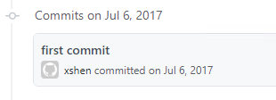

Unknowingly, I've been writing blog posts and WeChat articles for five years now. I never expected it to last this long.

I'd like to share my career path changes over these years, and what I've gained from writing blogs and WeChat articles.  Consider this a personal retrospective.  It would be even better if it resonates with you and provides some help.

## From QA to DEV to DEVOPS

My earliest followers probably connected with me through my software testing posts.  Yes, I worked in software testing for nearly 10 years, successively at SIMcom, DongSoft, JD.com, and a foreign company, engaging in functional, automation, and performance testing.

Starting with functional testing, I gradually realized that programming wasn't a unique skill for developers; it was also essential for testing engineers. Only with good coding skills can one perform automation, unit testing, and test development work.

As an automation testing engineer, I discovered that "solving" problems brought me more joy than "finding" them. I began to dream of becoming a developer. This would not only improve my programming skills but also offer more career possibilities with expertise in both development and testing.

Finally, due to opportunity, my initiative, and passable coding skills, I transitioned from testing to development. The initial difficulties and pressures were unprecedented in my almost 10-year career.  Days, nights, and weekends were spent looking at code...every single day. After more than six months of hard work, I finally reached the shore, capable of doing C/C++ project bug fixes.

It was my experience in development, automation, and continuous integration that led me to the role of Build/Release Engineer. This was my ideal position, responsible for automated product building, release, infrastructure construction, CI/CD, and development efficiency improvements.

That's how I went from QA to DEV to DEVOPS. The name changes of my WeChat Official Account reflect my career path:

* July 28, 2019: "Software Testing and Development" changed to "DevOps Engineer"
* December 29, 2018: "DevQA" changed to "Software Testing and Development"
* December 26, 2018: "Software Testing QA" changed to "DevQA"
* August 1, 2017: Registered "Software Testing QA"

## Five Years of Writing: The Harvest

**Writing is something where the long-term benefits far outweigh the short-term gains.**

For most people, there's little immediate tangible benefit. It also takes up a lot of spare time—it's essentially fueled by passion. From a monetary perspective, the input and output are completely disproportionate, making it hard to maintain.

However, from a long-term perspective, consistent writing will definitely bring value. I've summarized five benefits:

1. A bad memory is no match for a good pen – When we figure out a difficult technical problem, even if we understand it at the time, if we don't record it, we might not know how to solve it when we encounter the same problem later.
2. Only when you can make others understand, do you truly understand – Sometimes, we think we understand a problem, but when we share it with others, we find some logic doesn't make sense. This forces us to think further and fully understand it.
3. Building a learning flywheel – When you consistently share and people pay attention and interact with you, you'll be motivated to continue sharing, learning new knowledge, and then sharing it again. Once the learning flywheel is built, persistence becomes easier.
4. Indirect benefits – Consistently writing something will help with job searching, at least showing you're a learner. If your sharing impresses your colleagues or future interviewers, it could lead to new job opportunities.
5. Direct benefits – Direct benefits include platform traffic and advertising revenue, selling columns, and consulting. This requires a high level of skill, not only in self-media operation, but also in strong output capabilities, which requires more effort than others.

In 2017, I didn't think too much about it. I just thought I could write something, so on July 6, 2017, I built my [personal blog](https://shenxianpeng.github.io) using GitHub Pages.

With the content ready, copying it wasn't difficult, and I could learn how to use WeChat Official Accounts. So, I opened a WeChat Official Account in August of the same year. Later, wanting to learn about mini-programs, I created a WeChat mini-program (DevOps Engineer) for my blog during the May Day holiday in 2020.

Having spent so much spare time writing, let me talk about the specific gains:

1. Learned how to build and publish a blog on GitHub, making GitHub one of my most frequently visited websites.
2. Learned how to integrate Hexo blog with Disqus, Google Analytics, Google Adsense, etc., and made many improvements.
3. Learned how to use and integrate tools like GitHub Actions, Travis, SonarQube, etc.
4. Learned how to operate a WeChat Official Account; learned how to create and publish a WeChat mini-program.
5. Participated in open-source projects, learning coding, broadening my horizons, and gaining exposure to best practices in open-source projects.
6. A colleague told me they read my articles, found and followed my WeChat Official Account, which honored me.
7. Received consultations and even thank-you red packets from those I helped.  Helping others and receiving positive feedback made me very happy.
8. I was unexpectedly invited by a major publishing house to write a technical book, but I declined due to work commitments and other important knowledge I wanted to learn.
9. ... ...

Of these gains, I think the biggest is **building a learning flywheel and developing a habit of sharing.**

The best time was ten years ago, the second best is now.  Daily progress, no effort is wasted. Keep doing the right things, and leave the rest to time.

—— Updated at dawn on February 20, 2022.

## Related Reading

> * [Why did I switch from testing to development after 9 years?](https://shenxianpeng.github.io/2018/07/why-I-move-to-development/)
> * [Five Months from Testing to Development](https://shenxianpeng.github.io/2018/12/from-qa-to-dev/)

---

Please indicate the author and source when reprinting this article.  Do not use it for any commercial purposes.  Welcome to follow the WeChat Official Account "DevOps Engineer".