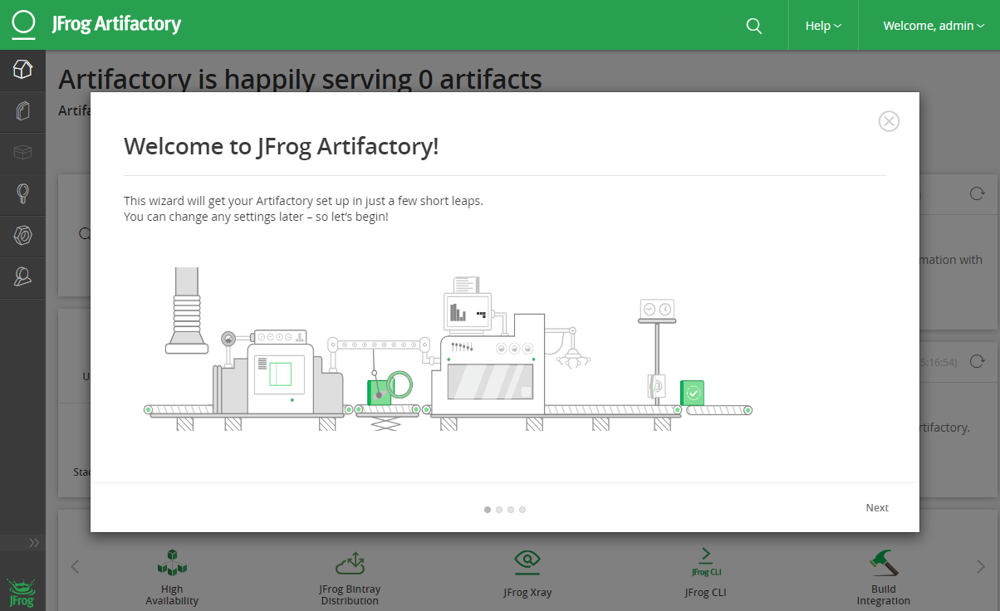

## What is Artifactory

Artifactory is a product from JFrog that serves as a binary repository manager.  A binary repository can unify the management of all these binaries, making team management more efficient and simpler.

Just like you use Git to manage code, Artifactory is used to manage binary files, typically referring to jar, war, pypi, DLL, EXE, and other build files.

I believe the biggest advantage of using Artifactory is that it creates a better continuous integration environment, helping other continuous integration tasks to call from Artifactory and then deploy to different test or development environments. This is crucial for implementing DevOps.


To learn more about Artifactory, please refer to the [Chinese website](https://www.jfrogchina.com/) and the [English Website](https://jfrog.com/artifactory/).

## Installing Artifactory

1. Download the Open Source [Artifactory](https://jfrog.com/open-source/#artifactory) from the official website. This demonstration shows installation on Linux, so click Download RPM to download.
2. Upload the downloaded `jfrog-artifactory-oss-6.14.0.rpm` to Linux.

```bash
# Create a file in the root directory. You can also create a folder in any directory.
sudo mkdir /artifactory
cd /artifactory
# Upload the downloaded jfrog-artifactory-oss-6.15.0.rpm to your Linux.
$ ls
jfrog-artifactory-oss-6.14.0.rpm
# Install artifactory
sudo rpm -ivh jfrog-artifactory-oss-6.14.0.rpm
```

## Starting and Stopping the Artifactory Service

```bash
# Start the service
sudo systemctl start artifactory.service

# If you encounter the following error when starting the service using the above command:
# Job for artifactory.service failed because a configured resource limit was exceeded. See "systemctl status artifactory.service" and "journalctl -xe" for details.
# Details: https://www.jfrog.com/jira/browse/RTFACT-19988
# You can try starting with the following command
cd /opt/jfrog/artifactory/app/bin && ./artifactory.sh start &

# Stop the service
sudo systemctl stop artifactory.service
# Check service status
sudo systemctl status artifactory.service
```

## Accessing Artifactory

Artifactory's default port is 8040. After successful installation, access `http://hostname:8040` to log in (default username: admin, password: password).


## Upgrading Artifactory

1. Download the latest [Artifactory](https://jfrog.com/open-source/#artifactory) from the official website.

2. Upload the downloaded `jfrog-artifactory-oss-6.15.0.rpm` (currently the latest) to your Linux.

```bash
cd /artifactory
ls
jfrog-artifactory-oss-6.14.0.rpm  jfrog-artifactory-oss-6.15.0.rpm
# Stop the service
sudo systemctl stop artifactory.service
# Perform the upgrade
sudo rpm -U jfrog-artifactory-oss-6.15.0.rpm
# Output log, showing successful upgrade
warning: jfrog-artifactory-oss-6.15.0.rpm: Header V4 DSA/SHA1 Signature, key ID d7639232: NOKEY
Checking if ARTIFACTORY_HOME exists
Removing tomcat work directory
Removing Artifactory's exploded WAR directory
Initializing artifactory service with systemctl...

************ SUCCESS ****************
The upgrade of Artifactory has completed successfully.

Start Artifactory with:
> systemctl start artifactory.service

Check Artifactory status with:
> systemctl status artifactory.service

NOTE: Updating the ownership of files and directories. This may take several minutes. Do not stop the installation/upgrade process.
```

## Uninstalling Artifactory

1. Stop the Artifactory service

```bash
systemctl stop artifactory.service
```

2. Use the root user to execute the RPM uninstall command

```bash
# remove OSS version
yum erase jfrog-artifactory-oss
# remove PRO version, etc.
yum erase jfrog-artifactory-pro
```

For more information on uninstalling JFrog products, see: https://www.jfrog.com/confluence/display/JFROG/Uninstalling+JFrog+Products

## Installing JFrog CLI

```bash
# ON MAC
brew install jfrog-cli-go
# WITH CURL
curl -fL https://getcli.jfrog.io | sh
# WITH NPM
npm install -g jfrog-cli-go
# WITH DOCKER
docker run docker.bintray.io/jfrog/jfrog-cli-go:latest jfrog -v
```

CLI for JFrog Artifactory

[How to use the JFrog CLI on Artifactory](https://www.jfrog.com/confluence/display/CLI/CLI+for+JFrog+Artifactory)