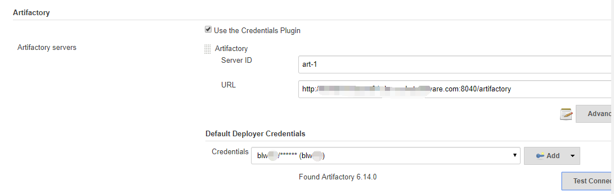
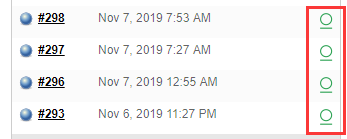
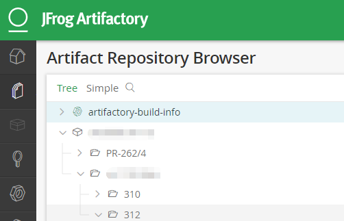

上一篇 [初识 JFrog Artifactory](https://shenxianpeng.github.io/2019/11/artifactory-install-and-upgrade/)，介绍了什么是 Artifactory，以及如何安装、启动和升级。

本篇介绍 Artifactory 与 Jenkins 的集成，因为没有与 CI 工具集成的 Artifactory 是没有灵魂的。

通过集成，可以让 Jenkins 在完成构建之后，可以直接将制品（比如 build）推送到 Artifactory，供测试下载、部署或是后续的 Jenkins 任务去继续进行持续集成。


## Jenkins 里配置 Artifactory

打开 Manage Jenkins->Configure System，找到 Artifactory，点击 Add Artifactory Server， 输入 Server ID 和 URL

1. Server ID 是给你的 Artifactory 起个别名，这样使用 Jenkins pipeline 的时候会用到
2. URL 是你的 Artifactory 服务器的地址，例如 `http://art.company.com:8040/artifactory`
3. 配置完成后，点击Test Connection，返回 `Found Artifactory 6.14.0` 表示配置成功。

如图所示: 

## 使用 Pipeline 调用 Artifactory

这里演示了两种方式，我在项目中用的是 Jenkins Shared Library；当然你也可以仅仅使用 Jenkinsfile，把如下两个 groovy 文件组合成一个 Jenkinsfile。

### 方式1：Jenkins Shared Library

`build.groovy`

```bash
def call() {
  pipeline {
    # 省略其他代码
    post {
      # 这里只有在 Jenkins Job 成功的时候才将 build post 到 artifactory
      success {
        script {
          if (env.BRANCH_NAME == 'develop') {
            # 如果当前是 develop 分支，则将 release 和 debug build 都 post 到 artifactory
            artifactory("${PATTERN_RELEASE_PATH}", "${TARGET_PATH}", "${BUILD_NAME}", "${BUILD_NUMBER}")
            artifactory("${PATTERN_DEBUG_PATH}",   "${TARGET_PATH}", "${BUILD_NAME}", "${BUILD_NUMBER}")
        } else if (env.BRANCH_NAME.startsWith('PR')) {
            # 如果当前是 pull request 分支，则只将 release build 都 post 到 artifactory
            artifactory("${PATTERN_RELEASE_PATH}", "${TARGET_PATH}", "${BUILD_NAME}", "${BUILD_NUMBER}")
          }
        }
      }
    }
  }
}
```

`artifactory.groovy`

```bash
import groovy.transform.Field

@Field artifactoryServerId   = "art-1"
@Field artifactoryURL        = "http://art.company.com:8040/artifactory"
@Field artifactoryCredential = "d1cbab74-823d-41aa-abb7"

def call(String patternPath, String targetPath, String buildName, String buildNumber) {
  rtServer (
    id: "${artifactoryServerId}",
    url: "${artifactoryURL}",
    credentialsId: "${artifactoryCredential}"
  )
  rtPublishBuildInfo (
      serverId: "${artifactoryServerId}"
  )
  rtUpload (
    serverId: "${artifactoryServerId}",
    spec: """{
      "files": [
        {
        "pattern": "${patternPath}",
        "target": "${targetPath}"
        }
      ]
    }""",
    buildNumber: "${buildNumber}",
    buildName: "${buildName}",
  )
}
```

### 方式2：Jenkinsfile

```bash
pipeline {
  # 省略其他代码
  stage('config art'){
    rtServer (
    id: "art-1",
    url: "http://art.company.com:8040/artifactory",
    credentialsId: "d1cbab74-823d-41aa-abb7")
  }
  post {
    # 这里只有在 Jenkins Job 成功的时候才将 build post 到 artifactory
    success {
      script {
        if (env.BRANCH_NAME == 'develop') {
          rtUpload (
            serverId: "art-1",
            spec: """{
              "files": [
                {
                "pattern": "/release/build/*.zip",
                "target": "demo/develop/"
                }
              ]
            }""",
            buildNumber: "${buildNumber}",
            buildName: "${buildName}",
          )
      } else if (env.BRANCH_NAME.startsWith('PR')) {
          rtUpload (
            serverId: "art-1",
            spec: """{
                "files": [
                  {
                  "pattern": "/release/build/*.zip",
                  "target": "demo/pull-request/"
                  }
                ]
            }""",
            buildNumber: "${buildNumber}",
            buildName: "${buildName}",
          )
        }
      }
    }
  }
}
```

## Jenkins 与 Artifactory 集成成功

蓝色表示构建成功，绿色圆圈表示 Build 已经 Post 到 Artifactory 上了。



点击绿色圆圈可以跳转到 Artifactory 看到制品。



Jenkins 与 Artifactory 打通了。完！
