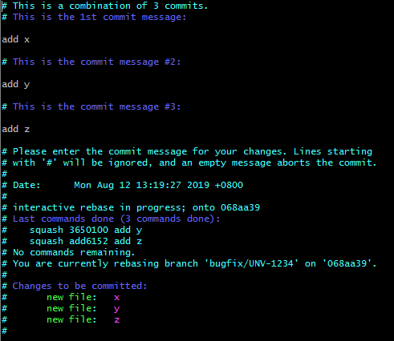
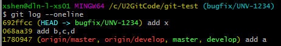
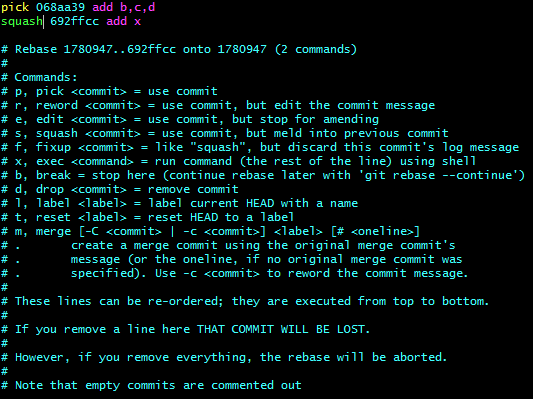

## If your commits on local not pushed to remote

### combine local commits, you could follow this flow


Here is [short video](https://www.youtube.com/watch?v=V5KrD7CmO4o) (only 3 minutes) and good explanation of `git rebase -i` usage.

list your local repository log


If you want to combine these 3 commits (add6152, 3650100, 396a652) to 1 commit, execute this command

```bash
git rebase -i HEAD~3      # last three commits
```


Select which commit you want to squash (type s or squash are OK)


then press ESC, enter :wq! to save and exit.



Comment out some commits message you don't need, press ESC, enter :wq! to save and exit.


Check log, you will see your local repository logs has combine to one commit


## If your commits had pushed to remote

### combine remote commits, you could follow this flow

list your repository logs



```bash
# so you can create another branch from bugfix/UNV-1234 named bugfix/UNV-1234-for-squash
xshen@dln-l-xs01 MINGW64 /c/U2GitCode/git-test (bugfix/UNV-1234)
$ git checkout -b bugfix/UNV-1234-for-squash
Switched to a new branch 'bugfix/UNV-1234-for-squash'

# combine last 2 commits
$ git rebase -i HEAD~2
```

change one commit from pick to squash, see the screenshot below. press ESC, enter :wq! to save and exit.



change commit message, for example "UNV-1234 combine all commit to one commit", then press ESC, enter :wq! to save and exit.


```bash
# push your new create branch to remote.
git push -u origin bugfix/UNV-1234-for-squash
```
