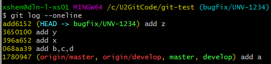
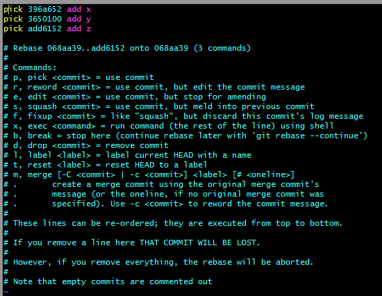
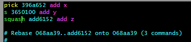
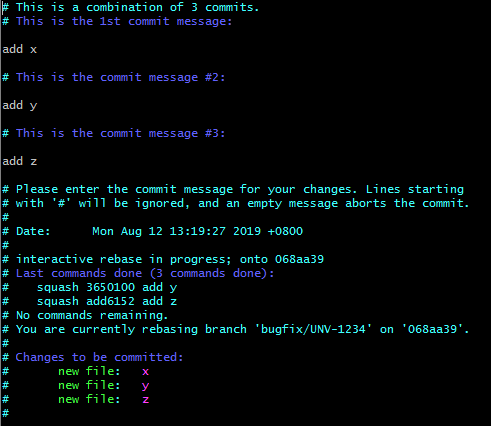
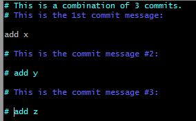
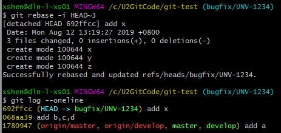
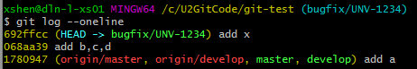
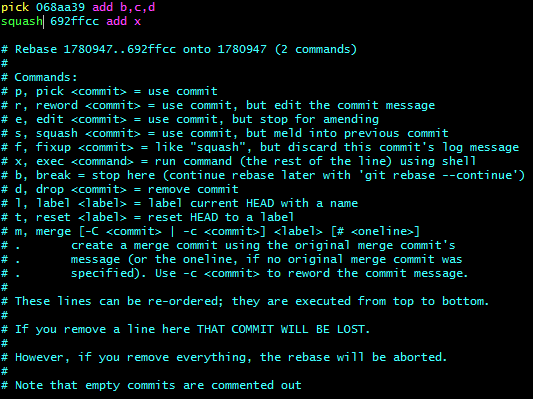
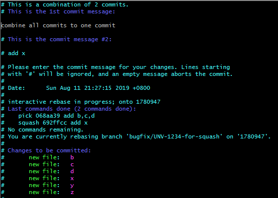

## 本地提交尚未推送到远程

如果要将本地的多个提交合并为一个，可以按以下流程操作。

这里有一个 [3 分钟短视频](https://www.youtube.com/watch?v=V5KrD7CmO4o) 讲解了 `git rebase -i` 的用法。

1. 查看本地仓库的日志：
   ```bash
   git log --oneline
``



2. 假设要合并最近的 3 个提交（`add6152`、`3650100`、`396a652`）：

   ```bash
   git rebase -i HEAD~3
   ```

   

3. 将需要合并到前一个提交的记录改为 `s` 或 `squash`：
   

4. 保存退出（`ESC` → `:wq!`）。

5. 在提交信息编辑界面中，注释掉不需要保留的提交信息：
   
   

6. 查看日志，确认已合并为一个提交：
   

---

## 提交已推送到远程

如果提交已推送到远程，建议新建分支进行 squash 以避免影响已有分支历史。

1. 查看日志：
   

2. 新建分支：

   ```bash
   git checkout -b bugfix/UNV-1234-for-squash
   ```

3. 合并最近 2 个提交：

   ```bash
   git rebase -i HEAD~2
   ```

   

4. 修改提交信息，例如：

   ```
   UNV-1234 combine all commit to one commit
   ```

   

5. 推送新分支到远程：

   ```bash
   git push -u origin bugfix/UNV-1234-for-squash
   ```
