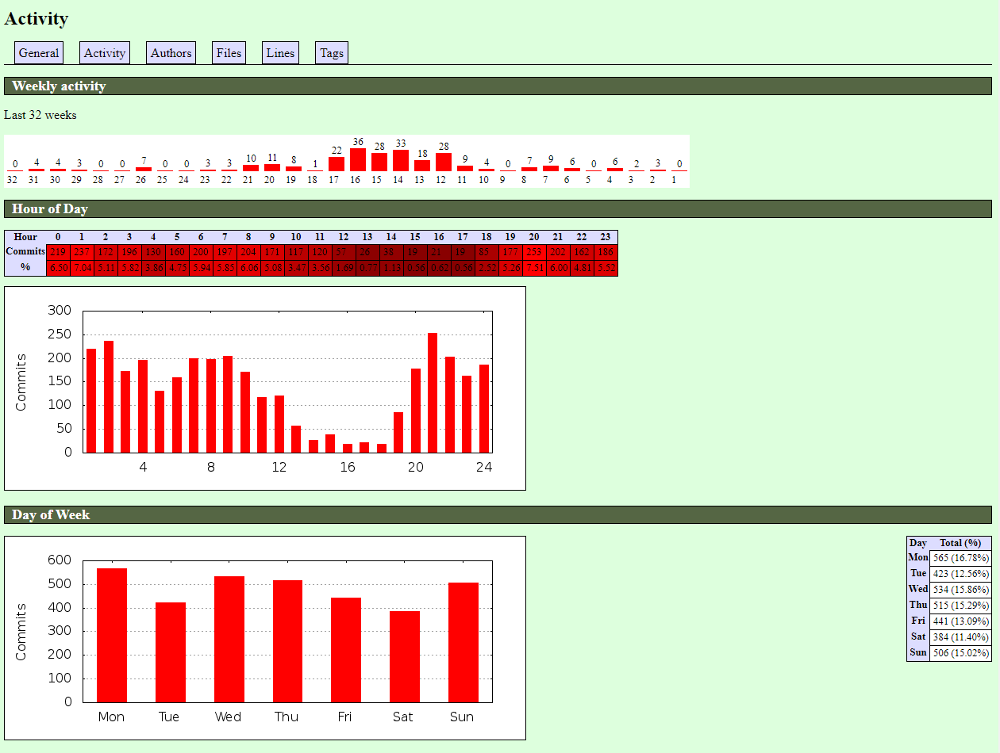
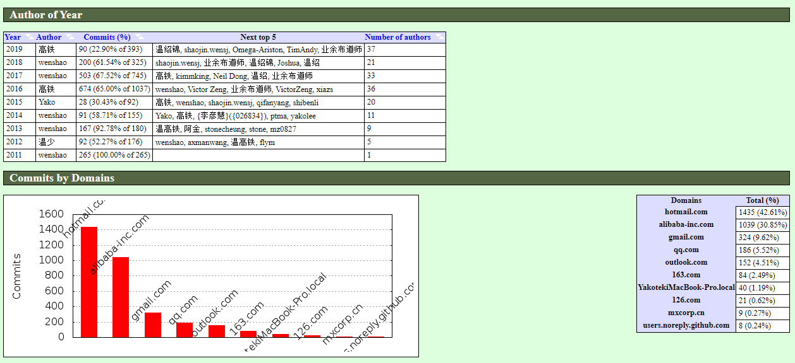
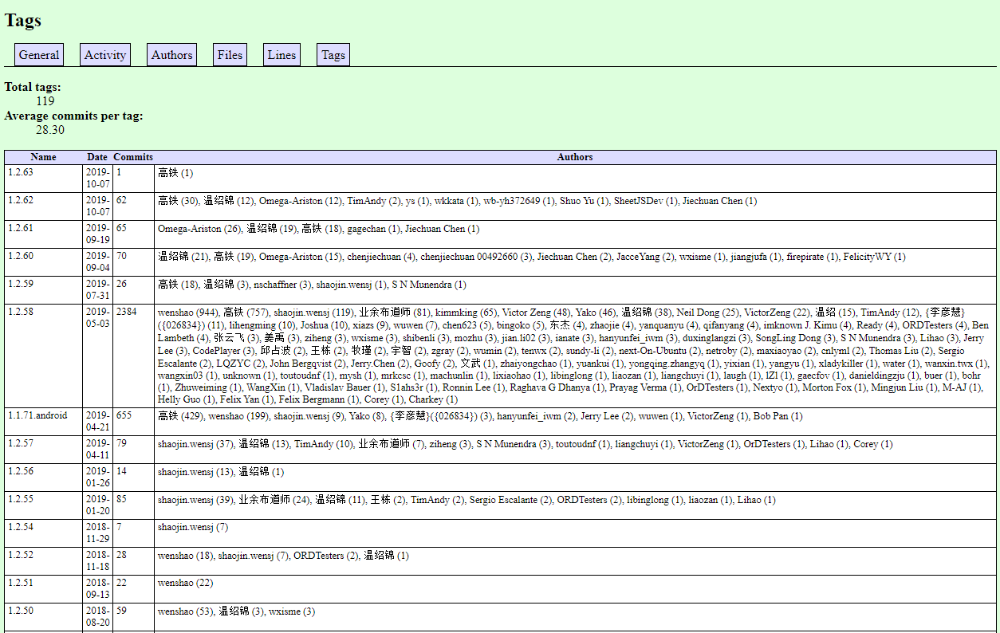

If you are a member of a research and development efficiency team or are engaged in CI/CD or DevOps, in addition to providing infrastructure, metrics and data are also a very important aspect. For example, you need to analyze the code submission status of a certain Git repository:

* Who submitted the most code to this repository?
* What is the activity level of this repository?
* Submission analysis data for different periods
* Contribution ranking for each version
* Weekly/monthly/yearly contribution ranking, etc.

A few days ago, I discovered a Git history statistics generation tool called GitStats (https://github.com/shenxianpeng/gitstats)


This is a tool written in Python.  It has a small codebase but very powerful analytical capabilities. It's one of the few open-source projects I've found that can generate beautiful reports and is easy to use.

The gitstats report is also powerful (https://shenxianpeng.github.io/gitstats/previews/main/index.html).  Those interested can try it out.

## How to Use

Dependencies required: Git, Python3, Gnuplot.

If you have Linux, it's recommended to download and install on Linux. I tried setting up the environment on Windows, but I had to configure Cygwin and manually configure Gnuplot (Gnuplot is a portable command-line driven graphics tool), which was quite troublesome. The following are the installation and usage steps on Linux.

```bash
# Install Gnuplot
sudo yum -y install gnuplot
# Install gitstats
pip install gitstats

# Clone the code repository you want to analyze
git clone https://github.com/alibaba/fastjson.git

# Execute the command to generate the report
gitstats ../fastjson ../html/fastjson

# After 15 seconds of execution, the report is generated
Generating report...
[0.00393] >> git --git-dir=/workspace/gitstats/.git --work-tree=/workspace/gitstats rev-parse --short HEAD
[0.00236] >> git --version
[0.00716] >> gnuplot --version
Generating graphs...
[0.01676] >> gnuplot "/workspace/html/fastjson/day_of_week.plot"
[0.01571] >> gnuplot "/workspace/html/fastjson/files_by_date.plot"
[0.01281] >> gnuplot "/workspace/html/fastjson/month_of_year.plot"
[0.09293] >> gnuplot "/workspace/html/fastjson/lines_of_code_by_author.plot"
[0.01340] >> gnuplot "/workspace/html/fastjson/commits_by_year.plot"
[0.01799] >> gnuplot "/workspace/html/fastjson/hour_of_day.plot"
[0.01627] >> gnuplot "/workspace/html/fastjson/domains.plot"
[0.01268] >> gnuplot "/workspace/html/fastjson/commits_by_year_month.plot"
[0.09435] >> gnuplot "/workspace/html/fastjson/commits_by_author.plot"
[0.01522] >> gnuplot "/workspace/html/fastjson/lines_of_code.plot"
Execution time 15.16208 secs, 4.58247 secs (30.22 %) in external commands)
You may now run:

   sensible-browser '/workspace/html/fastjson/index.html'
```

## Report Analysis

### General Statistics

You can see that this project is called fastjson. The first code submission was on July 31, 2011, and it has been 3060 days since then, with 893 active days. There are a total of 2960 files, with a total of 250,000 lines of code.


### Activity

The number of commits per hour of the day, per day of the week, per hour of the week, per month of the year, and per year.

In the past 32 weeks, the period from week 12 to week 17 was very active, with many submissions.  Also, you can see that there are very few submissions between 12 pm and 8 pm. Most programmers are dealing with company work during this time and cannot contribute to open-source projects.

Submissions start to increase after 8 pm, indicating a very dedicated developer.  You can also see that there are submissions from Monday to Sunday, with relatively fewer submissions on Saturday, likely due to rest and relaxation.  Sunday submissions are significantly more than Saturday, showing that considerable personal weekend time was spent.



You can also see that the main completion time of this project was from 2016 to 2017, and the completion time zone was UTC+8. This dimension allows for analysis of the contribution number of developers in different regions.


### Contributors

Lists all authors, number of submissions, first submission, and last submission.


This chart also shows who the creator of the project is, and who contributed the most each year over the years. You can also see the email accounts used by the contributors.



### Files and Lines of Code

The total number of files is 2960, and the number of lines of code is 250,000.

You can also see the yearly trend chart of file increases and the ranking of the number of these file types. You can see that Java files account for 96.08%, followed by JSON.


### Tags

Tags are an important analytical indicator for the team (provided that the repository to be analyzed has created a tag after the release). You can see the contribution ranking of each version.



## Conclusion

If you're interested, you can analyze your own projects or find an interesting and influential project on GitHub to analyze, such as 996.ICU and vue, and have fun.