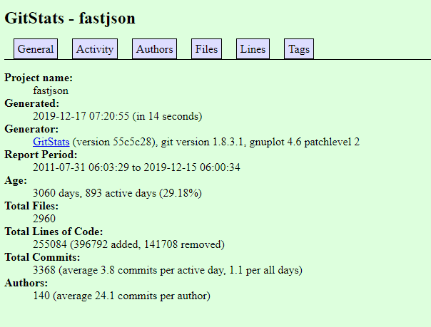
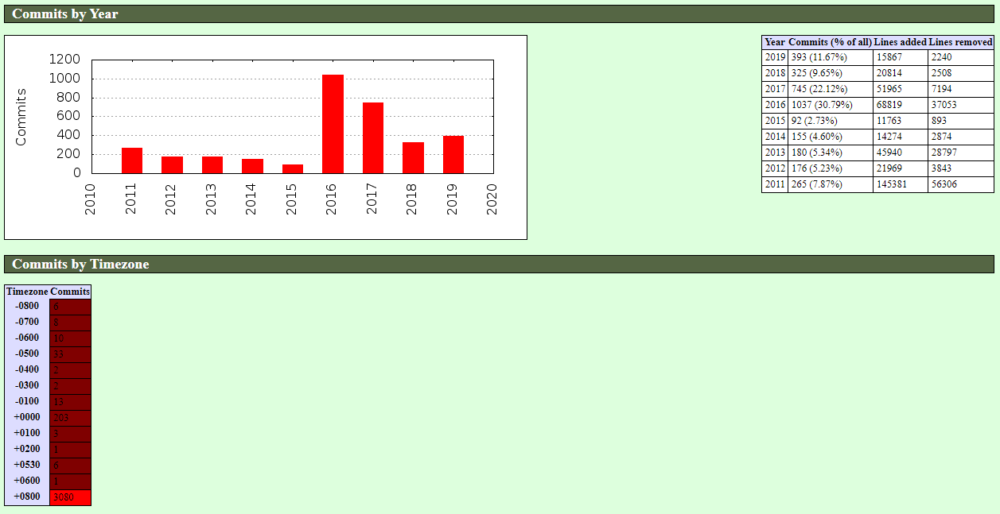
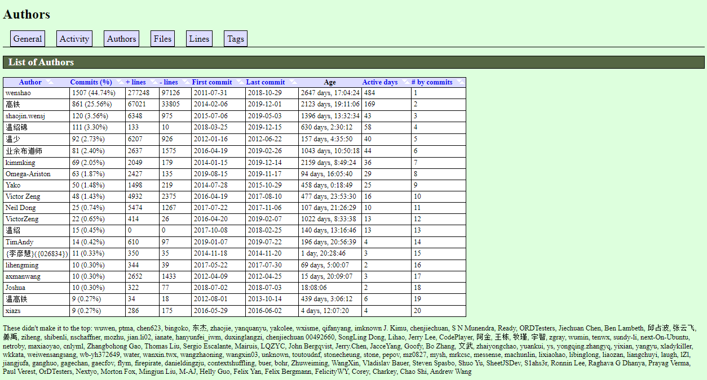

如果你是研发效能组的一员或者在从事 CI/CD 或 DevOps，除了提供基础设施，指标和数据是也是一个很重要的一环，比如需要分析下某个 Git 仓库代码提交情况：

* 这个仓库的代码谁提交的代码最多
* 这个仓库的活跃度是什么样子的
* 各个时段的提交分析数据
* 每个版本的贡献排名
* 每周/每月/每年的贡献排名等等

几天前发现一个 Git 历史统计信息生成工具叫 GitStats (https://github.com/shenxianpeng/gitstats)


这是一个用 python 写的，代码量很少，功能却非常强大的分析工具，也是我目前发现为数不多的可以生成漂亮的报告并且使用很方便的开源项目。

gitstats 的报告也很强大 (https://shenxianpeng.github.io/gitstats/previews/main/index.html) 感兴趣的可以试试

## 如何使用

需要的依赖：Git，Python3，Gnuplot。

如果有 Linux，推荐在 Linux 上下载和安装。我曾尝试用 Windows 来准备环境，要配置 Cygwin，还要手动配置 Gnuplot （Gnuplot 是一个可移植的命令行驱动的图形工具），挺麻烦的。以下是我在 Linux 上来的安装和使用步骤。

```bash
# 安装 Gnuplot
sudo yum -y install gnuplot
# 安装 gitstats
pip install gitstats

# 下载你要分析的代码仓库
git clone https://github.com/alibaba/fastjson.git

# 执行命令，生产报告
gitstats ../fastjson ../html/fastjson

# 经过 15 秒钟的执行，生成报告
Generating report...
[0.00393] >> git --git-dir=/workspace/gitstats/.git --work-tree=/workspace/gitstats rev-parse --short HEAD
[0.00236] >> git --version
[0.00716] >> gnuplot --version
Generating graphs...
[0.01676] >> gnuplot "/workspace/html/fastjson/day_of_week.plot"
[0.01571] >> gnuplot "/workspace/html/fastjson/files_by_date.plot"
[0.01281] >> gnuplot "/workspace/html/fastjson/month_of_year.plot"
[0.09293] >> gnuplot "/workspace/html/fastjson/lines_of_code_by_author.plot"
[0.01340] >> gnuplot "/workspace/html/fastjson/commits_by_year.plot"
[0.01799] >> gnuplot "/workspace/html/fastjson/hour_of_day.plot"
[0.01627] >> gnuplot "/workspace/html/fastjson/domains.plot"
[0.01268] >> gnuplot "/workspace/html/fastjson/commits_by_year_month.plot"
[0.09435] >> gnuplot "/workspace/html/fastjson/commits_by_author.plot"
[0.01522] >> gnuplot "/workspace/html/fastjson/lines_of_code.plot"
Execution time 15.16208 secs, 4.58247 secs (30.22 %) in external commands)
You may now run:

   sensible-browser '/workspace/html/fastjson/index.html'
```

## 报告分析

### 常规统计

可以看到这个项目叫 fastjson，从 2011 年 7 月 31 日开始提交第一次代码，距离当前已经 3060 天了，893 个活跃天。总共文件是 2960 个，一共的代码行数是 25 万行。



### 活跃度

每天中的每小时的、每周中的每天、每周中的每小时，每年中的每月的、每年的提交数量。

在过去的 32 周里，其中前 12 周到 17 周这段时间很活跃，提交很多。另外可以看到在白天 12 点到晚上 20 点这段时间提交很少，大部分程序员在这段时间都在应对公司里的工作，无法贡献开源项目。

晚上 20 点之后提交开始增多，看来是一个非常努力的开发者。另外可以看到周一到周日都有提交，周六相对最少，应该是周六休息和放松一下。周日提交明显比周六多，看来还是花费了不少的个人宝贵周末时间。


还能看到该项目主要完成时间在 2016 年到 2017 年，完成的时区是在东八区，这个维度可对不同区域的开发者贡献数量进行分析。



### 贡献者

列举了所有的作者，提交数，第一次提交及最近一次提交。



这张图也是可以看到谁是该项目的创建者，以及这几年以来每年的谁的贡献最大。还有可以看到提交者所用的邮箱账户。


### 文件及行数

文件总数是 2960 个，代码行数是 25 万行。

另外还可以看到每年的文件增加趋势图以及这些文件类型数量的排名，可以看到 java 文件占了 96.08%，其次是 json。


### Tags

Tags 对于团队是一个很重要分析指标（前提是所要分析的仓库在版本发布后创建了 Tag）可以看到每个版本的贡献度排名。


## 最后

如果感兴趣可以分析一下自己的项目或是去 GitHub 上找一个有意思、有影响力的项目拿来分析一下，比如 996.ICU 以及 vue 等，玩的开心。
