## Jenkins Warnings Next Generation 插件

Jenkins Warnings Next Generation 插件可收集编译器警告或静态分析工具报告的问题并可视化结果，它内置了对众多静态分析工具（包括多个编译器）的支持，更多[支持的报告格式](https://github.com/jenkinsci/warnings-ng-plugin/blob/master/SUPPORTED-FORMATS.md)。


### 支持的项目类型

Warnings Next Generation 插件支持以下 Jenkins 项目类型：

* 自由式项目
* Maven 项目
* 矩阵项目
* 脚本化管道（顺序和并行步骤）
* 声明式管道（顺序步骤和并行步骤）
* 多分支管道

### 功能概述

当作为后续构建任务操作（或步骤）添加时，Warnings Next Generation 插件提供以下功能：

1. 该插件会扫描 Jenkins 版本的控制台日志或你工作区中的文件中是否存在任何问题。支持一百多种[报告格式](https://github.com/jenkinsci/warnings-ng-plugin/blob/master/SUPPORTED-FORMATS.md)，它可以检测到的问题包括：

  * 来自编译器的错误（C，C＃，Java等）
  * 来自静态分析工具（CheckStyle，StyleCop，SpotBugs 等）的警告
  * 来自复制粘贴检测器（CPD, Simian 等）的重复
  * 漏洞
  * 在源文件的注释中打开任务

2. 该插件会发布有关在构建中发现的问题的报告，因此可以从以下位置导航到摘要报告，主构建页面。你还可以从那里深入了解细节：

  * 发行新的，固定的和未解决的问题
  * 按严重性，类别，类型，模块或程序包分发问题
  * 所有问题的列表，包括来自报告工具的有用评论
  * 受影响文件的带注释的源代码
  * 问题趋势图

该插件不会运行静态分析，它只是可视化此类工具报告的结果。你仍然需要在构建文件或 Jenkinsfile 中启用和配置静态分析工具。

## 配置

你可以在 Jenkins 作业配置用户界面中配置插件的每个选项（在自由式，maven 或矩阵作业中）。在这里你需要在工作中添加并启用生成后操作“记录编译器警告和静态分析结果”。

在管道中，将通过添加 recordIssues 激活插件。也可以使用相同的用户界面来配置此步骤（通过使用 Snippet 编辑器）。请注意，对于脚本化管道，一些其他功能可用于汇总和分组问题，有关详细信息，请参阅“高级管道配置”部分。

在以下各节中，将同时显示图形配置和管道配置。

### 工具选择

下图显示了插件的基本配置：

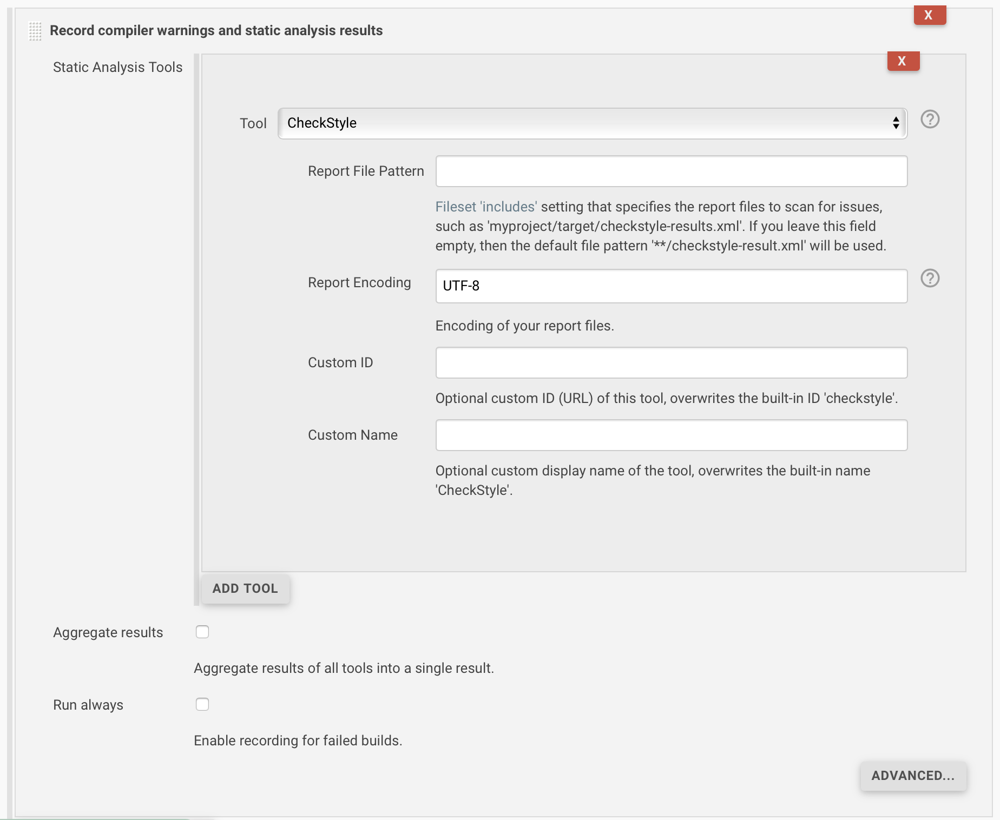

首先，你需要指定用于创建问题的工具，根据所选工具，你可能还会配置一些其他参数。

对于所有读取报告文件的解析器，你需要指定应分析和扫描问题的报告文件的模式。如果未指定模式，则将扫描构建的控制台日志。对于几种流行的工具，提供了默认模式，在这种情况下，如果模式为空，则将使用默认模式。

为了让扫描程序正确解析你的报告，需要设置文件的编码，否则将使用平台编码，这可能不正确。

每个工具都由一个 ID 标识，该 ID 用作分析结果的 URL。对于每个工具，都提供了一个默认 URL（和名称），可以根据需要进行更改。例如，如果你打算多次使用解析器，则需要为每个调用指定不同的 ID。

你可以指定将用于同一配置的多个工具（和模式），由于 Jenkins 的技术（或市场）限制，无法通过使用多个后期构建操作来选择不同的配置。

通过使用“汇总结果”复选框，可以使用一项新功能。如果选中此选项，则将创建一个结果，其中包含所选工具的所有问题的汇总。这是之前静态分析收集器插件提供的。激活此选项后，你将获得所有问题的唯一入口点。以下屏幕截图显示了此新行为：

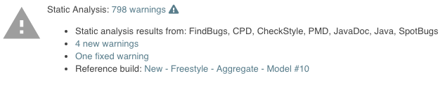

如果未启用此选项，则将为每个工具创建单独的结果。此结果具有唯一的 URL 和图标，因此你可以快速查看创建的报告之间的区别：

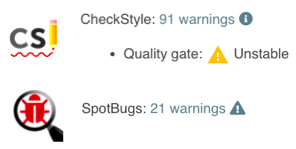

在基本配置部分中，你还可以选择是否针对失败的构建也运行该步骤。默认情况下禁用此选项，因为如果构建失败，分析结果可能会不准确。

以下代码段显示了具有这些选项的示例管道：

```java
recordIssues(
    enabledForFailure: true, aggregatingResults: true,
    tools: [java(), checkStyle(pattern: 'checkstyle-result.xml', reportEncoding: 'UTF-8')]
)
```

如果使用单个工具，则可以使用属性工具代替工具：

```bash
recordIssues enabledForFailure: true, aggregatingResults: true, tool: checkStyle(pattern: 'checkstyle-result.xml')
```

### 创建对自定义工具的支持

如果你的项目中没有内置工具，则可以通过多种方式添加其他工具。

#### 将问题导出为受支持的格式

将工具的分析结果获取到 Warnings 插件中的一种简单方法是将信息导出为一种已经支持的格式。例如，几种工具将其问题导出为 CheckStyle 或 PMD 格式。如果要使用警告插件的所有功能，则最好将信息导出为本机 XML 或 JSON 格式（此解析器使用 ID 问题）。
这些格式已经在用户界面中注册，你可以直接使用它们。你甚至可以在包含单行 JSON 问题的简单日志文件中提供问题，请参见示例。

这是一个示例步骤，可用于解析本机 JSON（或 XML）格式：

```bash
recordIssues(tool: issues())
```

#### 使用自定义插件部署新工具

最灵活的方法是通过编写将在你自己的小型 Jenkins 插件中部署的 Java 类来定义新工具，有关详细信息，请参见文档“为自定义静态分析工具提供支持”。

#### 使用Groovy解析器创建新工具

如果日志消息的格式非常简单，则可以通过在 Jenkins 的用户界面中创建简单的工具配置来定义对工具的支持。 出于安全原因（Groovy 脚本可能会危害你的主服务器），此配置仅在系统配置中可用。 新解析器的配置采用正则表达式，该正则表达式将用于匹配报告格式。 如果表达式匹配，则将调用 Groovy 脚本，该脚本将匹配的文本转换为问题实例。 这是基于 Groovy 的解析器的示例：

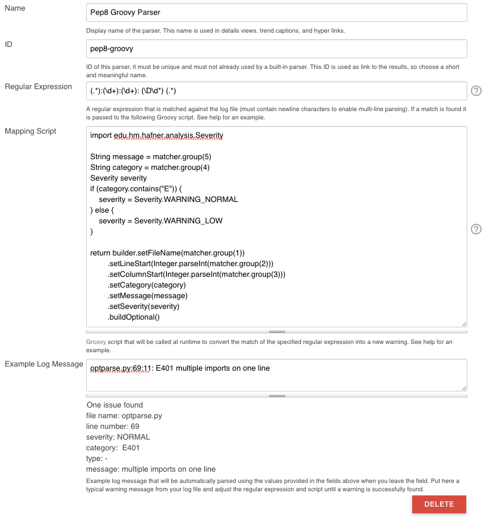

#### 以编程方式创建 Groovy 解析器

还可以使用 Groovy 脚本从管道，Jenkins 启动脚本或脚本控制台中创建基于 Groovy 的解析器，请参见以下示例：

```bash
def config = io.jenkins.plugins.analysis.warnings.groovy.ParserConfiguration.getInstance()

if(!config.contains('pep8-groovy')){
  def newParser = new io.jenkins.plugins.analysis.warnings.groovy.GroovyParser(
    'pep8-groovy',
    'Pep8 Groovy Parser',
    '(.*):(\\d+):(\\d+): (\\D\\d*) (.*)',
    'return builder.setFileName(matcher.group(1)).setCategory(matcher.group(4)).setMessage(matcher.group(5)).buildOptional()',
    "optparse.py:69:11: E401 multiple imports on one line"
  )
  config.setParsers(config.getParsers().plus(newParser))
}
```

#### 使用配置作为代码导入解析器（JCasC）

还可以使用 JCasC yaml 文件中的部分来指定基于 Groovy 的解析器。这是一个小示例，展示了如何添加这样的解析器：

```yaml
unclassified:
  warningsParsers:
    parsers:
      - name: "Example parser"
        id: example-id
        regexp: "^\\s*(.*):(\\d+):(.*):\\s*(.*)$"
        script: |
          import edu.hm.hafner.analysis.Severity
          builder.setFileName(matcher.group(1))
                  .setLineStart(Integer.parseInt(matcher.group(2)))
                  .setSeverity(Severity.WARNING_NORMAL)
                  .setCategory(matcher.group(3))
                  .setMessage(matcher.group(4))
          return builder.buildOptional();
        example: "somefile.txt:2:SeriousWarnings:SomethingWentWrong"
```

#### 使用定义的工具

一旦注册了 Groovy 解析器，就可以在作业的工具配置部分中使用它：

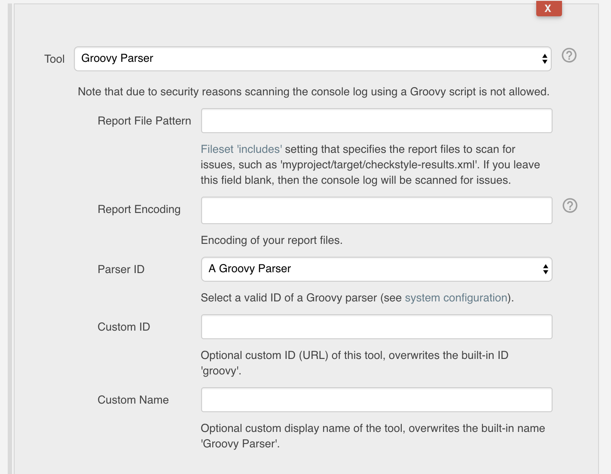

首先，你需要选择工具 “Groovy Parser” 以获取 Groovy 解析器的配置屏幕。 然后，你可以从可用解析器列表中选择解析器。 该列表是根据 Jenkins 的“系统配置”部分中定义的解析器动态创建的。可以使用与其他工具相同的方式来设置自定义 ID 和名称属性。

为了在管道中使用 Groovy 解析器，你需要使用以下形式的脚本语句：

```bash
recordIssues sourceCodeEncoding: 'UTF-8',
    tool: groovyScript(parserId: 'groovy-id-in-system-config', pattern:'**/*report.log', reportEncoding:'UTF-8')
```

### 处理受影响的源代码文件的属性

为了让插件解析并显示你的源代码文件，需要为这些文件设置正确的编码。 此外，如果你的源代码不在工作区中（例如，它已签出到共享代理文件夹中），则该插件将不会自动找到你的源文件。 为了让插件显示这些文件，你可以添加一个附加的源目录：

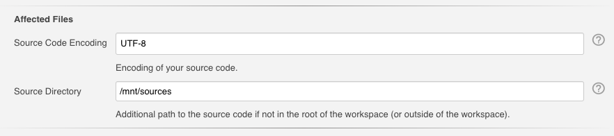

以下代码段显示了带有这些选项的示例管道，请注意，如果需要，可以不同地设置报告文件的编码：

```bash
recordIssues sourceCodeEncoding: 'ISO-8859-1', sourceDirectory: '/path/to/sources', tool: java(reportEncoding: 'UTF-8')
```

请注意，工作区外部的文件内容可能很敏感。 为了防止意外显示此类文件，你需要在 Jenkins 系统配置屏幕中提供允许的源代码目录的白名单：

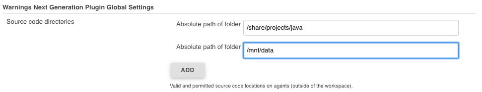

另外，此配置设置可以由 JCasC yaml 文件中的以下子节提供

```yaml
unclassified:
  warningsPlugin:
    sourceDirectories:
    - path: "C:\\Temp"
    - path: "/mnt/sources"
```

### 控制参考构建的选择（基准）

警告下一代插件的一项重要功能是将问题分类为新问题，未解决问题和已解决问题：

* 新增：所有问题，属于当前报告的一部分，但未在参考报告中显示
* 已修复：所有问题，属于参考报告的一部分，但不再存在于当前报告中
* 未解决：所有问题，是当前报告和参考报告的一部分

为了计算此分类，插件需要参考构建（基准）。 然后，通过比较当前版本和基准中的问题来计算新的，已修复的和未解决的问题。 有三个选项可控制参考构建的选择。

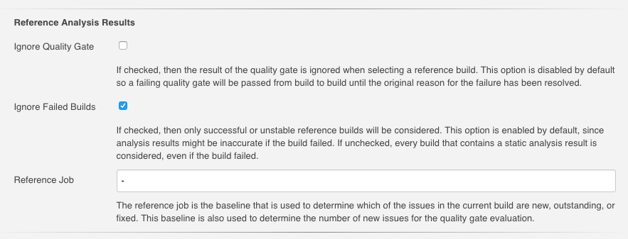

以下代码段显示了具有这些选项的示例管道：

```bash
recordIssues tool: java(), ignoreQualityGate: false, ignoreFailedBuilds: true, referenceJobName: 'my-project/master'
```

### 筛选问题

创建的问题报告可以随后进行过滤。 你可以指定任意数量的包含或排除过滤器。 当前，支持按模块名称，程序包或名称空间名称，文件名，类别或类型过滤问题。

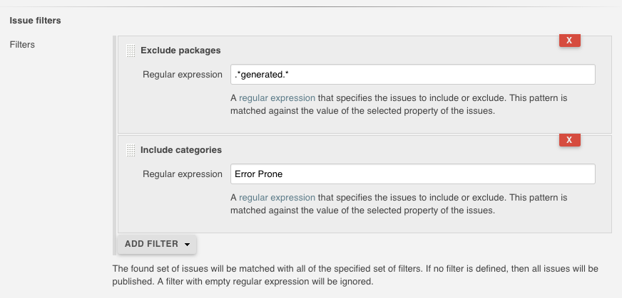

以下代码段显示了具有这些选项的示例管道：

```bash
recordIssues tool: java(pattern: '*.log'), filters: [includeFile('MyFile.*.java'), excludeCategory('WHITESPACE')]
```

### Quality gate 配置

你可以定义几个 Quality gate (质量门)，在报告问题后将对其进行检查。这些质量门使你可以修改詹金斯的生产状态，以便立即查看是否满足所需的产品质量。对于这些质量门中的每一个，都可以将构建设置为不稳定或失败。所有质量门都使用一个简单的度量标准：给定质量门将失败的问题数量。

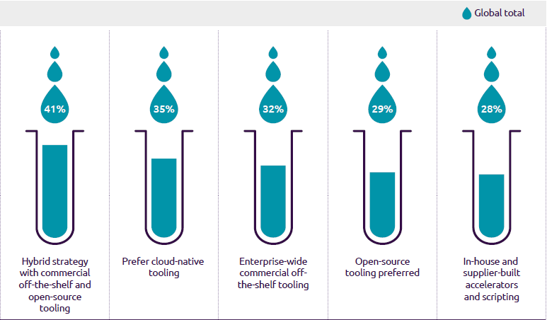

以下代码段显示了具有这些选项的示例管道：

```bash
recordIssues tool: java(pattern: '*.log'), qualityGates: [[threshold: 1, type: 'TOTAL', unstable: true]]
```

类型确定将用来评估质量门的属性。请参阅枚举 QualityGateType 以查看支持哪些不同类型。

### 健康报告配置

该插件可以参与你项目的运行状况报告。你可以更改将运行状况更改为 0％ 和 100％ 的问题数。此外，可以选择在创建运行状况报告时应考虑的严重性。

[健康报告配置!](11.png)

以下代码段显示了具有这些选项的示例管道：

```bash
recordIssues tool: java(pattern: '*.log'), healthy: 10, unhealthy: 100, minimumSeverity: 'HIGH'
```

该作业根据严重性为 HIGH 和错误的所有警告来调整构建运行状况。如果内部版本包含 10 条或更少的警告，则运行状况为 100％。如果内部版本有 100 个以上的警告，则运行状况为 0％。

### 管道配置

在 Jenkins Pipeline 中使用 Warnings 插件的要求可能很复杂，有时会引起争议。为了尽可能灵活，我决定将主要步骤分为两个独立的部分，然后可以彼此独立使用。

#### 简单的管道配置

步骤 recordIssues 提供了简单的管道配置，它提供了与构建后操作相同的属性（请参见上文）。此步骤扫描给定文件集（或控制台日志）中的问题，并在构建中报告这些问题。你可以使用代码片段生成器来创建一个有效的代码片段，以调用此步骤。以下示例显示了此步骤的典型示例：

```bash
recordIssues(
    enabledForFailure: true,
    tool: java(pattern: '*.log'),
    filters: [includeFile('MyFile.*.java'), excludeCategory('WHITESPACE')]
)
```

在此示例中，将扫描文件 `* .log` 中的 Java 问题。仅包括文件名与模式 `MyFile.*.java` 匹配的问题。类别 `WHITESPACE` 的问题将被排除，即使构建失败，也会执行该步骤。

为了查看所有配置选项，你可以研究[步骤实现](https://github.com/jenkinsci/warnings-ng-plugin/blob/master/src/main/java/io/jenkins/plugins/analysis/core/steps/IssuesRecorder.java)。

#### 声明式管道配置

声明性管道作业中的插件配置与脚本管道中的配置相同，请参见以下示例，该示例在 Jenkins 上构建分析模型库：

```bash
pipeline {
    agent 'any'
    tools {
        maven 'mvn-default'
        jdk 'jdk-default'
    }
    stages {
        stage ('Build') {
            steps {
                sh '${M2_HOME}/bin/mvn --batch-mode -V -U -e clean verify -Dsurefire.useFile=false -Dmaven.test.failure.ignore'
            }
        }

        stage ('Analysis') {
            steps {
                sh '${M2_HOME}/bin/mvn --batch-mode -V -U -e checkstyle:checkstyle pmd:pmd pmd:cpd findbugs:findbugs spotbugs:spotbugs'
            }
        }
    }
    post {
        always {
            junit testResults: '**/target/surefire-reports/TEST-*.xml'

            recordIssues enabledForFailure: true, tools: [mavenConsole(), java(), javaDoc()]
            recordIssues enabledForFailure: true, tool: checkStyle()
            recordIssues enabledForFailure: true, tool: spotBugs()
            recordIssues enabledForFailure: true, tool: cpd(pattern: '**/target/cpd.xml')
            recordIssues enabledForFailure: true, tool: pmdParser(pattern: '**/target/pmd.xml')
        }
    }
}
```

#### 高级管道配置

有时仅使用一个步骤发布和报告问题是不够的。例如，如果你使用多个并行步骤来构建产品，并且想要将所有这些步骤中的问题合并为一个结果。然后，你需要拆分扫描和聚合。该插件提供以下两个步骤：

* scanForIssues 此步骤使用特定的解析器扫描报告文件或控制台日志，并创建一个包含报告的中 间 AnnotatedReport 对象。有关详细信息，请参见步骤实现。
* publishIssues：此步骤在你的构建中发布一个新报告，其中包含几个 scanForIssues 步骤的汇总结果。有关详细信息，请参见步骤实现。

```bash
node {
  stage ('Checkout') {
      git branch:'5.0', url: 'git@github.com:jenkinsci/warnings-plugin.git'
  }
  stage ('Build') {
    def mvnHome = tool 'mvn-default'

    sh "${mvnHome}/bin/mvn --batch-mode -V -U -e clean verify -Dsurefire.useFile=false"

    junit testResults: '**/target/*-reports/TEST-*.xml'

    def java = scanForIssues tool: java()
    def javadoc = scanForIssues tool: javaDoc()

    publishIssues issues: [java, javadoc], filters: [includePackage('io.jenkins.plugins.analysis.*')]
  }

  stage ('Analysis') {
    def mvnHome = tool 'mvn-default'

    sh "${mvnHome}/bin/mvn --batch-mode -V -U -e checkstyle:checkstyle pmd:pmd pmd:cpd findbugs:findbugs"

    def checkstyle = scanForIssues tool: checkStyle(pattern: '**/target/checkstyle-result.xml')
    publishIssues issues: [checkstyle]

    def pmd = scanForIssues tool: pmdParser(pattern: '**/target/pmd.xml')
    publishIssues issues: [pmd]

    def cpd = scanForIssues tool: cpd(pattern: '**/target/cpd.xml')
    publishIssues issues: [cpd]

    def spotbugs = scanForIssues tool: spotBugs(pattern: '**/target/findbugsXml.xml')
    publishIssues issues: [spotbugs]

    def maven = scanForIssues tool: mavenConsole()
    publishIssues issues: [maven]

    publishIssues id: 'analysis', name: 'All Issues', issues: [checkstyle, pmd, spotbugs], filters: [includePackage('io.jenkins.plugins.analysis.*')]
  }
}
```

## 新功能

以下各节介绍了最重要的新功能。

### 发行记录：New, Fixed, Outstanding 问题

该插件的一大亮点是能够将后续版本的问题分类为 New, Fixed, Outstanding。

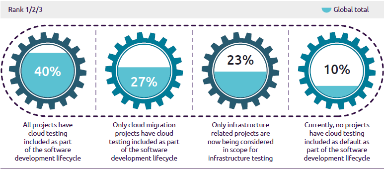

使用此功能可以更轻松地控制项目的质量：你只能专注于最近引入的警告。

注意：新警告的检测基于复杂的算法，该算法试图在源代码的两个不同版本中跟踪同一警告。根据源代码的修改程度，它可能会产生一些误报，即，即使应该没有警告也可能会收到一些新的固定警告。该算法的准确性仍在研究中，并将在接下来的几个月中进行完善。

### Severities 严重程度

该插件在图表中显示问题严重性的分布，它定义了以下默认严重级别，但是扩展警告插件的插件可能会添加其他默认级别。

* **Error**：表示通常会导致构建失败的错误
* **Warning** (High, Normal, Low)：指示给定优先级的警告。映射到优先级取决于各个解析器。

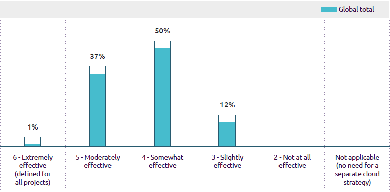

请注意，并非每个解析器都能产生不同严重性的警告。某些解析器仅对所有问题使用相同的严重性。

### Build trend 构建趋势

为了查看分析结果的趋势，几个图表显示了每个构建的问题数量。这些图表用于详细信息页面和作业概述中。当前提供以下不同的趋势图类型：

#### 问题的严重程度分布

默认趋势图显示问题总数，按严重性堆叠。使用此图表，你可以查看哪种严重程度对问题总数贡献最大。


#### 每种静态分析类型的问题

如果你要汇总几个静态分析结果，则类型图将使用单独的一行显示每个工具的问题数量。你可以通过单击相应的图例符号暂时隐藏工具。

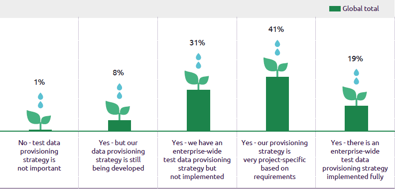

#### 新问题与已修复问题

如果你对积压的问题感兴趣，可以打开新的与固定的图表。它映射了引入的问题与通过一系列构建解决的问题。这可以帮助你了解整个待办事项列表是在增加还是在减少。

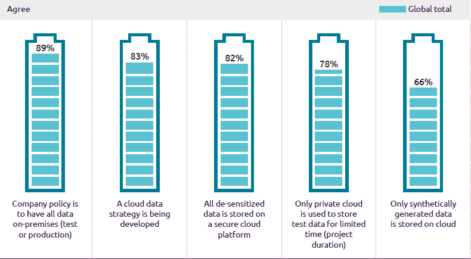

#### 项目健康

仅当启用了运行状况报告后，运行状况图表才可用。在这种情况下，趋势图将显示健康和不健康区域中的警告数量。你的项目目标应该是使警告数量不逃避图表的绿色部分。

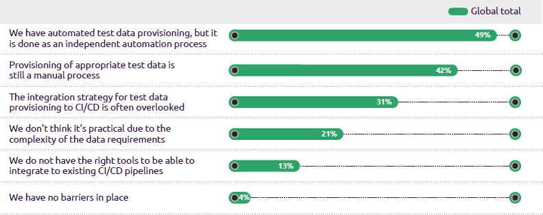

#### 缩放

细节视图中的所有趋势图都支持使用图表底部的范围滑块缩放构建轴。

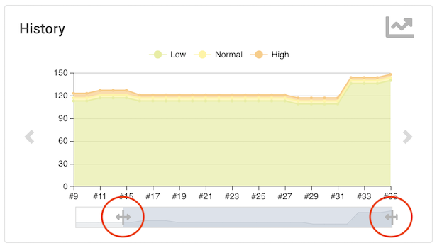

#### 构建与日期轴

详细信息视图中的所有趋势图都可以显示每个构建或每天的警告数量。你可以通过选择右上角的相应图标在X轴变体之间切换，每天显示平均警告数。

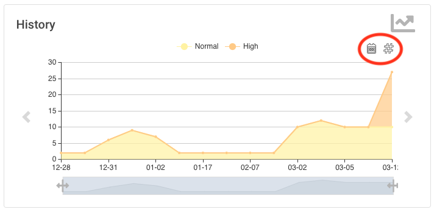

### 问题概述

你可以在几个聚合视图中快速，高效地查看报告的问题集。根据问题的数量或类型，你将看到问题的分布

* Static Analysis Tool（静态分析工具）
* Module（模组）
* Package or Namespace（包或命名空间）
* Severity（严重程度）
* Category（类别）
* Type（类型）

这些详细信息视图中的每一个都是交互式的，即，你可以导航到已分类问题的子集。

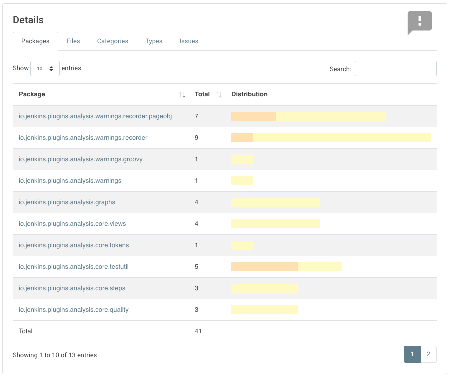

### 问题详情

一组已报告的问题显示在一个现代化的响应表中。该表使用 Ajax 调用按需加载，它提供以下功能：

* **Pagination**（分页）：问题的数量分为几个页面，可以使用提供的页面链接进行选择。请注意，目前分页是在客户端进行的，即从服务器获取整个问题表可能要花费一些时间。
* **Sorting**（排序）：可以通过单击表列中的仅一个来对表内容进行排序。
* **Filtering, Searching**（过滤，搜索）：你可以通过在搜索框中输入一些文本来过滤显示的问题。
* **Content Aware**（内容感知）：仅当有必要显示的内容时才显示列。也就是说，如果工具未报告问题类别，则该类别将被自动隐藏。
* **Responsive**（响应式）：布局应适应实际的屏幕阈值。
* **Details**（详细信息）：问题的详细信息消息（如果由相应的静态分析工具提供）在表中显示为子行。


### 源代码 Blame（归咎于）

这个功能需要安装其他插件：[Git Forensics 插件](https://github.com/jenkinsci/git-forensics-plugin)

如果未在作业配置中禁用，则插件将执行 `git blame` 以确定谁是问题的负责 `author`。在相应的 SCM Blames 视图中，所有问题将与 `auther name`, `email`, 和 `commit ID` 一起列出。

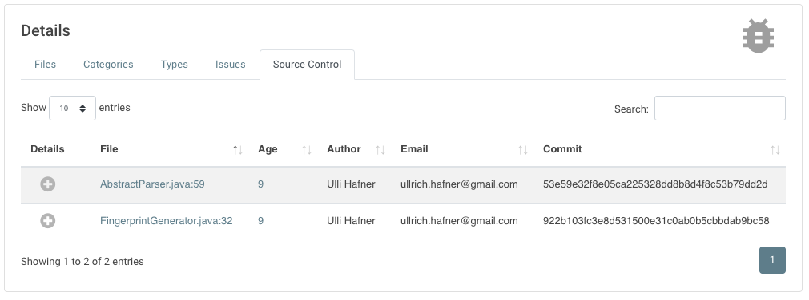

为了禁用 `git blame` 功能，请将属性 `blameDisabled` 设置为 `true`，请参见以下示例：

```bash
recordIssues blameDisabled: true, tool: java(pattern: '*.log')
```

### Git 仓库取证

此功能需要安装其他插件：[Git Forensics 插件](https://github.com/jenkinsci/git-forensics-plugin)

如果未在作业配置中禁用，则该插件将以“犯罪现场代码”的样式（Adam Tornhill，2013年11月）挖掘源代码存储库，以确定受影响文件的统计信息。在相应的 “SCM 取证” 视图中，将列出所有问题以及受影响文件的以下属性：

* 提交总数
* 不同作者总数
* 创作时间
* 最后修改时间
* 源代码控制概述

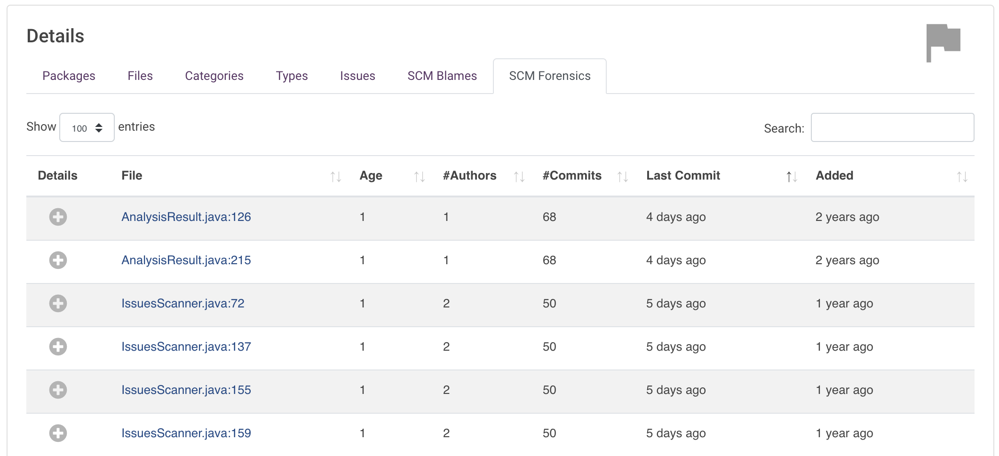

为了禁用 Git 取证功能，请将属性 `forensicsDisabled`设置为 `true`，请参见以下示例：

```bash
recordIssues forensicsDisabled: true, tool: java(pattern: '*.log')
```

### 源代码视图

现在，源代码视图使用 JS 库 Prism 在受影响的文件中显示警告。该库为最流行的语言提供语法高亮显示，并在客户端呈现所有内容。

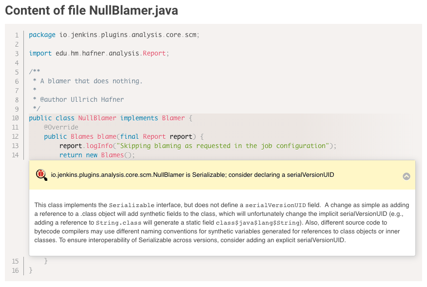

### 发行总数栏

你可以在 Jenkins 作业表的单独列中显示作业的总数。 默认情况下，Jenkins 主列表视图将显示一个新列，该列计算所有工具的发行总数。 你可以添加可以配置的其他列

* 列名
* 应考虑的实际工具
* 要显示的总计类型（总体警告，新警告，特定严重性等），请参阅 “token宏支持” 部分。

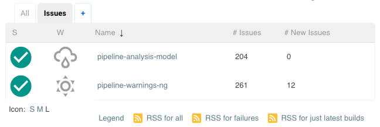

### 仪表板视图支持

还提供对 Jenkins 仪表板视图的支持。当前，以下 portlet 可用：

#### 每个工具和作业表的问题

问题表显示了作业的问题总数（由每个工具分开）。

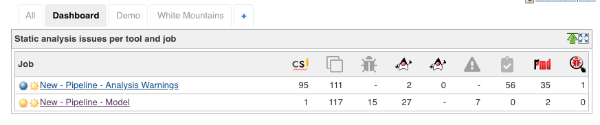

#### 问题趋势

可以将趋势图添加为 portlet，该趋势图显示所有作业的发行总数。

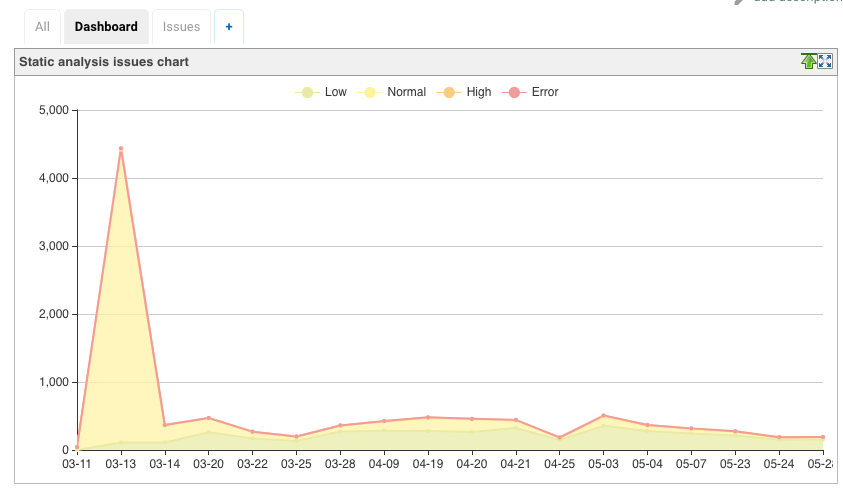

### 远程API

该插件提供以下 REST API 端点。

#### 所有分析结果的汇总摘要

可以使用 URL `[build-url]/warnings-ng/api/json`（或 `[build-url]/warnings-ng/api/xml`）查询构建中已配置的所有静态分析工具。此汇总显示每个工具的 ID，名称，URL 和问题总数。

```json
{
  "_class": "io.jenkins.plugins.analysis.core.restapi.AggregationApi",
  "tools": [
    {
      "id": "maven",
      "latestUrl": "http://localhost:8080/view/White%20Mountains/job/New%20-%20Pipeline%20-%20Simple%20Model/26/maven",
      "name": "Maven Warnings",
      "size": 9
    },
    {
      "id": "java",
      "latestUrl": "http://localhost:8080/view/White%20Mountains/job/New%20-%20Pipeline%20-%20Simple%20Model/26/java",
      "name": "Java Warnings",
      "size": 1
    },
    {
      "id": "javadoc",
      "latestUrl": "http://localhost:8080/view/White%20Mountains/job/New%20-%20Pipeline%20-%20Simple%20Model/26/javadoc",
      "name": "JavaDoc Warnings",
      "size": 0
    },
    {
      "id": "checkstyle",
      "latestUrl": "http://localhost:8080/view/White%20Mountains/job/New%20-%20Pipeline%20-%20Simple%20Model/26/checkstyle",
      "name": "CheckStyle Warnings",
      "size": 0
    },
    {
      "id": "pmd",
      "latestUrl": "http://localhost:8080/view/White%20Mountains/job/New%20-%20Pipeline%20-%20Simple%20Model/26/pmd",
      "name": "PMD Warnings",
      "size": 671
    },
    {
      "id": "spotbugs",
      "latestUrl": "http://localhost:8080/view/White%20Mountains/job/New%20-%20Pipeline%20-%20Simple%20Model/26/spotbugs",
      "name": "SpotBugs Warnings",
      "size": 0
    },
    {
      "id": "cpd",
      "latestUrl": "http://localhost:8080/view/White%20Mountains/job/New%20-%20Pipeline%20-%20Simple%20Model/26/cpd",
      "name": "CPD Warnings",
      "size": 123
    },
    {
      "id": "open-tasks",
      "latestUrl": "http://localhost:8080/view/White%20Mountains/job/New%20-%20Pipeline%20-%20Simple%20Model/26/open-tasks",
      "name": "Open Tasks Scanner Warnings",
      "size": 11
    }
  ]
}
```

#### 分析结果汇总

你可以使用 URL `[build-url]/[tool-id]/api/xml`（或 `[build-url]/[tool-id]/api/json`）获得特定分析报告的摘要。摘要包含问题数量，质量门状态以及所有信息和错误消息。

这是一个示例 XML 报告：

```xml
<analysisResultApi _class='io.jenkins.plugins.analysis.core.restapi.AnalysisResultApi'>
  <totalSize>3</totalSize>
  <fixedSize>0</fixedSize>
  <newSize>0</newSize>
  <noIssuesSinceBuild>-1</noIssuesSinceBuild>
  <successfulSinceBuild>-1</successfulSinceBuild>
  <qualityGateStatus>WARNING</qualityGateStatus>
  <owner _class='org.jenkinsci.plugins.workflow.job.WorkflowRun'>
    <number>46</number>
    <url>http://localhost:8080/view/White%20Mountains/job/Full%20Analysis%20-%20Model/46/</url>
  </owner>
  <infoMessage>Searching for all files in '/tmp/node1/workspace/Full Analysis - Model' that match the pattern
    '**/target/spotbugsXml.xml'
  </infoMessage>
  <infoMessage>-> found 1 file</infoMessage>
  <infoMessage>Successfully parsed file /tmp/node1/workspace/Full Analysis - Model/target/spotbugsXml.xml</infoMessage>
  <infoMessage>-> found 3 issues (skipped 0 duplicates)</infoMessage>
  <infoMessage>Post processing issues on 'node1' with encoding 'UTF-8'</infoMessage>
  <infoMessage>Resolving absolute file names for all issues</infoMessage>
  <infoMessage>-> affected files for all issues already have absolute paths</infoMessage>
  <infoMessage>Copying affected files to Jenkins' build folder /Users/hafner/Development/jenkins/jobs/Full Analysis -
    Model/builds/46
  </infoMessage>
  <infoMessage>-> 2 copied, 0 not in workspace, 0 not-found, 0 with I/O error</infoMessage>
  <infoMessage>Resolving module names from module definitions (build.xml, pom.xml, or Manifest.mf files)</infoMessage>
  <infoMessage>-> all issues already have a valid module name</infoMessage>
  <infoMessage>Resolving package names (or namespaces) by parsing the affected files</infoMessage>
  <infoMessage>-> all affected files already have a valid package name</infoMessage>
  <infoMessage>Creating fingerprints for all affected code blocks to track issues over different builds</infoMessage>
  <infoMessage>No filter has been set, publishing all 3 issues</infoMessage>
  <infoMessage>No valid reference build found - all reported issues will be considered outstanding</infoMessage>
  <infoMessage>Evaluating quality qualityGates</infoMessage>
  <infoMessage>-> WARNING - Total number of issues: 3 - Quality Gate: 1</infoMessage>
  <infoMessage>-> Some quality qualityGates have been missed: overall result is WARNING</infoMessage>
  <infoMessage>Health report is disabled - skipping</infoMessage>
</analysisResultApi>
```

### Token 宏支持

Warnings 插件提供了 token `ANALYSIS_ISSUES_COUNT`，可用于其他后期构建处理步骤，例如在邮件中。为了使用此 token，你需要安装 token 宏插件。token 具有以下可选参数：

* `tool`：选择特定的分析结果，如果未定义，则将所有结果相加
* `type`：选择要使用的计数器的类型，请选择以下之一
  * Total（任何严重性）
  * Total（仅错误）
  * Total（仅严重度高）
  * Total（仅严重级别正常）
  * Total（仅限严重性低）
  * New  （任何严重程度）
  * New  （仅限错误）
  * New  （仅限严重性高）
  * New  （仅严重性为正常）
  * New  （仅限严重性低）
  * Delta（任何严重程度）
  * Delta（仅错误）
  * Delta（仅严重度高）
  * Delta（仅严重等级正常）
  * Delta（仅严重度低）
  * Fixed（任何严重性）

例子：

`${ANALYSIS_ISSUES_COUNT}`：扩展到所有分析工具的合计数量

`${ANALYSIS_ISSUES_COUNT, tool="checkstyle"}`：扩展到CheckStyle问题的总数

`${ANALYSIS_ISSUES_COUNT, tool="checkstyle", type: "NEW"}`：扩展到新的 CheckStyle 问题数

## 从静态分析套件过渡

以前，静态分析套件的插件提供了相同的功能集（CheckStyle，PMD，FindBugs，静态分析实用工具，Analysis Collector，任务扫描器，Warnings 等）。为了简化用户体验和开发过程，这些插件和核心功能已合并到Warnings Next Generation 插件中。这些旧的静态分析插件不再需要，现在已经停产。如果当前使用这些旧插件之一，则应尽快迁移到新的记录器和步骤。我仍然会保留旧代码一段时间，但是主要的开发工作将花在新的代码库中。

* 迁移 Pipelines

调用旧的静态分析步骤（例如，findbug，checkstyle 等）的管道需要立即调用新的 recordIssues 步骤。所有静态分析工具都使用相同的步骤，使用 step 属性工具选择实际的解析器。有关可用参数集的更多详细信息，请参见“[配置](https://github.com/jenkinsci/warnings-ng-plugin/blob/master/doc/Documentation.md#configuration)”部分。

* 迁移其他所有工作

使用旧版 API 的 Freestyle，Matrix 或 Maven Jobs 使用了由每个插件提供的所谓的 Post Build Action。例如，FindBugs 插件确实提供了构建后操作“发布 FindBugs 分析结果”。这些旧的插件特定操作不再受支持，它们现在在用户界面中标记为 [Deprecated]。现在，你需要添加一个新的后期构建步骤-对于所有静态分析工具，此步骤现在称为“记录编译器警告和静态分析结果”。工具的选择是此后期构建步骤配置的一部分。注意：新的后期制作操作无法读取使用旧 API 的后期制作步骤所产生的警告。也就是说，你看不到新旧结果的合并历史记录-你仅看到两个不相关的结果。也不会自动转换以旧格式存储的结果。

*  插件的迁移取决于分析核心

以下插件已集成到此警告插件的新版本中：

* Android-Lint 插件
* Analysis Collector 插件
* CheckStyle 插件
* CCM 插件
* Dry 插件
* PMD 插件
* FindBugs 插件
* Tasks Scanner 插件
* Warnings 插件

所有其他插件仍需要集成或需要重构以使用新的 API
