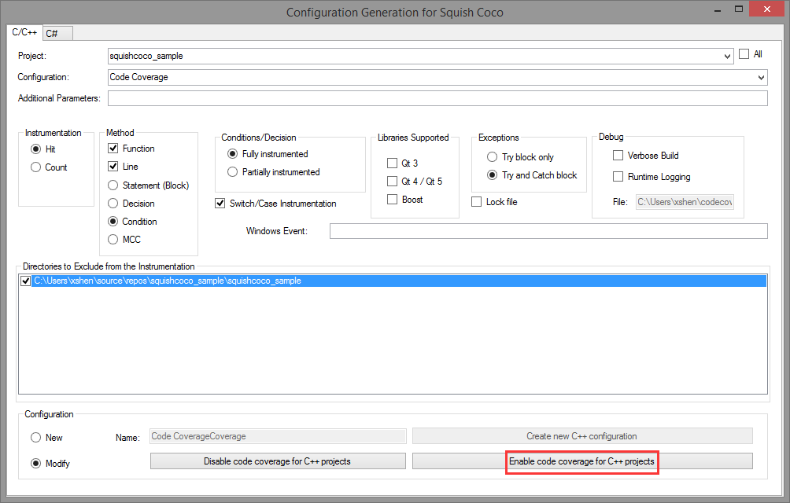

## 准备工作

1. 申请 [免费试用许可](https://www.froglogic.com/coco/free-trial/) 并安装  
   * 会收到包含用户名/密码的邮件，用于登录下载。
2. 本文测试环境为 Windows，因此下载并安装 Windows 版本的 Squish Coco 及其 VS 插件。
3. 安装 Visual Studio 2010 及以上版本（本文使用 VS2017 Professional）。

---

## 安装 VS 插件

进入 `..squishcoco\Setup` 目录，双击 `SquishCocoVSIX2017.vsix`，重新打开 VS2017 后即可看到插件入口。

---

## 创建示例项目

1. 在 Visual Studio 中选择 **File → New → Project...**  
2. 选择 **Visual C++** → **Win32 Console Application** 模板。
3. 项目命名为 `squishcoco_sample`，点击 **OK** → **Finish**。

此时程序尚未插桩，需要为构建添加新的配置。


1. 打开 **Build → Configuration Manager...**
2. 在 **Configuration** 列点击 **New...**
3. 在 **New Project Configuration** 窗口中：
   * Name 填写 `Code Coverage`
   * Copy settings from 选择 `Release` 或 `Debug`
   * 点击 **OK**

---

## 添加测试代码

`squishcoco_sample.cpp`
```c
#include "stdafx.h"
extern int myprint();

int _tmain(int argc, _TCHAR* argv[]) {
    int age;
    printf("Enter your age: ");
    scanf("%d", &age);
    if (age > 0 && age <= 40)
        printf("You're young guys\n");
    else if (age > 40 && age <= 70)
        printf("You're midle guys\n");
    else if (age > 70 && age <= 100)
        printf("You're old guys\n");
    else
        printf("You're awesome\n");

    myprint();
    return 0;
}
```

`myprint.cpp`

```c
#include "stdafx.h"

int myprint() {
    printf("you have call printf function\n");
    return 0;
}
```

---

## 启用代码覆盖率插桩

使用 VS 插件：



1. 点击 **Tools → Code Coverage Build Mode...**
2. Project 选择 `squishcoco_sample`
3. Configuration 选择 `Code Coverage`
4. 底部选择 **Modify** → 点击 **Enable code coverage for C++ projects**

执行后，SquishCoco 会在输出窗口显示对编译器、链接器等附加的参数配置。

---

## 构建项目

构建后会生成：

* 可执行文件 `squishcoco_sample.exe`
* 插桩信息文件 `squishcoco_sample.exe.csmes`

双击 `.csmes` 文件会在 CoverageBrowser 中打开，此时因未运行程序，所有插桩行会显示为灰色。

---

## 收集和查看覆盖率结果

1. 双击运行 `squishcoco_sample.exe`，会生成 `squishcoco_sample.exe.csexe` 覆盖率快照文件。
2. 在 CoverageBrowser 中：

   * 点击 **File → Load Execution Report...**
   * 选择快照文件并 **Import**
3. 代码窗口中已执行的行会以绿色高亮显示。

---

## 最终结果示例


