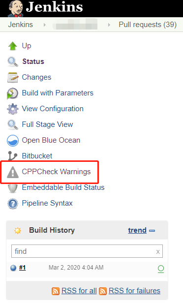
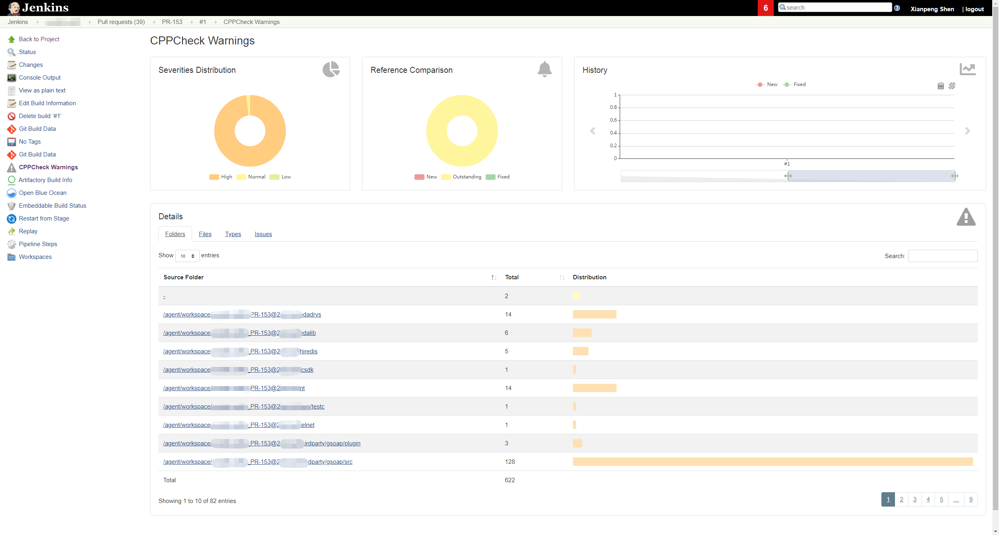

Due to historical reasons, our current product's code repository has many warnings that cannot be resolved immediately. Only by continuously enriching automated test cases to ensure the final quality control can we proceed with the orderly repair of warnings. Before that, how to effectively prevent the introduction of more warnings is what we should be doing now.


Therefore, I want to integrate C/C++ static code scanning into the Pull Request phase. However, many tools related to C/C++ are often commercial, such as SonarQube, which is our first choice. The Community version does not support C/C++ code scanning; only the Developer and Enterprise paid versions support it. Before static code scanning brings any return on investment, blindly paying will only increase the cost for the product. Therefore, I decided to look for other open-source tools as a replacement.

Finally, I chose CPPCheck, mainly for the following reasons:

1. It's one of the few open-source static code scanning tools for C/C++.
2. It can be integrated with Jenkins, allowing you to view the report in Jenkins.
3. It supports Jenkins Pipeline.

This article documents my investigation and usage experience. If you have similar needs, this might provide some reference.

## Installing Cppcheck

Installation on Linux

```bash
sudo yum install cppcheck.x86_64
```

For installation on other platforms, please refer to the cppcheck [official website](http://cppcheck.sourceforge.net/).

If you can't install it with a single command on Linux, you can also build cppcheck from source code. The following steps show how to manually build a cppcheck executable file from the source code:

```bash
cd opt && mkdir cppcheck && cd cppcheck
# Download the code
wget https://github.com/danmar/cppcheck/archive/1.90.tar.gz
# Extract
tar -xvf 1.90.tar.gz
# Make build
cd cppcheck-1.90
mkdir build
cd build
cmake ..
cmake --build .
# link
sudo ln -s /opt/cppcheck/cppcheck-1.90/build/bin/cppcheck /usr/bin/cppcheck
# Check if the installation was successful
which cppcheck
/usr/bin/cppcheck
cppcheck --version
Cppcheck 1.90
```

## Using cppcheck for Static Code Scanning

Before integrating with Jenkins, let's see how to use this tool. By consulting the [Cppcheck official documentation](http://cppcheck.sourceforge.net/manual.pdf), the general usage is as follows:

```bash
# For example, scan the code under the src/public and src/themes directories and output the results to cppcheck.xml
cppcheck src/public src/themes --xml 2> cppcheck.xml
```

## Integrating Cppcheck with Jenkins

First, download the Cppcheck Jenkins [plugin](https://plugins.jenkins.io/cppcheck/). The following code `publishCppcheck pattern: 'cppcheck.xml'` was generated through Pipeline Syntax.

However, when reading the XML file to display the report, I encountered two problems:

Problem 1: The analysis of `cppcheck.xml` succeeded on some Linux machines but failed on others. I suspect this is due to different JDK versions. I also found this issue on Jenkins JIRA [JENKINS-60077](https://issues.jenkins-ci.org/browse/JENKINS-60077), but it hasn't been resolved yet.

The main reason I didn't continue trying to solve Problem 1 is that it has a more fatal flaw, as described below.

Problem 2: I cannot directly view the code through the Cppcheck Results report. Even if problems are scanned, I still need to check the specific problems in Git or the local IDE, which greatly reduces efficiency.

```bash
# An error occurs when viewing the code file
Can't read file: Can't access the file: file:/disk1/agent/workspace/cppcheck-ud113/src/public/dummy/err_printf.c
```

The official ticket also records this issue [JENKINS-42613](https://issues.jenkins-ci.org/browse/JENKINS-42613) and [JENKINS-54209](https://issues.jenkins-ci.org/browse/JENKINS-54209). JENKINS-42613 is waiting to be merged, and as of this writing, it is still unresolved.

Finally, I found that [Warnings Next Generation](https://plugins.jenkins.io/warnings-ng/) plugin will replace the entire Jenkins static analysis suite, including plugins like Android Lint, CheckStyle, Dry, FindBugs, PMD, Warnings, Static Analysis Utilities, Static Analysis Collector. Finally, the Warnings Next Generation plugin solved the problem of report display.

Here, you can generate the code for reading the report through Pipeline Syntax: `recordIssues(tools: [cppCheck(pattern: 'cppcheck.xml')])`

For more information on using the Warnings Next Generation plugin, please refer to the [documentation](https://github.com/jenkinsci/warnings-ng-plugin/blob/master/doc/Documentation.md).

### Final Pipeline Example

```bash
pipeline{
  agent {
    node {
      label 'cppcheck'
      customWorkspace "/agent/workspace/cppcheck"
    }
  }

  parameters {
    string(name: 'Branch', defaultValue: 'develop', description: 'Which branch do you want to do cppcheck?')
  }

  options {
    timestamps ()
    buildDiscarder(logRotator(numToKeepStr:'50'))
  }

  stage("Checkout"){
    steps{
      checkout([$class: 'GitSCM', branches: [[name: '*/${Branch}']],
      browser: [$class: 'BitbucketWeb', repoUrl: 'https://git.yourcompany.com/projects/repos/cppcheck-example/browse'],
      doGenerateSubmoduleConfigurations: false, extensions: [
      [$class: 'LocalBranch', localBranch: '**'], [$class: 'CheckoutOption', timeout: 30], [$class: 'CloneOption', depth: 1, noTags: false, reference: '', shallow: true,   timeout: 30]], submoduleCfg: [],
      userRemoteConfigs: [[credentialsId: 'CREDENTIALS_ID', url: 'https://git.yourcompany.com/scm/cppcheck-example.git']]])
    }
  }
  stage("Cppcheck"){
    steps{
      script {
        sh 'cppcheck src/public src/themes --xml 2> cppcheck.xml'
      }
    }
  }
  stage('Publish results'){
    steps {
      recordIssues(tools: [cppCheck(pattern: 'cppcheck.xml')])
    }
  }
}
```

### Report Display

I applied CPPCheck to each Pull Request. When a developer submits new code, CPPCheck scans the code and compares it with the previous history.  When CPPCheck executes successfully and generates a report, a button appears, which you can click to access it.



After opening it, you will see the scan results for the current branch code.



CPPCheck uses three dimensions to display static code scan results:

1. Severity Distribution: This is divided into three levels: High, Normal, and Low.

2. Reference Comparison: This compares the data with previous data.  New issues are displayed as New, existing issues as Outstanding, and resolved issues as Fixed.

3. History: This displays a historical trend as the code is added and modified.

Note: The cppcheck-related XML files are stored on the Jenkins master. Only when the current Jenkins Job is manually deleted will the cppcheck XML files be deleted.

```bash
-sh-4.2$ ls -l cppcheck*
-rw-r--r-- 1 jenkins jenkins 418591 Feb 27 05:54 cppcheck-blames.xml
-rw-r--r-- 1 jenkins jenkins    219 Feb 27 05:54 cppcheck-fixed-issues.xml
-rw-r--r-- 1 jenkins jenkins 142298 Feb 27 05:54 cppcheck-forensics.xml
-rw-r--r-- 1 jenkins jenkins    219 Feb 27 05:54 cppcheck-new-issues.xml
-rw-r--r-- 1 jenkins jenkins 488636 Feb 27 05:54 cppcheck-outstanding-issues.xml
```


Clicking the corresponding link will directly jump to the specific code warning location.

Isn't it pretty good?