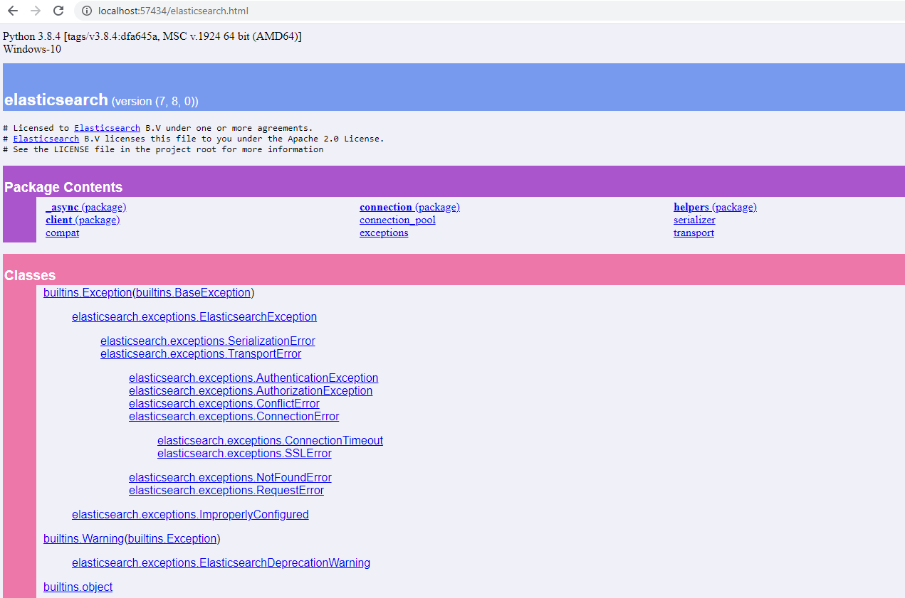

本篇介绍个人或企业在 GitHub 上发布一个 Python 项目需要了解和注意哪些内容

1. [如何配置setup.py](#配置setup.py)
2. [如何发布到PyPI](#发布到PyPI)
3. [生成pydoc](#关于pydoc)
4. [版本号的选择](#关于版本号)
5. [License的选择](#选择License)

## 配置setup.py

打包和发布一项都是通过准备一个 `setup.py` 文件来完成的。假设你的项目目录结构如下：

```bash
demo
├── LICENSE
├── README.md
├── MANIFEST.in # 打包时，用来定制化生成 `dist/*.tar.gz` 里的内容
├── demo
│   └── __init__.py
├── setup.py
├── tests
│   └── __init__.py
│   └── __pycache__/
└── docs
```

在使用打包命令 `python setup.py sdist bdist_wheel`，将会生成在 dist 目录下生成两个文件 `demo-1.0.0-py3-none-any.whl` 和 `demo-1.0.0.tar.gz`

* `.whl` 文件是用于执行 `pip install dist/demo-1.0.0-py3-none-any.whl` 将其安装到 `...\Python38\Lib\site-packages\demo` 目录时使用的文件。

* `.tar.gz` 是打包后的源代码的存档文件。而 `MANIFEST.in` 则是用来控制这个文件里到底要有哪些内容。


下面例子是如何使用 `MANIFEST.in` 来定制化生成 `dist/*.tar.gz` 里的内容。`MANIFEST.in` 文件内容如下：

```python
include LICENSE
include README.md
include MANIFEST.in
graft demo
graft tests
graft docs
global-exclude __pycache__
global-exclude *.log
global-exclude *.pyc
```

根据以上文件内容，在使用命令 `python setup.py sdist bdist_wheel` 生成 `demo-1.0.0.tar.gz` 文件时会包含 `LICENSE`, `README.md`, `MANIFEST.in` 这三个文件，并且还会包含 `demo`, `tests`, `docs` 三个目录下的所有文件，最后排除掉所有的 `__pycache__`, `*.log`, `*.pyc` 文件。

更多关于  `MANIFEST.in` 文件的语法请参看 https://packaging.python.org/guides/using-manifest-in/

> 官方有详细的示例和文档 https://packaging.python.org/tutorials/packaging-projects/
>
> Python sample 项目供你参考 https://github.com/pypa/sampleproject

攒点耐心将上面的链接看完，就完全满足一般项目的发布要求了。

## 发布到PyPI

使用 Python 大家都知道可以通过以下命令来下载你要是使用的外部库，Python 有着大量的第三方库，将开源项目发布到 PyPI 上方便用户使用。

```bash
pip install xxxx
```

### 什么是 PyPI

PyPI 是 The Python Package Index 的缩写，意思是 Python 包索引仓库，用来查找、安装和发布 Python 包。

PyPI 有两个环境

* 测试环境 [TestPyPI](https://test.pypi.org/)
* 正式环境 [PyPI](https://pypi.org/)

### 准备

1. 如果想熟悉 PyPI 发布工具和发布流程可以使用测试环境 [TestPyPI](https://test.pypi.org/)
2. 如果已经熟悉了 PyPI 的发布工具和流程可以直接使用正式环境 [PyPI](https://pypi.org/)
3. TestPyPI 和 PyPI 需要单独注册，即在正式环境注册了，如果去使用测试环境也同样需要注册。注意：同一个账号不能在 PyPI 和 TestPyPI 同时注册。

假设你的项目已经完成了，准备要发布到 PyPI 了，执行下面的命令，就可以将项目发布到 PyPI 上了。

```bash
rm dist/*
# 生成代码存档 .tar.gz 文件和构建文件 .whl 文件
python setup.py sdist bdist_wheel
# 如果发布到TestPyPI使用以下命令
twine upload --repository testpypi dist/*
# 如果发布到PyPI使用以下命令
twine upload dist/*
```

## 关于pydoc

Python 内置了 doc 的功能，叫 `pydoc`。执行 `python -m pydoc` 可以看到它有哪些选项和功能。

```bash
cd docs
python -m pydoc -w ..\   # 生成全部文档
```

执行 `python -m pydoc -b` 可以在本地立即启动一个 web 页面来访问你 `...\Python38\Lib\site-packages\` 目录下所有 Libraries 文档。



这些本地的 web 文档如何在外网进行访问？可以通过 GitHub 有内置的 GitHub Pages 功能，很容易提供一个在线网址。

打开你的 GitHub python 项目设置选项 -> 找到 GitHub Pages -> Source 选择你的分支和路径，保存后就立刻拥有了一个网址。例如：

* https://xxxxx.github.io/demo/ 是你的项目主页，显示是 README.md 信息
* https://xxxxx.github.io/demo/docs/demo.html 是你的项目的 pydoc 文档

## 关于版本号

另外如果是正式版本，在发布还需要注意版本号的选择。

* 如果是功能简单，完成度也不高，建议从 0.0.1 版本开始。
* 如果是功能完善，且完成度很高，那么可以从 1.0.0 版本开始。

比如一个项目从准备发布到正式发布有四个阶段：Alpha, Beta, 候选发布以及正式发布。假如正式发布的版本号是 1.1.0 版本，根据以下的版本标识的规范：

```text
X.YaN   # Alpha release
X.YbN   # Beta release
X.YrcN  # Release Candidate
X.Y     # Final release
```

得到 Alpha, Beta, 候选发布及正式发布版本分别如下：

Alpha release 版本号是 `1.1.0a1, 1.1.0a1, 1.1.0aN...`\
Beta release  版本号是 `1.1.0b1, 1.1.0b1, 1.1.0bN...`\
Release Candidate 版本号是 `1.1.0rc1, 1.1.0rc2, 1.1.0rcN...`\
Final release 版本号 `1.1.0, 1.1.1, 1.1.N...`

> Python 官方的[版本标识和依赖规范文档](https://www.python.org/dev/peps/pep-0440/)

## 选择License

企业级的项目 License 一般由公司的法律团队来提供，发布者只需拿到 License 文件做一些格式化工作（比如将 license.txt 文件格式化为每行 70~80 个字符）。

如果是个人项目或是想了解开源许可相关的介绍，常见的软件开源许可证（以下许可证是按条件数量排序的）

* GNU AGPLv3
* GNU GPLv3
* GNU LGPLv3
* Mozilla Public License 2.0
* Apache License 2.0
* MIT License
* Boost Software License 1.0
* The Unlicense

这里有一篇关于《[Github仓库如何选择开源许可证](https://mp.weixin.qq.com/s/CjeWol3BdGkmGZi-zMnDkQ)》文章供参考。

> 如何选项 License https://choosealicense.com/licenses\
> 如何选项 License GitHub 仓库 https://github.com/github/choosealicense.com\
> 如何选项 License 附录 https://choosealicense.com/appendix \
