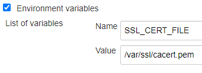

> 本文对于同样在 AIX 遇到这个问题的人会非常有帮助。另外，不要被标题无聊到，解决问题的过程值得参考。

分享一个花了两天时间才解决的一个问题：使用 Jenkins Artifactory 插件上传制品到 https 协议的企业级的 Artifactory 失败。该问题只在 AIX 平台上出现的，其他 Windows，Linux, Unix 均正常。


## 前言

最近计划将之前使用的 Artifactory OSS（开源版）迁移到 Artifactory Enterprise（企业版）上。为什么要做迁移？这里有一个 Artifactory 对比的矩阵图 https://www.jfrog.com/confluence/display/JFROG/Artifactory+Comparison+Matrix

简单来说，开源版缺少与 CI 工具集成时常用的 REST API 功能，比如以下常用功能

* 设置保留策略(Retention)。设置上传的制品保留几天等，达到定期清理的目的。
* 提升(Promote)。通过自动化测试的制品会被提升到 stage（待测试）仓库，通过手工测试的提升到 release（发布）仓库。
* 设置属性(set properties)。对于通过不同阶段的制品通过 CI 集成进行属性的设置。

正好公司已经有企业版了，那就开始迁移吧。本以为会很顺利的完成，没想到唯独在 IBM 的 AIX 出现上传制品失败的问题。

> 环境信息
> * Jenkins ver. 2.176.3
> * Artifactory Plugin 3.6.2
> * Enterprise Artifactory 6.9.060900900
> * AIX 7.1 && java version 1.8.0

以下是去掉了无相关的信息的错误日志。

```java
[consumer_0] Deploying artifact: https://artifactory.company.com/artifactory/generic-int-den/database/develop/10/database2_cdrom_opt_AIX_24ec6f9.tar.Z
Error occurred for request GET /artifactory/api/system/version HTTP/1.1: A system call received a parameter that is not valid. (Read failed).
Error occurred for request PUT /artifactory/generic-int-den/database/develop/10/database2_cdrom_opt_AIX_24ec6f9.tar.Z;build.timestamp=1591170116591;build.name=develop;build.number=10 HTTP/1.1: A system call received a parameter that is not valid. (Read failed).
Error occurred for request PUT /artifactory/generic-int-den/database/develop/10/database2_cdrom_opt_AIX_24ec6f9.tar.Z;build.timestamp=1591170116591;build.name=develop;build.number=10 HTTP/1.1: A system call received a parameter that is not valid. (Read failed).
[consumer_0] An exception occurred during execution:
 java.lang.RuntimeException: java.net.SocketException: A system call received a parameter that is not valid. (Read failed)
 	at org.jfrog.build.extractor.clientConfiguration.util.spec.SpecDeploymentConsumer.consumerRun(SpecDeploymentConsumer.java:44)
 	at org.jfrog.build.extractor.producerConsumer.ConsumerRunnableBase.run(ConsumerRunnableBase.java:11)
 	at java.lang.Thread.run(Thread.java:785)
 Caused by: java.net.SocketException: A system call received a parameter that is not valid. (Read failed)
 	at java.net.SocketInputStream.socketRead(SocketInputStream.java:127)
 	at java.net.SocketInputStream.read(SocketInputStream.java:182)
 	at java.net.SocketInputStream.read(SocketInputStream.java:152)
 	at com.ibm.jsse2.a.a(a.java:227)
 	at com.ibm.jsse2.a.a(a.java:168)
 	at com.ibm.jsse2.as.a(as.java:702)
 	at com.ibm.jsse2.as.i(as.java:338)
 	at com.ibm.jsse2.as.a(as.java:711)
 	at com.ibm.jsse2.as.startHandshake(as.java:454)
 	at org.apache.http.conn.ssl.SSLConnectionSocketFactory.createLayeredSocket(SSLConnectionSocketFactory.java:436)
 	at org.apache.http.conn.ssl.SSLConnectionSocketFactory.connectSocket(SSLConnectionSocketFactory.java:384)
 	at org.apache.http.impl.conn.DefaultHttpClientConnectionOperator.connect(DefaultHttpClientConnectionOperator.java:142)
 	at org.apache.http.impl.conn.PoolingHttpClientConnectionManager.connect(PoolingHttpClientConnectionManager.java:374)
 	at org.apache.http.impl.execchain.MainClientExec.establishRoute(MainClientExec.java:393)
 	at org.apache.http.impl.execchain.MainClientExec.execute(MainClientExec.java:236)
 	at org.apache.http.impl.execchain.ProtocolExec.execute(ProtocolExec.java:186)
 	at org.apache.http.impl.execchain.RetryExec.execute(RetryExec.java:89)
 	at org.apache.http.impl.execchain.ServiceUnavailableRetryExec.execute(ServiceUnavailableRetryExec.java:85)
 	at org.apache.http.impl.execchain.RedirectExec.execute(RedirectExec.java:110)
 	at org.apache.http.impl.client.InternalHttpClient.doExecute(InternalHttpClient.java:185)
 	at org.apache.http.impl.client.CloseableHttpClient.execute(CloseableHttpClient.java:83)
 	at org.jfrog.build.client.PreemptiveHttpClient.execute(PreemptiveHttpClient.java:89)
 	at org.jfrog.build.client.ArtifactoryHttpClient.execute(ArtifactoryHttpClient.java:253)
 	at org.jfrog.build.client.ArtifactoryHttpClient.upload(ArtifactoryHttpClient.java:249)
 	at org.jfrog.build.extractor.clientConfiguration.client.ArtifactoryBuildInfoClient.uploadFile(ArtifactoryBuildInfoClient.java:692)
 	at org.jfrog.build.extractor.clientConfiguration.client.ArtifactoryBuildInfoClient.doDeployArtifact(ArtifactoryBuildInfoClient.java:379)
 	at org.jfrog.build.extractor.clientConfiguration.client.ArtifactoryBuildInfoClient.deployArtifact(ArtifactoryBuildInfoClient.java:367)
 	at org.jfrog.build.extractor.clientConfiguration.util.spec.SpecDeploymentConsumer.consumerRun(SpecDeploymentConsumer.java:39)
 	... 2 more
Failed uploading artifacts by spec
```

很奇怪会出现上述问题，从开源版的 Artifactory 迁移到企业版的 Artifactory，它们之间最直接的区别是使用了不同的传输协议，前者是 http 后者是 https。

> HTTPS 其实是有两部分组成：HTTP + SSL/TLS，也就是在 HTTP 上又加了一层处理加密信息的模块，因此更安全。

本以为 Google 一下就能找到此类问题的解决办法，可惜这个问题在其他平台都没有，只有 AIX 上才有，肯定这个 AIX 有什么“过人之处”和其他 Linux/Unix 不一样。

## 使用 `curl` 来替代

由于上述问题重现在需要重新构建，比较花时间，就先试试直接用 `curl` 命令来调用 Artifactory REST API 看看结果。

做了以下测试，查看 Artifactory 的版本

```bash
curl  https://artifactory.company.com/artifactory/api/system/version
curl: (35) Unknown SSL protocol error in connection to artifactory.company.com:443

# 打开 -v 模式，输出更多信息
bash-4.3$ curl -v  https://artifactory.company.com/artifactory/api/system/version
*   Trying 10.18.12.95...
* Connected to artifactory.company.com (10.18.12.95) port 443 (#0)
* Cipher selection: ALL:!EXPORT:!EXPORT40:!EXPORT56:!aNULL:!LOW:!RC4:@STRENGTH
* TLSv1.2 (OUT), TLS handshake, Client hello (1):
* TLSv1.2 (IN), TLS handshake, Server hello (2):
* NPN, negotiated HTTP1.1
* TLSv1.2 (IN), TLS handshake, Certificate (11):
* TLSv1.2 (OUT), TLS alert, Server hello (2):
* Unknown SSL protocol error in connection to artifactory.company.com:443
* Closing connection 0
curl: (35) Unknown SSL protocol error in connection to artifactory.company.com:443
```

果然也出错了，`curl` 也不行，可能就是执行 `curl` 命令的时候没有找到指定证书，查了 `curl` 的 help，有 `--cacert` 参数可以指定 cacert.pem 文件。

```bash
bash-4.3$ curl --cacert /var/ssl/cacert.pem https://artifactory.company.com/artifactory/api/system/version
{
  "version" : "6.9.0",
  "revision" : "60900900",
  "addons" : [ "build", "docker", "vagrant", "replication", "filestore", "plugins", "gems", "composer", "npm", "bower", "git-lfs", "nuget", "debian", "opkg", "rpm", "cocoapods", "conan", "vcs", "pypi", "release-bundle", "replicator", "keys", "chef", "cran", "go", "helm", "rest", "conda", "license", "puppet", "ldap", "sso", "layouts", "properties", "search", "filtered-resources", "p2", "watch", "webstart", "support", "xray" ],
  "license" : "xxxxxxxxxxxxxxxxxxxxxxxxxxxxxxxxxxxx"
}
```

试了下成功了。

到这里问题已经解决了，只要使用 `curl` 调用 Artifactory REST API 就能完成上传操作了。但我用的 Jenkins Artifactory Plugin，如果使用 `curl` 我需要把之前的代码重新再实现一遍，然后再测试，就为了 AIX 一个平台的问题，实在是“懒”的重新开始。本着这样懒惰的性格，还得继续解决 Jenkins 调用 agent 去执行上传失败的问题。

## 最终解决办法

### 尝试设置 `SSL_CERT_FILE` 环境变量

想试试用上述的办法来解决 Jenkins 的问题。如果能有一个环境变量能设置指定 cacert.pem 文件的路径，那样在 Jenkins 调用 agent 执行上传时候就能找到证书，可能就能解决这个问题了。果然是有这样的环境变量的 `SSL_CERT_FILE`，设置如下

```bash
set SSL_CERT_FILE=/var/ssl/cacert.pem
```

设置好环境变量之后，通过 `curl` 调用，再不需要使用 `--cacert` 参数了。这下看起来有戏了，带着喜悦的心情把这个环境变量加到 agent 机器上，设置如下：



或者可以修改 agent 机器上的 `/etc/environment` 文件。

结果经测试错误信息依旧，看来 Jenkins 执行的 remote.jar 进行上传时跟本地配置环境没有关联，看来需要从执行 remote.jar 着手，把相应的设置或是环境变量在启动 remote.jar 时传进去。

> Jenkins 管理 agent 的原理是通过在 agent 上启动一个 remote.jar 实现的

### 在启动 remote.jar 时设置环境变量

`java` 的 `-D` 参数可以完成这一点。

进行了大量的搜索和尝试，最终在 IBM 的官方找到了这篇文档 https://www.ibm.com/support/knowledgecenter/SSYKE2_8.0.0/com.ibm.java.security.component.80.doc/security-component/jsse2Docs/matchsslcontext_tls.html

文档大意是，IBM SDK 系统属性 `com.ibm.jsse2.overrideDefaultTLS=[true|false]` 有 `true` 和 `false` 两个值，如果想要与 Oracle `SSLContext.getInstance("TLS")` 的行为相匹配，请将此属性设置为 `true`，默认值为 `false`。

下表显示了系统属性对 SSLContext.getInstance("TLS") 的影响

| Property value setting | Protocol enabled |
|---|---|
| false | TLS V1.0 |
| true | TLS V1.0, V1.1, and V1.2 |

绝大多数的 Java 应用都是使用 Oracle 的 JDK 来开发的，这里要与 Oracle 的行为保持一致；另外 IBM 的 SDK 默认协议只有 TLS V1.0，而上面的 log 可以看到使用的 TLSv1.2 协议，因此需要将属性设置为 `true`。

最终在 Jenkins 的 agent 配置里将 JVM Options 区域加上这句 `-Dcom.ibm.jsse2.overrideDefaultTLS=true`，断开连接，重新启动 agent，再次执行 Pipeline，成功的把 AIX 上的制品上传到 Artifactory 上了，问题解决了。

## 总结

遇到问题并解决问题是一件非常爽的事，从中也学到了很多之前不曾了解过的知识，解决问题的过程比 Google 随便查查更让人印象深刻，再遇到此类问题可能就会举一反三了。

另外，凡事如果觉得自己在短时间内没有头绪、自己搞不定的时候尽快寻求有经验的同事的帮助。感谢帮助我的同事们，没有他们的帮助和指导就不能这么快的解决问题。
