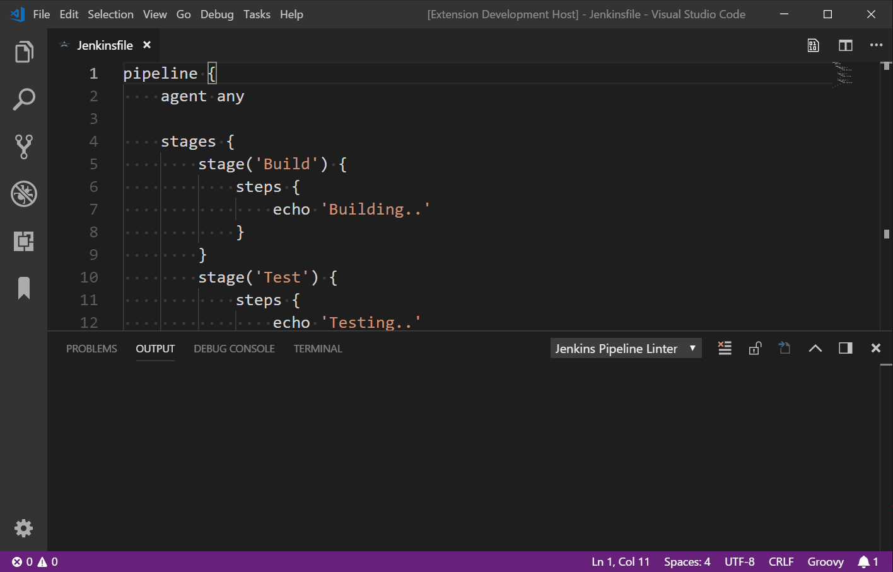

我在做 Jenkins 声明式流水线开发时常会遇到的问题是：修改后的 Pipeline 看起来没有问题，当提交到代码仓库后进行 Jenkins 构建时发现原来有语法错误，然后再去修改、提交、构建，结果可能还有有其他没有注意到的语法问题。

为了减少这种因为语法错误而需要频繁像代码库去提交的情况，如果能在提交之前进行基本的语法校验，来检查当前的 Pipeline 是否存在语法错误就好了。

经过调查发现 Jenkins 本身提供了这样的语法检查 REST API，可以直接使用这个 API 来对 Pipeline 声明式进行语法校验，这个方式需要执行一长串的 `curl` 命令，看起来似乎很麻烦，如果能在 IDE 里直接运行就好了。

VS Code 作为当前当前最流行 IDE 工具，果然找到了相关的插件。

以下就介绍两种方法：针对 Jenkins 声明式流水线中的 Jenkinsfile 文件进行语法错误检查，这两种方式的原理都是通过调用 Jenkins REST API 来实现的。


> 注意：
>
> 当前只有声明式流水线支持语法校验，脚本式流水线不支持。
>
> 如果使用 Jenkins 回放功能或是使用 Jenkins Web 页面开发 Pipeline 不存在上述问题。

## REST API

如果你的项目使用了 Jenkins Shared Libraries，为了方便使用 REST API，那么不妨在该仓库下面创建一个 linter.sh 文件，并将这个文件加到你的 .gitignore 里，这样你可以在这个文件里配置你的用户名和密码就不会意外的被提交到 Git 仓库中。

以下是 linter.sh 脚本内容如下，供参考。

```sh
# 如何使用
# sh linter.sh your-jenkinsfile-path

# 替换为你的 Jenkins 用户名
username=admin
# 替换为你的 Jenkins 密码
password=admin
# 替换为你的 Jenkins URL
JENKINS_URL=http://localhost:8080/

PWD=`pwd`
JENKINS_FILE=$1

curl --user $username:$password -X POST -F "jenkinsfile=<$PWD/$JENKINS_FILE" $JENKINS_URL/pipeline-model-converter/validate
```

让我们来测试一下效果 `sh linter.sh your-jenkinsfile-path`

实例 1

```bash
$ sh linter.sh Jenkinsfile
Errors encountered validating Jenkinsfile:
WorkflowScript: 161: Expected a stage @ line 161, column 9.
           stages {
           ^
```

实例 2

```bash
sh linter.sh Jenkinsfile
Errors encountered validating Jenkinsfile:
WorkflowScript: 60: Invalid condition "failed" - valid conditions are [always, changed, fixed, regression, aborted, success, unsuccessful, unstable, failure, notBuilt, cleanup] @ line 60, column 9.
           failed{
           ^
# 将 failed 改为 failure，再次执行，成功。
sh linter.sh Jenkinsfile
Jenkinsfile successfully validated.
```

当 Pipeline 写的很长的时候，总是很难发现有什么地方没有匹配或是缺了括号什么的。有了这个脚本就可以在提交之前检查是否有问题。

```sh
Jenkinsfile successfully validated.
```

## `Jenkins Pipeline Linter Connector` 插件

第二种方式就是通用了，只要是声明式流水线，就可以使用这个插件去验证是否存在语法错误问题。

### 安装插件

在 VSCode 插件里搜索 `Jenkins Pipeline Linter Connector`

### 配置插件

打开 File -> Preferences -> Settings -> Extensions， 找到 `Jenkins Pipeline Linter Connector`，参考如下配置。


### 运行插件

右键 -> Command Palette -> Validate Jenkinsfile

或

执行快捷键 Shift + Alt + V

### 执行效果



## 总结

如果使用 VSCode 作为开发工具，推荐使用 `Jenkins Pipeline Linter Connector` 插件。

如果是 Jenkins Shared Libraries 仓库不妨可以创建一个 shell 脚本，通过执行脚本来进行校验。

当然，如果只是简单的使用 Jenkinfile 也可以在 Jenkins Web Pipeline 页面里编写，那里自带语法检查。

如果您还有别的方式，欢迎留言告诉我。
