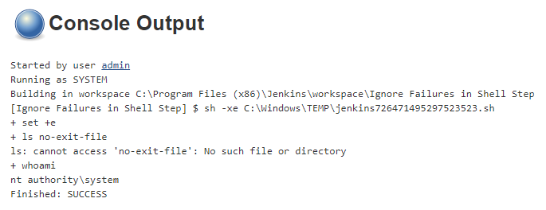
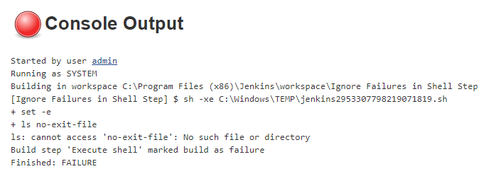
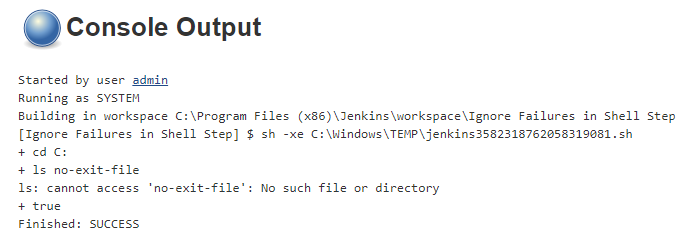
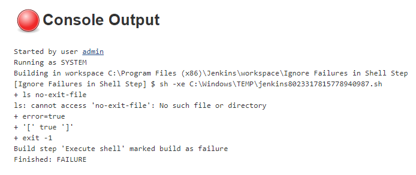

> 《Jenkins Tips 1》 —— 每期用简短的图文描述一个 Jenkins 小技巧。

## 问题

* 不希望 Shell 脚本因失败而中止
* 想一直运行 Shell 脚本并报告失败


## 解决

### 方法一

运行 Shell 时，你可以通过使用内置的 `+e` 选项来控制执行你的脚本错误。这可以禁用“非 0 退出”的默认行为。

请参考如下四个示例中的测试 Shell 和测试结果 Console Output。

#### 示例一

执行的时候如果出现了返回值为非零（即命令执行失败）将会忽略错误，继续执行下面的脚本。

```bash
set +e
ls no-exit-file
whoami
```



#### 示例二

执行的时候如果出现了返回值为非零，整个脚本就会立即退出。

```bash
set -e
ls no-exit-file
whoami
```



### 方法二

#### 示例三

还有一种方式，如果不想停止失败的另一种方法是添加 `|| true` 到你的命令结尾。

```bash
# 做可能会失败，但并不关注失败的命令时
ls no-exit-file || true
```



#### 示例四

如果要在失败时执行某些操作则添加 `|| <doSomethingOnFailure>` 。

```bash
# 做可能会失败的事情，并关注失败的命令
# 如果存在错误，则会创建变量 error 并将其设置为 true
ls no-exit-file || error=true

# 然后去判断 error 变量的值。如果为真，则退出 Shell
if [ $error ]
then
   exit -1
fi
```


