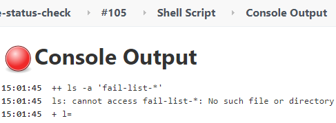

> Jenkins Tip 3—Each installment describes a Jenkins tip using brief text and images.

## Problem

When using a Jenkins pipeline, if a Shell command returns a non-zero value (meaning the Shell command encountered an error), the Jenkins Job defaults to marking the current stage as failed.  Therefore, the entire Job also fails.

In some cases, we want the Jenkins Job to show a successful status even if the Shell command fails and returns a non-zero value.

For example:  A Shell command lists files starting with `fail-list-`. If such files exist, the user is notified; otherwise, no notification is sent.

```bash
ls -a fail-list-*
```

By default, executing the above command causes the entire Job to fail.



## Solution

After some investigation, the following code snippet solved the problem.

```java
stage("Send notification") {
  steps {
    script {
      def fileExist = sh script: "ls -a fail-list-* > /dev/null 2>&1", returnStatus: true
      if ( fileExist == 0 ) {
        // send email to user
      }else {
        // if not found fail-list-* file, make build status success.
        currentBuild.result = 'SUCCESS'
      }
    }
  }
}
```

## Analysis

When executing the Shell command, `returnStatus: true` is added. This returns and saves the status code, which is then compared to 0.

If it's not equal to 0, and `currentBuild.result = 'SUCCESS'` is not added, the entire Jenkins Job will still be marked as failed. Adding it artificially ignores the error and sets the Job status to success.