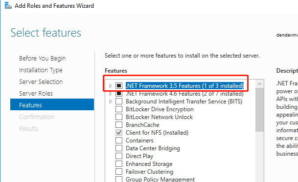
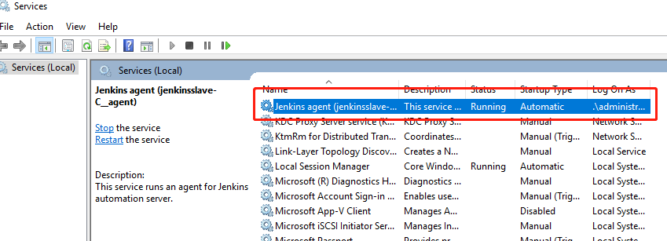
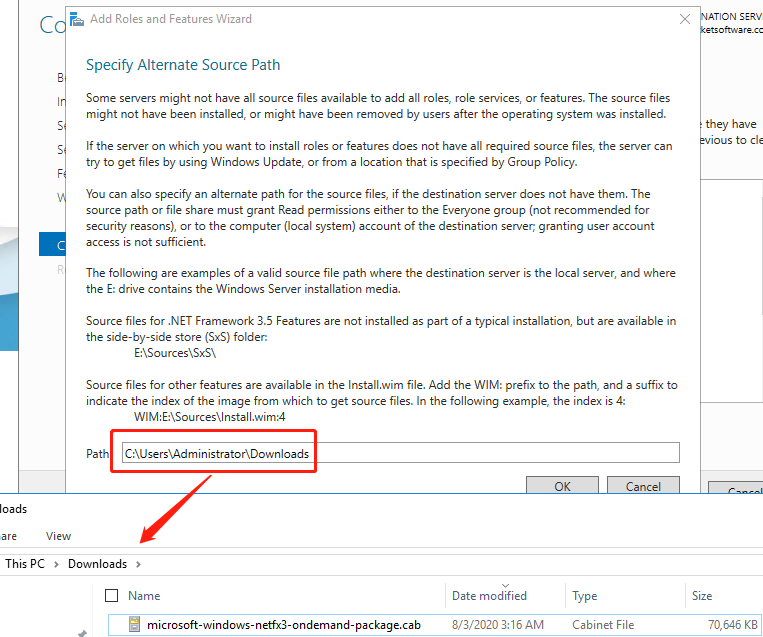

When I upgrade Jenkins 2.176.3 to Jenkins 2.235.1, my Windows agent can not connect with master successfully and outcome this warning message ".NET Framework 2.0 or later is required on this computer to run a Jenkins agent as a Windows service".


It means I need to upgrade my Windows agent .NET Framework. Here are steps about how to upgrade .NET Framework to version 3.5.

## Install .NET Framework 3.5

1. Open Programs and Features

   

2. Select .NET Framework 3.5 Features (In my screenshot, it had already installed)

    

Then try to reconnect the Jenkins agent, then it should back to work.

## Install Jenkins agent service

If you can not found a `Jenkins agent` like me,



You can try these steps to install `Jenkins agent`

```bash
# install Jenkins agent service
cd c:\\jenkins
.\jenkins-agent.exe install
net start jenkinsslave-C__agent

# unstall Jenkins agent service
sc delete jenkinsslave-C__agent
```

## Manual install .NET Framework 3.5

Btw, if you could not install .NET Framework 3.5 successfully. you can try to install manually by this step

1. Manually download [microsoft-windows-netfx3-ondemand-package.cab](https://androidfilehost.com/?fid=1322778262904003837)

2. Specify the path like below to install(note: the path is the directory where the file located)

    

In my case no need to reboot the Windows agent.

Hopefully, this also works for you. Let me know in case you have any comments.
