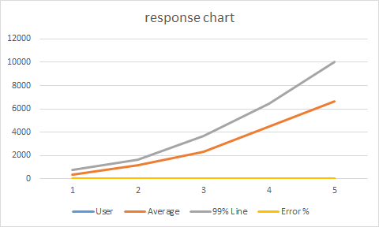

## 录制 JMeter 脚本

使用 JMeter 的 **HTTP(S) Test Script Recorder**，参考官方文档：  
<https://jmeter.apache.org/usermanual/jmeter_proxy_step_by_step.html>

---

## 运行 JMeter 脚本

- **GUI 模式调试**  
  在 GUI 模式下调试录制的脚本，直到无报错为止。

- **非 GUI 模式运行（推荐）**  
  ```bash
  jmeter -n -t ..\extras\Test.jmx -l Test.jtl
  ```

---

## 在 Jenkins 中运行 JMeter 脚本

### 需要的工具

1. JMeter - Web Request Load Testing
2. JMeter Plugins

   * `ServerAgent-2.2.1`（PerfMon Agent，用于性能监控）

### 测试环境

两台虚拟机：

* **被测系统（System under test）**
* **JMeter 执行机**（同时作为 Jenkins 服务器）

---

### 实现步骤

#### 1. 开发测试脚本

录制脚本可参考官方文档：
[https://jmeter.apache.org/usermanual/jmeter\_proxy\_step\_by\_step.html](https://jmeter.apache.org/usermanual/jmeter_proxy_step_by_step.html)

#### 2. 在 Jenkins 中创建任务运行 JMeter 脚本

1. 新建 **Freestyle Project**

2. 添加构建步骤 → **Execute Windows batch command**
   清理上次测试结果：

   ```bash
   cd C:\Users\peter\.jenkins\jobs\TEST-122 Upload large data\workspace
   del /Q "jtl"\*
   del /Q "PerfMon Metrics Collector"\*
   ```

3. 添加构建步骤 → **Execute Windows batch command**
   执行 JMeter 脚本：

   ```bash
   jmeter -n -t script/UploadLargeData-1.jmx -l jtl/UploadLargeData-1.jtl
   ```

4. 配置 Jenkins 邮件通知（Extended E-mail Notification）：

   * SMTP Server: `smtp.gmail.com`
   * Recipient List: `xianpeng.shen@gmail.com`
   * Content Type: HTML
   * 触发器：Always

---

### 生成测试报告

在 JMeter 中添加监听器：
`jp@gc - PerfMon Metrics Collector` → 选择 `.jtl` 文件 → 右键导出为 CSV。

---

### 分析测试结果

#### 测试场景

使用 **1、5、10、20、30（50）** 个并发用户进行压测，记录各组结果。

**常用指标解释**：

* **Sample (label)**：虚拟用户请求数
* **Average**：平均响应时间
* **Median**：中位数
* **% Line**：90%、95%、99% 分位数
* **Min/Max**：最短/最长响应时间
* **Error %**：失败率
* **Throughput**：每秒请求数（越大越好）
* **KB/Sec**：吞吐量（KB/s）

示例结果：

| User | # Samples | Average | Median | 90% Line | 95% Line | Min | Max   | Error % | Throughput | Received | Send KB/sec |
| ---- | --------- | ------- | ------ | -------- | -------- | --- | ----- | ------- | ---------- | -------- | ----------- |
| 1    | 31        | 348     | 345    | 452      | 517      | 5   | 773   | 0.00%   | 2.85       | 2.50     | 0           |
| 5    | 155       | 1166    | 1164   | 1414     | 1602     | 9   | 1821  | 0.00%   | 4.26       | 3.73     | 0           |
| 10   | 310       | 2275    | 2299   | 2687     | 2954     | 20  | 4104  | 0.00%   | 4.38       | 3.84     | 0           |
| 20   | 620       | 4479    | 4620   | 5113     | 6152     | 39  | 6571  | 0.00%   | 4.42       | 3.88     | 0           |
| 30   | 930       | 6652    | 6899   | 7488     | 9552     | 4   | 10060 | 0.00%   | 4.47       | 3.91     | 0           |

---

### 可视化分析



