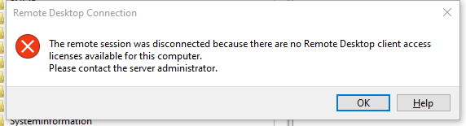
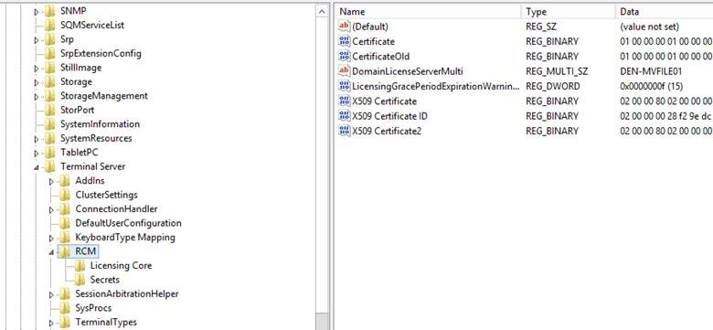

## 问题描述

在 Windows Server 2012 R2 上，有时会遇到 RDP 无法连接的问题：

```text
The remote session was disconnected because there are no Remote Desktop client access licenses available for this computer.
Please contact the server administrator.
```



---

## 解决方法

如果你有 **vSphere Web Client** 或其他方式可以登录服务器控制台，可以尝试以下步骤：

1. **打开注册表编辑器**
   在命令行或运行窗口输入 `regedit.exe`，回车。

   

2. **删除以下键值**

   * `LicensingGracePeriod`
   * `LicensingGracePeriodExpirationWarningDays`

3. **处理删除失败的情况**
   如果出现 `unable to delete all specified values` 错误，需要先修改该键的权限。
   可参考 [YouTube 视频教程](https://www.youtube.com/results?search_query=unable+to+delete+all+specified+values)。

4. **重启系统**
   如果仍无法连接，重启后再尝试。

---

## 注意事项

* 在我的环境中，大约每 **90\~120 天** 就会再次遇到此问题，这并不是最终解决方案。
* 如果你有更好的永久性解决办法，欢迎分享。

> 特别感谢 **Bill K.** 提供上述解决方案。
