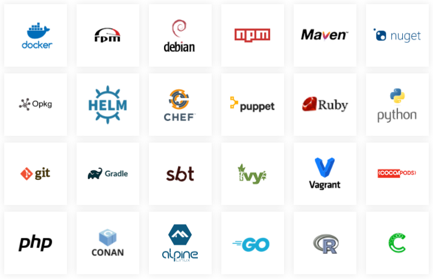
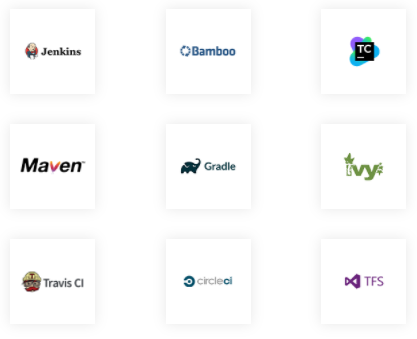
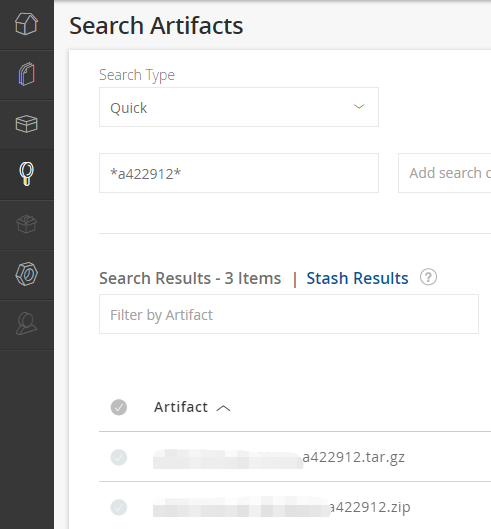
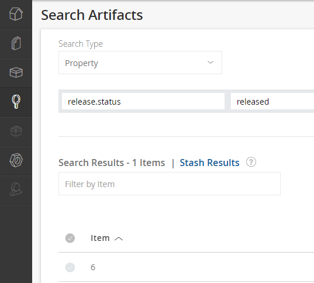
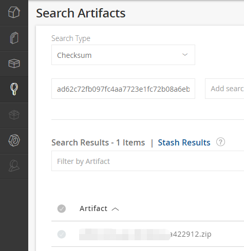
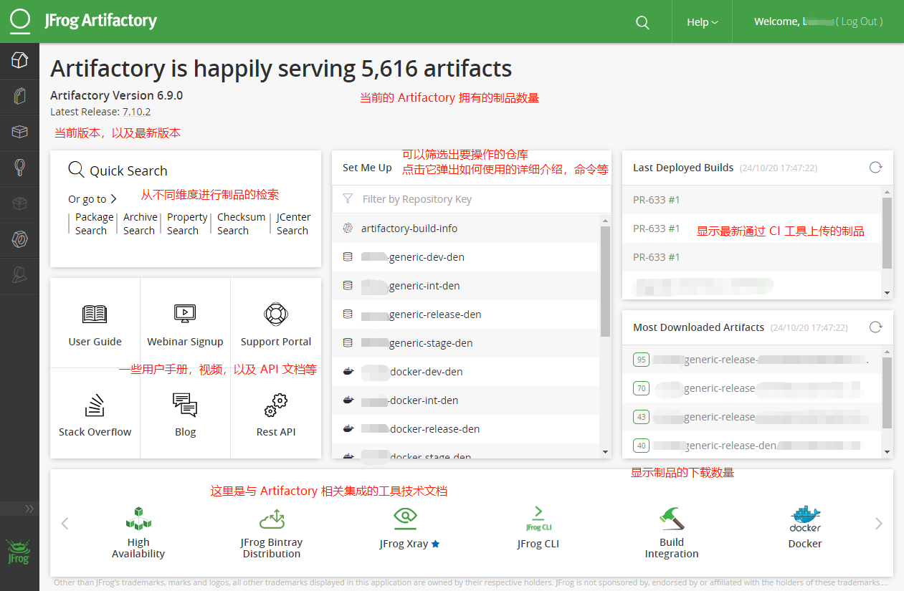
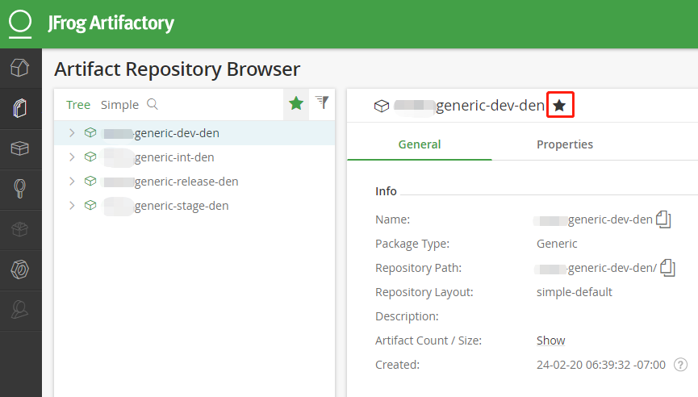

I have been using Artifactory for continuous integration for some time now, and I have gained some experience and insights into enterprise-level Artifactory. I hope this sharing will help those who are just getting started with this tool to understand what Artifactory is, what it can do, why you should choose it, and what to pay attention to during its use.

## What is Artifactory

In short: Artifactory is a tool for storing artifacts. Currently, Artifactory is a very influential and powerful tool.

## Advantages of Artifactory

Your team may already have its own way of managing artifacts, such as FTP. What can Artifactory bring? Let's take a look at its advantages.

> Note: The following advantages are introduced for the JFrog Artifactory Enterprise Edition. The open-source edition, the OSS version, does not have the following rich features.

### Advantage 1: It's a Universal Repository Manager

JFrog Artifactory Enterprise Edition fully supports repository managers for all major package formats. It can not only manage binary files but also manage dependencies of packages in almost all languages on the market, as shown in the figure below:



Therefore, using Artifactory allows you to store all binary files and packages in **one place**.


### Advantage 2: Better Integration with CI Tools

It supports all mainstream CI tools (as shown in the figure below) and captures detailed build environment information during deployment to achieve fully reproducible builds.



In addition, it provides rich REST APIs, so any operation on the GUI page can be programmatically completed through code, facilitating CI/CD implementation.

### Advantage 3: Powerful Search Functionality

If your builds are stored on FTP and you want to find a specific artifact from a large number of artifacts without knowing its name, it can be very difficult.

Artifactory provides powerful search capabilities. You can search by name with regular expressions; you can also search by file checksum; and you can quickly search by properties, as shown in the following examples:

#### Example 1: Search by Name

If you want to find a build artifact from a specific commit, such as the commit hash `a422912`, you can directly enter `*a422912*` and press Enter to quickly find it from numerous artifacts, such as Demo_Linux_bin_a422912.zip



#### Example 2: Search by Property

For example, to find all builds with the property `release.status` set to `released`, you can search like this.



#### Example 3: Search by Checksum

If you only know the file's `checksum`, you can also search by it. For example, calculate the file's `checksum` using `sha1sum`:

```bash
$ sha1sum test.zip
ad62c72fb097fc4aa7723e1fc72b08a6ebcacfd1 *test.zip
```



### Advantage 4: Artifact Lifecycle Management

By defining repositories with different maturity levels and using the Artifactory `Promote` function, you can move artifacts to different maturity repositories and better manage and maintain the artifact lifecycle through metadata properties.

In addition to these advantages, Artifactory has many more features that I won't go into detail here.

> More features can be found on the JFrog Artifactory official website: https://jfrog.com/artifactory/features/

Next, through a demo, we will introduce how to use Artifactory and some best practices to avoid detours.

## Artifactory Homepage Introduction



### Top of the Page

You can see that this Artifactory has served over 5000 artifacts. You can also see the current version number of Artifactory and the latest version.

### Middle of the Page, From Left to Right

1. The far left is the search function, which allows you to easily find artifacts through a variety of search criteria. Then there is some user manual, video, REST API documentation, etc.

2. In the middle is Set Me Up, which allows you to select and filter the repositories you want to operate on. Clicking on a specific repository will pop up detailed instructions on how to use it.

3. On the far right, it displays the recently deployed builds and the most downloaded artifacts (`95` represents the number of downloads).

### Bottom of the Page

At the bottom are some integrated tools and technical user documentation related to Artifactory, making it easy to quickly find the most authoritative technical documentation during integration.

## Practices and Workflow

### Setting Up Watched Repositories

In the Set Me Up section on the homepage, you can see that we have many repositories. However, among the many repositories, most members are only interested in some of them. You can then only focus on some repositories. Add a like, and then click the like button to list only your favorite Artifact Repositories.



### Repository Permissions and Retention Policies

| Repository (maturity) | Retention Policy | Personal Account | Service Account | Admin |
|---|---|---|---|---|
| dev | Usually not cleaned | read/write | read/write | all |
| int | One week or a few days | read | read/write | all |
| stage | Never cleaned | read | read/write | all |
| release | Never cleaned | read | read/write | all |

The table makes it easy to understand the permission settings and retention policies. This is suitable for most situations, but not necessarily for all enterprise situations.

### Artifactory Repository Naming Convention

In this list of repositories, you can see that certain naming conventions are followed. Here, the [JFrog Artifactory officially recommended naming convention](https://jfrog.com/whitepaper/best-practices-structuring-naming-artifactory-repositories/) is followed.  It is strongly recommended that you do the same. It consists of four parts:

`<team>-<technology>-<maturity>-<locator>`

* In the figure, the team has been anonymized; let's call it team1.
* Then comes the technology; there are many options, such as generic, Docker, Maven, NPM, etc. I used generic because our product is a binary file compiled from C/C++, which belongs to the generic category.
* Next is maturity. A repository usually consists of four levels of maturity, from low to high, which are `dev`, `int`, `stage`, and `release`.
* Finally, it indicates the location of the artifact. For example, a multinational company may have Artifactory instances in different regions to ensure upload/download speed and other needs. The `den` in the figure is an abbreviation for the location of the current Artifactory.

### Understanding the Workflow from Build Generation to Release

`dev` stands for development. This repository has read/write permissions for all product members, who can upload libraries or other binary files.

`int` stands for integration. For example, artifacts successfully built from Jenkins will first be placed in this repository. If the build fails, it will not be uploaded to Artifactory.

`stage` represents the pre-release repository. Artifacts that have passed Unit Test/Smoke Test will be `Promoted` to this repository for further testing, such as manual testing.

`release` Artifacts that have passed testing will be `Promoted` to this repository.

To better manage the Artifactory directory and artifact lifecycle, I recommend **standardizing branch naming** and adding **properties** to artifacts at different stages.

#### 1. Standardized Branch Naming for Clear Artifactory Directories

For example, a product is called ART, its Git repository is also called ART, and it has a branch called `feature/ART-1234`.

The environment variables in the Jenkins Pipeline are set as follows:

```Jenkinsfile
environment {
  INT_REPO_PATH = "team1-generic-int-den/ART/${BRANCH_NAME}/${BUILD_NUMBER}/"
}
```

Let's see how this branch build flows.

After the first successful build of this branch through Jenkins, it will first be placed under the directory `team1-generic-int-den/ART/feature/ART-1234/1/`. If a second build is successful, the artifact directory will be:
`team1-generic-int-den/ART/feature/ART-1234/2/`, and so on.

To better manage the directories under the repository, it is recommended that the team agree on branch naming conventions in advance so that all builds of the same type of branch will appear under the same directory.

For branch naming conventions, see this article: [Programmer's Self-Cultivation: Git Commit Message and Branch Creation Specification](../conventional-branch/)

If you also want to put Pull Request Builds on Artifactory, it is recommended to set it up as follows:

```Jenkinsfile
environment {
  PR_INT_REPO_PATH = "team1-generic-int-den/ART/PRs/${BRANCH_NAME}/${BUILD_NUMBER}/"
}
```

In this way, all successful Pull Request Builds will be placed under the `PRs` directory, which is convenient for searching and management.

#### 2. Adding Different Properties at Different Stages

If the above builds pass some quality checkpoints, such as unit tests, automated tests, and SonaQube scans, it is recommended to add different properties, such as:

`unit.test.status=passed`
`automated.test.status=passed`
`sonaqube.scan.status=passed`

Then, based on the above status, promote the artifacts that meet the conditions from the `int` repository to the `stage` repository. Test engineers go to the `stage` repository to get the build and perform testing. After passing the test, add the corresponding property status to the artifact, such as adding `manual.test.status=passed` in the Property.

Then, the release pipeline goes to the `stage` repository to find the build that meets all the conditions for release.

`unit.test.status=passed`
`automated.test.status=passed`
`sonaqube.scan.status=passed`
`manual.test.status=passed`

After successful release, promote the build from the `stage` repository to the `release` repository and add the property `release.status=released`. This completes the release.

## Conclusion

In software delivery, quality trustworthiness and security trustworthiness are two important criteria for evaluating the reliability of a version. In this process, like using a funnel, the build is screened layer by layer, from the `int` repository to the `stage` repository, and finally to the `release` repository, completing the artifact release. By using Artifactory to create a single source of truth for artifact management, it paves the way for continuous software delivery.

## Previous Related Articles

* [Introduction to JFrog Artifactory](../artifactory-install-and-upgrade/in)
* [Artifactory and Jenkins Integration](../artifactory-integrate-with-jenkins/)
* [Solving the Problem of Jenkins Artifactory Plugin Failing to Upload Artifacts to HTTPS Artifactory Only on AIX](../java-net-socketexception-on-aix/)