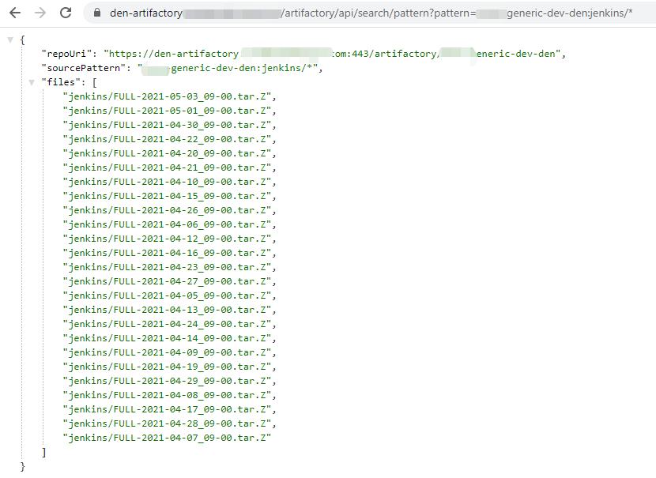

## 问题背景

在 CI 过程中，如果需要从 JFrog Artifactory 下载整个文件夹的制品，而 IT 出于某些原因关闭了 **Download Folder** 功能，就会遇到以下报错：

访问类似 API：  

```
[https://den-artifactory.company.com/artifactory/api/archive/download/team-generic-release-den/project/abc/main/?archiveType=zip](https://den-artifactory.company.com/artifactory/api/archive/download/team-generic-release-den/project/abc/main/?archiveType=zip)
```

返回：
```json
{
  "errors": [
    {
      "status": 403,
      "message": "Download Folder functionality is disabled."
    }
  ]
}
```

> 官方文档：[Retrieve Folder or Repository Archive](https://www.jfrog.com/confluence/display/JFROG/Artifactory+REST+API#ArtifactoryRESTAPI-RetrieveFolderorRepositoryArchive)

---

## 解决思路

虽然直接下载文件夹功能被禁用，但 Artifactory 还有其他 API 可以间接实现批量下载。

下面介绍两种常用方式。

---

### 方法 1：按创建时间范围获取制品列表

API 文档：[Artifacts Created in Date Range](https://www.jfrog.com/confluence/display/JFROG/Artifactory+REST+API#ArtifactoryRESTAPI-ArtifactsCreatedinDateRange)

示例 Shell 脚本 `download.sh`：

```bash
#!/bin/sh

USERNAME=$1
PASSWORD=$2
REPO=$3
N_DAY_AGO=$4

# 时间范围（毫秒）
START_TIME=$(($(date --date="$N_DAY_AGO days ago" +%s%N)/1000000))
END_TIME=$(($(date +%s%N)/1000000))

ARTIFACTORY=https://den-artifactory.company.com/artifactory

if [ ! -x "`which sha1sum`" ]; then
  echo "You need to have the 'sha1sum' command in your path."
  exit 1
fi

# 获取制品 URI 列表
RESULTS=$(curl -s -X GET -u $USERNAME:$PASSWORD \
  "$ARTIFACTORY/api/search/creation?from=$START_TIME&to=$END_TIME&repos=$REPO" |
  grep uri | awk '{print $3}' | sed s'/.$//' | sed s'/.$//' | sed -r 's/^.{1}//')

# 循环下载
for RESULT in $RESULTS; do
    echo "Fetching path from $RESULT"
    PATH_TO_FILE=$(curl -s -X GET -u $USERNAME:$PASSWORD $RESULT |
      grep downloadUri | awk '{print $3}' | sed s'/.$//' | sed s'/.$//' | sed -r 's/^.{1}//')

    echo "Downloading $PATH_TO_FILE"
    curl -u $USERNAME:$PASSWORD -O $PATH_TO_FILE
done
```

使用方式：

```bash
sh download.sh <USERNAME> <PASSWORD> <REPO_NAME> <N_DAY_AGO>
```

---

### 方法 2：使用模式匹配搜索制品

API 文档：[Pattern Search](https://www.jfrog.com/confluence/display/JFROG/Artifactory+REST+API#ArtifactoryRESTAPI-PatternSearch)

通过 Ant 风格的路径模式搜索制品，例如：

```
repo-key/path/to/files/*.jar
```

解析 API 响应中的 `downloadUri`，再用 `curl` 批量下载：

```bash
curl -u $USERNAME:$PASSWORD -O $PATH_TO_FILE
```



---

💡 如果你有更好的方法，可以在评论中分享交流。
