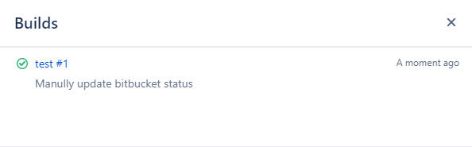

## 使用场景

1. **添加构建状态**  
   当你从某个分支启动构建时，希望为该分支的特定提交添加构建状态。

2. **更新构建状态**  
   当构建状态错误时（如错误地标记为 `FAILED`），你可能需要将其手动更新为 `SUCCESSFUL` 等正确状态。

此时可通过 **Bitbucket REST API** 实现。

---

## 示例脚本

以下 Shell 脚本演示了如何使用 REST API 更新 Bitbucket 构建状态。  
代码 GitHub Gist 链接：[gist.github.com/shenxianpeng/bd5eddc5fb39e54110afb8e2e7a6c4fb](https://gist.github.com/shenxianpeng/bd5eddc5fb39e54110afb8e2e7a6c4fb)

```bash
#!/bin/sh

username=your-bitbucket-user
password=your-bitbucket-password

commit_id='57587d7d4892bc4ef2c4375028c19b27921e2485'
# 构建状态可选值：SUCCESSFUL, FAILED, INPROGRESS
build_result='SUCCESSFUL'
description='Manually update bitbucket status'

build_name='test #1'
build_url=http://localhost:8080/job/test/

bitbucket_rest_api='https://myorg.bitbucket.com/rest/build-status/latest/commits'

gen_post_data() {
cat <<EOF
{
  "state": "$build_result",
  "key": "$commit_id",
  "name": "$build_name",
  "url": "$build_url",
  "description": "$description"
}
EOF
}

echo "$(gen_post_data)"

curl -u $username:$password \
  -H "Accept: application/json" \
  -H "Content-Type:application/json" \
  -X POST $bitbucket_rest_api/$commit_id --data "$(gen_post_data)"

if [ $? -ne 0 ]; then
  echo "$0: Update bitbucket build status failed."
  exit 1
else
  echo "$0: Update bitbucket build status success."
  exit 0
fi
```

---

## 最终效果

执行成功后，可以在 Bitbucket 中看到构建状态的更新结果：



---

转载本文请注明作者与出处，禁止用于商业用途。欢迎关注公众号「DevOps攻城狮」。
