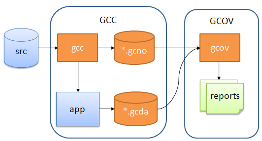
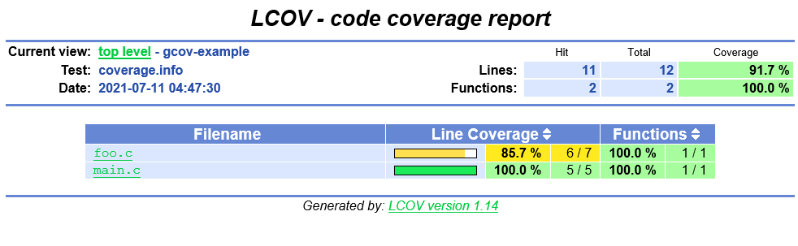
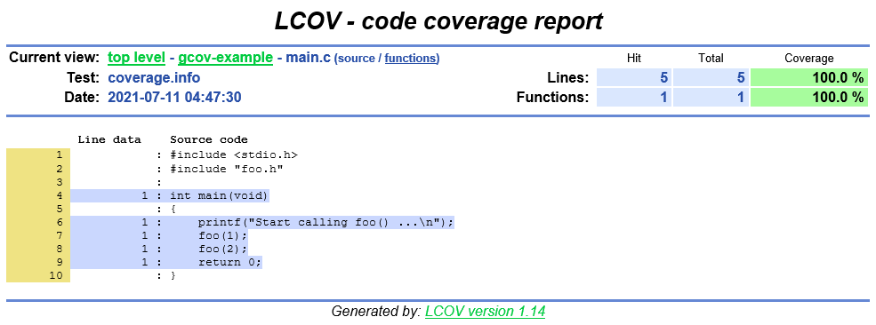
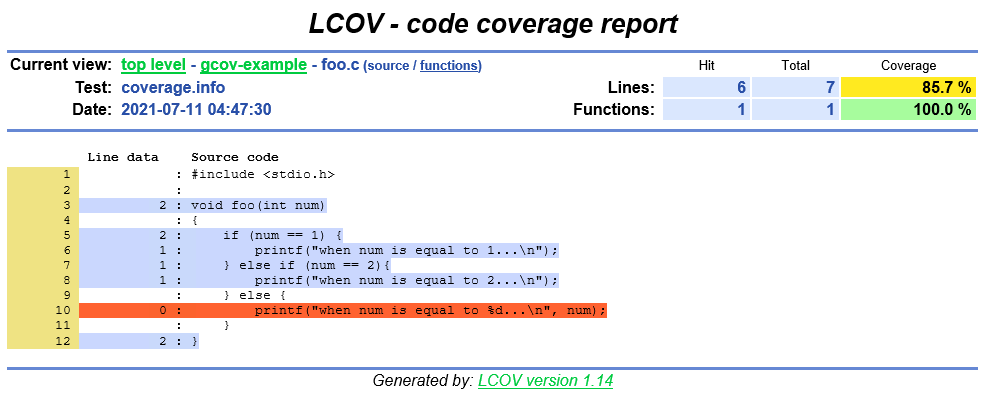

本篇分享如何使用 Gcov 和 LCOV 对 C/C++ 项目进行代码覆盖率的度量。

如果你想了解代码覆盖率工具 Gcov 是如何工作的，或是以后需要做 C/C++ 项目的代码覆盖率，希望本篇对你有所帮助。


## 问题

不知道你没有遇到过和我一样的问题：几十年前的 C/C++ 项目没有单元测试，只有回归测试，但是想知道回归测试测了哪些代码？还有哪些代码没测到？代码覆盖率是多少？今后哪些地方需要提高自动化测试用例？

可能对于接触过 Java 的 Junit 和 JaCoCo 的人来说，没有单元测试应该测不了代码覆盖率吧 ... 其实不然，如果不行就没有下文了 :)

## 现状

市场上有一些工具可以针对黑盒测试来衡量代码覆盖率 Squish Coco，Bullseye 等，它们的原理就是在编译的时候插入 instrumentation，中文叫插桩，在运行测试的时候用来跟踪和记录运行结果。

其中我比较深入的了解过 [Squish Coco](https://shenxianpeng.github.io/2019/05/squishcoco/) 它如何使用，但对于大型项目，引入这类工具都或多或少的需要解决编译上的问题。也正是因为有一些编译问题没有解决，就一直没有购买这款价格不菲的工具 License。

当我再次重新调查代码覆盖率的时候，我很惭愧的发现原来正在使用的 GCC 其实有内置的代码覆盖率的工具的，叫 [Gcov](https://gcc.gnu.org/onlinedocs/gcc/Gcov.html)

## 前提条件

对于想使用 Gcov 的人，为了说明它是如何工作的，我准备了一段示例程序，运行这个程序之前需要先安装 [GCC](https://gcc.gnu.org/install/index.html) 和 [LCOV](http://ltp.sourceforge.net/coverage/lcov.php)。

如果没有环境或不想安装，可以直接查看示例仓库的 GitHub 仓库：https://github.com/shenxianpeng/gcov-example

注：主分支 `master` 下面放的是源码，分支 `coverage` 下的 `out` 目录是最终的结果报告。

```bash
# 这是我的测试环境上的 GCC 和 lcov 的版本
sh-4.2$ gcc --version
gcc (GCC) 4.8.5 20150623 (Red Hat 4.8.5-39)
Copyright (C) 2015 Free Software Foundation, Inc.
This is free software; see the source for copying conditions.  There is NO
warranty; not even for MERCHANTABILITY or FITNESS FOR A PARTICULAR PURPOSE.

sh-4.2$ lcov -v
lcov: LCOV version 1.14
```

## Gcov 是如何工作的

Gcov 工作流程图



主要分三步：

1. 在 GCC 编译的时加入特殊的编译选项，生成可执行文件，和 `*.gcno`；
2. 运行（测试）生成的可执行文件，生成了 `*.gcda` 数据文件；
3. 有了 `*.gcno` 和 `*.gcda`，通过源码生成 `gcov` 文件，最后生成代码覆盖率报告。

下面就开始介绍其中每一步具体是怎么做的。

### 1. 编译

第一步编译，这里已经将编译用到的参数和文件都写在了 `makefile` 里了，只要执行 `make` 就可以编译了。

```bash
make
```

<details>
<summary>点击查看 make 命令的输出</summary>

```bash
sh-4.2$ make
gcc -fPIC -fprofile-arcs -ftest-coverage -c -Wall -Werror main.c
gcc -fPIC -fprofile-arcs -ftest-coverage -c -Wall -Werror foo.c
gcc -fPIC -fprofile-arcs -ftest-coverage -o main main.o foo.o
```

</details>

通过输出可以看到，这个程序在编译的时候添加了两个编译选项 `-fprofile-arcs` and `-ftest-coverage`。在编译成功后，不仅生成了 `main` and `.o` 文件，同时还生成了两个 `.gcno` 文件.

> `.gcno` 记录文件是在加入 GCC 编译选项 `-ftest-coverage` 后生成的，在编译过程中它包含用于重建基本块图和为块分配源行号的信息。

### 2. 运行可执行文件

在编译完成后，生成了 `main` 这个可执行文件，运行（测试）它：

```bash
./main
```

<details>
<summary>点击查看运行 main 时输出</summary>

```bash
sh-4.2$ ./main
Start calling foo() ...
when num is equal to 1...
when num is equal to 2...
```

</details>

当运行 `main` 后，执行结果被记录在了 `.gcda` 这个数据文件里，查看当前目录下可以看到一共有生成了两个 `.gcda` 文件，每个源文件都对应一个  `.gcda` 文件。

```bash
$ ls
foo.c  foo.gcda  foo.gcno  foo.h  foo.o  img  main  main.c  main.gcda  main.gcno  main.o  makefile  README.md
```

> `.gcda` 记录数据文件的生成是因为程序在编译的时候引入了 `-fprofile-arcs` 选项。它包含弧过渡计数、值分布计数和一些摘要信息。

### 3. 生成报告

```bash
make report
```

<details>
<summary> 点击查看生成报告的输出 </summary>

```bash
sh-4.2$ make report
gcov main.c foo.c
File 'main.c'
Lines executed:100.00% of 5
Creating 'main.c.gcov'

File 'foo.c'
Lines executed:85.71% of 7
Creating 'foo.c.gcov'

Lines executed:91.67% of 12
lcov --capture --directory . --output-file coverage.info
Capturing coverage data from .
Found gcov version: 4.8.5
Scanning . for .gcda files ...
Found 2 data files in .
Processing foo.gcda
geninfo: WARNING: cannot find an entry for main.c.gcov in .gcno file, skipping file!
Processing main.gcda
Finished .info-file creation
genhtml coverage.info --output-directory out
Reading data file coverage.info
Found 2 entries.
Found common filename prefix "/workspace/coco"
Writing .css and .png files.
Generating output.
Processing file gcov-example/main.c
Processing file gcov-example/foo.c
Writing directory view page.
Overall coverage rate:
  lines......: 91.7% (11 of 12 lines)
  functions..: 100.0% (2 of 2 functions)
```

</details>

执行 `make report` 来生成 HTML 报告，这条命令的背后实际上主要执行了以下两个步骤：

1. 在有了编译和运行时候生成的 `.gcno` 和 `.gcda` 文件后，执行命令 `gcov main.c foo.c` 即可生成 `.gcov` 代码覆盖率文件。

2. 有了代码覆盖率 `.gcov` 文件，通过 [LCOV](http://ltp.sourceforge.net/coverage/lcov.php) 生成可视化代码覆盖率报告。

生成 HTML 结果报告的步骤如下：

```bash
# 1. 生成 coverage.info 数据文件
lcov --capture --directory . --output-file coverage.info
# 2. 根据这个数据文件生成报告
genhtml coverage.info --output-directory out
```

### 删除所有生成的文件

上传过程中所有生成的文件可通过执行 `make clean` 命令来彻底删除掉。

<details>
<summary> 点击查看 make clean 命令的输出 </summary>

```bash
sh-4.2$ make clean
rm -rf main *.o *.so *.gcno *.gcda *.gcov coverage.info out
```
</details>

## 代码覆盖率报告


首页以目录结构显示



进入目录后，显示该目录下的源文件



蓝色表示这些语句被覆盖



红色表示没有被覆盖的语句

> LCOV 支持语句、函数和分支覆盖度量。

旁注：

* 还有另外一个生成 HTML 报告的工具叫 [gcovr](https://github.com/gcovr/gcovr)，使用 Python 开发的，它的报告在显示方式上与 LCOV 略有不同。比如 LCOV 以目录结构显示， gcovr 以文件路径来显示，前者与代码结构一直因此我更倾向于使用前者。

## 相关阅读

* 关于代码覆盖率(About Code Coverage)：https://shenxianpeng.github.io/2021/07/code-coverage/
* 在 Linux 内核中使用 Gcov 的示例：https://01.org/linuxgraphics/gfx-docs/drm/dev-tools/gcov.html
* 当构建环境与测试环境不同时设置环境变量：https://gcc.gnu.org/onlinedocs/gcc/Cross-profiling.html#Cross-profiling
