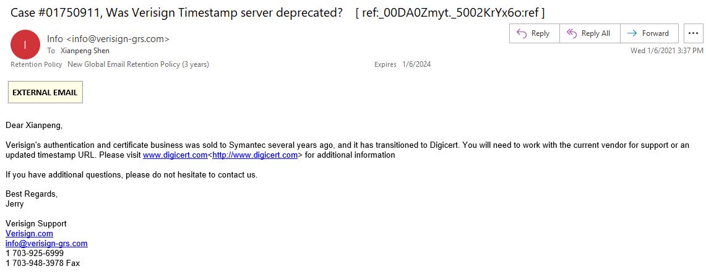

Many programmers may have encountered issues with the Verisign Timestamp server, http://timestamp.verisign.com/scripts/timstamp.dll, becoming unavailable when performing code signing, especially at the start of the new year.  The following error may have appeared:

The reason is that the default timestamp server for code signing is no longer accessible.

A response on Stack Overflow [post](https://stackoverflow.com/questions/65541786/is-the-verisign-timestamp-server-down) provided an answer from Verisign Support:

> Their authentication services were sold to Symantec, and the current service provider is Digicert.  This server has been deprecated.
>
> They suggest contacting Digicert or finding free timestamp servers online.

This was a user's response; I didn't find an official response online, so I decided to send an email to formally confirm.  I received a reply shortly after:

Similar to the previous reply:  Years ago, Verisign's authentication and certificate business was sold to Symantec and has now transitioned to Digicert. You will need to work with your current provider for support or an updated timestamp URL. Please visit http://www.digicert.com for more information.

Now that's confirmed, let's confidently proceed with changing to a new timestamp server.

I found that Digicert's timestamp server is `http://timestamp.digicert.com`. After switching to the new timestamp server, the digital signature process resumed normally.

In addition to the Digicert URL above, the following URLs can be used as replacements:

* http://timestamp.comodoca.com/authenticode
* http://timestamp.globalsign.com/scripts/timestamp.dll
* http://tsa.starfieldtech.com

However, I didn't choose any of these; I opted for the official timestamp service and kept it as a backup. What if the "official" provider gets sold again someday?
