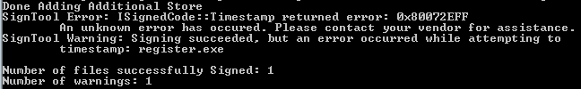

相信许多程序员在新年开始在做 code sign (数字签名)的时候可能遇到 Verisign Timestamp 服务器不好用了 http://timestamp.verisign.com/scripts/timstamp.dll 的情况。出现了如下错误：

原因是 code sign 默认的时间戳服务器无法访问了。

在 Stack overflow 这个 [post](https://stackoverflow.com/questions/65541786/is-the-verisign-timestamp-server-down) 里上面有人给出了答案，是来自于 Verisign Support 的回复：

> 他们的身份验证服务已出售给赛门铁克(Symante)，现在的服务商是 Digicert。该服务器已弃用了。
>
> 他们建议联系 Digicert 或在网络上找免费的 timestamp servers

以上是别人的回复，我在网络上没有找到一个官方回复，因此打算发邮件正式确认一下，发完不一会就得到了回复：

和上面的回复类似：几年前，Verisign 的身份验证和证书业务被出售给赛门铁克(Symantec)，目前已过渡到Digicert。您将需要与当前供应商合作以获得支持或更新的时间戳URL。请访问 http://www.digicert.com 了解更多信息。

好了，这下实锤了，放心大胆的开始动手修改到新的时间戳了。

我找到了 Digicert 的时间戳服务器是 `http://timestamp.digicert.com`。更换到新的时间戳服务器后，数字签名恢复正常。

除了上面 Digicert 那个网址，还有如下网址可以作为替换:

* http://timestamp.comodoca.com/authenticode
* http://timestamp.globalsign.com/scripts/timestamp.dll
* http://tsa.starfieldtech.com

但我都没有选用，我还是选择了官方的时间戳服务，留作备用吧。一旦又抽风 “官方” 哪天又被卖了呢？
