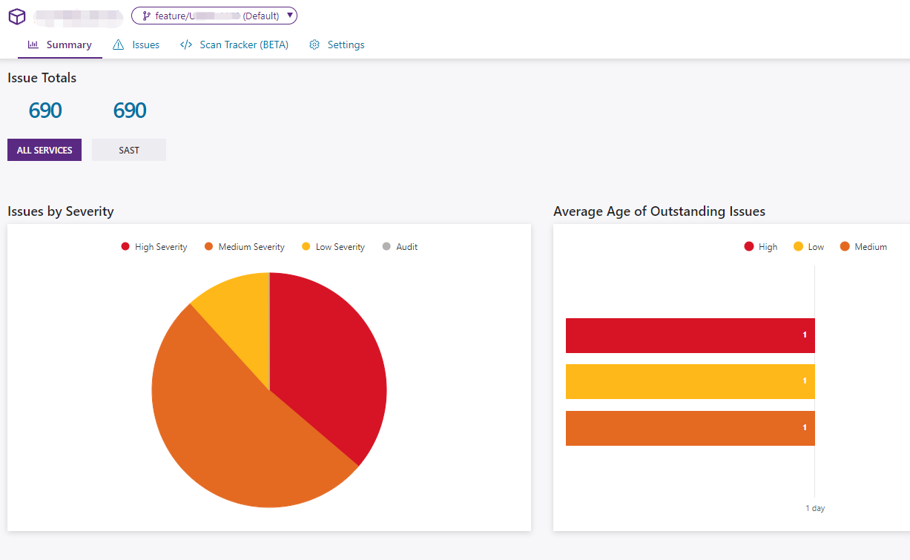
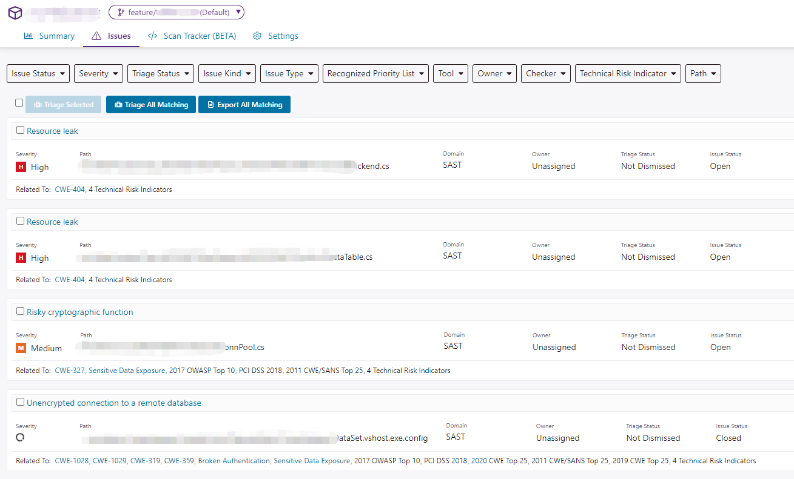

> This might be the most detailed article about Polaris available in Chinese.

## What is Polaris?

**Polaris** - A SaaS platform for managed Static Application Security Testing (SAST) tools. It's a web site used to categorize and remediate vulnerabilities and run reports.
**SAST** - A tool that analyzes source code or build artifacts to find security vulnerabilities. It's a crucial step in ensuring security throughout the Software Development Life Cycle (SDLC).
**Coverity** - Coverity is the original Static Application Security Testing (SAST) tool provided by Synopsys. Polaris is the SaaS version of Coverity.
**Synopsys** - The company that develops Polaris and other software scanning tools, such as BlackDuck.

## Which Languages Does Polaris Support?

```text
C/C++
C#
Java
JavaScript
TypeScript
PHP
Python
Fortran
Swift
...and more
```

## Polaris SaaS Platform

Usually, if your organization has introduced the Polaris SaaS service, you will have the following URL available: https://organization.polaris.synopsys.com

After logging in, you can create projects for your Git repositories.

> Recommendation: Name the project the same as the Git repository.

## How Does Polaris Perform Vulnerability Scanning?

### Polaris Installation

Before performing a Polaris scan, you need to download and install polaris.

If your Polaris server URL is: `POLARIS_SERVER_URL=https://organization.polaris.synopsys.com`

The download link is: `$POLARIS_SERVER_URL/api/tools/polaris_cli-linux64.zip`

Then unzip the downloaded `polaris_cli-linux64.zip` to your local machine and add its bin directory to your PATH.

### Polaris YAML Configuration File

Before scanning, you need to create a YAML file for your project. The default configuration file name is `polaris.yml`, located in the project root directory. If you want to specify a different configuration file name, you can use the `-c` option in the `polaris` command.

Run `polaris setup` in the project root directory to generate a generic `polaris.yml` file.

Run `polaris configure` to verify that your file is syntactically correct and that `polaris` has no problems.

#### Capture - Capture

A YAML configuration file can contain three types of Capture:

* Build - Run build commands and then analyze the results.
* Filesystem - For interpreted languages, provide the project type and a list of extensions to analyze.
* Buildless - For some languages that use dependency managers, such as Maven.

| Languages  | Build Options  |
|---|---|
| C, C++, ObjectiveC, Objective C++,Go, Scala, Swift  | Use Build capture |
| PHP, Python, Ruby  | Use Buildless or Filesystem capture |
| C#, Visual Basic. | Use Build capture for more accurate results; use Buildless capture for simplicity |
| Java | Use Build capture for more accurate results; use Buildless capture for simplicity  |
| JavaScript,TypeScript | Use Filesystem capture; use Buildless capture for simplicity |

#### Analyze - Analyze

If you are scanning C/C++ code, you should include this analysis section to make full use of Polaris's scanning capabilities:

```yml
analyze:
  mode: central
  coverity:
    cov-analyze: ["--security","--concurrency"]
```

#### Polaris YAML Example Files


Example 1: A C/C++ project

```yml
version: "1"
project:
  name: test-cplus-demo
  branch: ${scm.git.branch}
  revision:
    name: ${scm.git.commit}
    date: ${scm.git.commit.date}
capture:
  build:
    cleanCommands:
    - shell: [make, -f, GNUmakefile, clean]
    buildCommands:
    - shell: [make, -f, GNUmakefile]
analyze:
  mode: central
install:
  coverity:
    version: default
serverUrl: https://organization.polaris.synopsys.com
```

Example 2: A Java project

```yml
version: "1"
project:
  name: test-java-demo
  branch: ${scm.git.branch}
  revision:
    name: ${scm.git.commit}
    date: ${scm.git.commit.date}
capture:
  build:
    cleanCommands:
    - shell: [gradle, -b, build.gradle, --no-daemon, clean]
    buildCommands:
    - shell: [gradle, -b, build.gradle, --no-daemon, shadowJar]
  fileSystem:
    ears:
      extensions: [ear]
      files:
      - directory: ${project.projectDir}
    java:
      files:
      - directory: ${project.projectDir}
    javascript:
      files:
      - directory: client-vscode
      - excludeRegex: node_modules|bower_components|vendor
    python:
      files:
      - directory: ${project.projectDir}
    wars:
      extensions: [war]
      files:
      - directory: ${project.projectDir}
analyze:
  mode: central
install:
  coverity:
    version: default
serverUrl: https://organization.polaris.synopsys.com
```

Example 3: A CSharp project

```yml
version: "1"
project:
  name: test-ssharp-demo
  branch: ${scm.git.branch}
  revision:
    name: ${scm.git.commit}
    date: ${scm.git.commit.date}
capture:
  build:
    buildCommands:
    # If the build process is complex, you can write a script and then call it.
    - shell: ['script\polaris.bat']
    # Skip some files you don't want to scan.
    skipFiles:
    - "*.java"
    - "*.text"
    - "*.js"
analyze:
  mode: central
install:
  coverity:
    version: default
serverUrl: https://organization.polaris.synopsys.com
```

For more details on writing `polaris.yml`, please refer to the official Polaris documentation: https://sig-docs.synopsys.com/polaris/topics/c_conf-overview.html

### Executing Analysis

Use the following command to perform Polaris analysis:

```bash
polaris -c polaris.yml analyze -w --coverity-ignore-capture-failure
```

`--coverity-ignore-capture-failure` - Ignore Coverity capture failures. Run `polaris help analyze` to see more information about analysis commands.

### Polaris Analysis Results

If the Polaris analysis is successful, you will see a success message in the console as follows:

```bash
[INFO] [1zb99xsu] Coverity job completed successfully!

[INFO] [1zb99xsu] Coverity - analyze phase took 4m 36.526s.
Analysis Completed.
Coverity analysis
{
 "JobId": "mlkik4esb961p0dtq8i6m7pm14",
 "Status": "Success"
}
Job issue summary
{
 "IssuesBySeverity": {
  "Critical": 0,
  "High": 250,
  "Medium": 359,
  "Low": 81
 },
 "Total": 690,
 "NewIssues": 0,
 "ClosedIssues": 0,
 "SummaryUrl": "https://organization.polaris.synopsys.com/projects/bb079756-194e-4645-9121-5131493a0c93/branches/d567c376-4d5d-4941-8733-aa27bb2f5f5b"
}
```

This shows a total of 690 vulnerabilities found, and how many of each severity level. Specific vulnerability information needs to be viewed by logging into the Polaris SaaS platform.

Clicking the link in `SummaryUrl` will directly jump to the Polaris scan results for that project.



