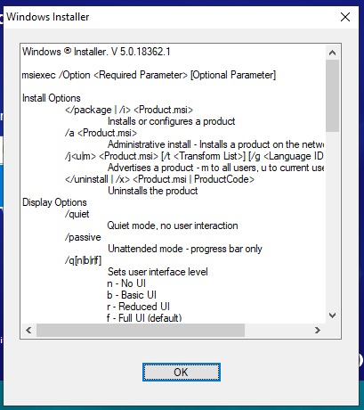

## 问题描述

今天我遇到一个问题：自己打包的 Windows 安装程序无法安装，并弹出如下安装窗口：



奇怪的是，上一个版本一切正常，而且我并没有修改任何代码。  
最终发现问题很简单，但定位过程却不轻松。

---

## 解决方法

我的情况是 **构建目录名称里包含了空格**。  
例如：

- **正常的构建名称**：`v2.2.2.3500-da121sa-Developer`  
- **出问题的构建名称**：`v2.2.2.3500-32jkjdk - Developer`（多了空格）

将文件夹名中的空格去掉后，安装程序恢复正常工作。

---

## 如何找到原因

我在 Google 搜索时看到了这篇[文章](https://community.spiceworks.com/topic/874022-msiexec-just-returns-a-pop-up)，得到启发。  
按照文章思路，如果用命令行执行：

```powershell
msiexec.exe other-commands ...
```

比较正常版本和出问题版本的行为，很快就能发现问题出在路径命名上。

---

✅ 结论：**Windows Installer 在某些情况下无法正确处理路径中的空格**，尤其是在文件夹命名中。
如果你遇到类似问题，不妨先检查一下构建路径和文件名是否包含空格。

如果这个方法对你也有效，欢迎在评论区留言。
