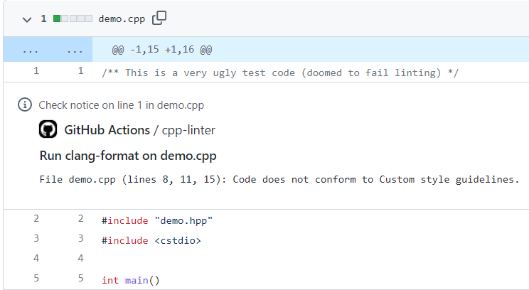

本篇是关于 C/C++ 代码格式化和静态分析检查的实践分享。

目前 C/C++ 语言的代码格式化和检查工具使用的最为广泛的是 [LLVM](https://llvm.org/) 项目中的 [Clang-Format](https://clang.llvm.org/docs/ClangFormat.html) 和 [Clang-Tidy](https://clang.llvm.org/extra/clang-tidy/)。

> LLVM 项目是模块化和可重用的编译器和工具链技术的集合。

对于 C/C++ 代码格式化和静态分析检查用到是 LLVM 项目中 clang-format 和 clang-tidy，放在一起我们称它为 clang-tools。

虽然我们有了工具，但**如何把工具更好的集成到我们的工作流中**才是本篇重点要讨论的。

[cpp-linter](https://github.com/cpp-linter) 组织的诞生就是为 C/C++ 代码格式化和静态分析检查提供一站式的工作流，包括：

1. 方便下载 clang-tools，提供了 Docker images 和 binaries 两种使用方式；
2. 方便与工作流进行集成，包括与 CI 以及 git hooks 的集成。

下面介绍如何使用 clang-tools 下载工具，以及集成到工作流中。


## clang-tools Docker images

如果你想通过 Docker 来使用 clang-format 和 clang-tidy，[clang-tools](https://github.com/clang-tools) 项目是专门用来提供 Docker 镜像的。

只要下载 clang-tools Docker 镜像，然后就可以使用 clang-format 和 clang-tidy 了。例如：

```bash
# 检查 clang-format 版本
$ docker run xianpengshen/clang-tools:12 clang-format --version
Ubuntu clang-format version 12.0.0-3ubuntu1~20.04.4

# 格式化代码 (helloworld.c 在仓库的 demo 目录下)
$ docker run -v $PWD:/src xianpengshen/clang-tools:12 clang-format --dry-run -i helloworld.c

# 查看 clang-tidy 版本
$ docker run xianpengshen/clang-tools:12 clang-tidy --version
LLVM (http://llvm.org/):
  LLVM version 12.0.0

  Optimized build.
  Default target: x86_64-pc-linux-gnu
  Host CPU: cascadelake
# 诊断代码 (helloworld.c 在仓库的 demo 目录下)
$ docker run -v $PWD:/src xianpengshen/clang-tools:12 clang-tidy helloworld.c \
-checks=boost-*,bugprone-*,performance-*,readability-*,portability-*,modernize-*,clang-analyzer-cplusplus-*,clang-analyzer-*,cppcoreguidelines-*
```

## clang-tools binaries

如果你需要使用 clang-tools binaries，以 Windows 为例，通常下载指定版本的 clang-tools 需要先安装 LLVM 这个大的安装包才能获得 clang-format & clang-tidy 这些工具；在 Linux 上会方便很多，可以使用命令来下载，但如果想下载指定版本的 clang-format & clang-tidy 可能要面临手动下载和安装。

[clang-tools-pip](https://github.com/clang-tools-pip) 提供并支持在 Windows，Linux，MacOs 上通过命令行下载任何指定版本的 clang-tools 可执行文件。

只需要使用 `pip` 安装 `clang-tools` （即 `pip install clang-tools`）后，然后通过 `clang-tools` 命令就可以安装任何版本的可执行文件了。

例如，安装 clang-tools 版本 13：

`$ clang-tools --install 13`

也可以将它安装到指定目录下面：

`$ clang-tools --install 13 --directory .`

安装成功后，可以查看安装版本：

```bash
$ clang-format-13 --version
clang-format version 13.0.0

$ clang-tidy-13 --version
LLVM (http://llvm.org/):
  LLVM version 13.0.0
  Optimized build.
  Default target: x86_64-unknown-linux-gnu
  Host CPU: skylake
```

`clang-tools` CLI 还提供了其他选项，比如自动帮你创建链接等，可以查看它的 CLI [文档](https://cpp-linter.github.io/clang-tools-pip/cli_args.html)来获得帮助。

## 把 clang-tools 集成到工作流

上面介绍了方便下载 clang-tools 的 Docker images 和 binaries 这两种方式，如何把它们集成到工作流中是我们最终所关心的。

当前的主流 IDE 可以通过插件的方式来使用 clang-format 和 clang-tidy，但这样的问题是：

1. 不同的开发可能会使用不同的 IDE，这样在不同的 IDE 上安装插件需要比较高的学习成本；
2. 没法保证所有开发人员在提交代码的时候都会去执行 Clang-Format 或 Clang-Tidy。

那么怎样确保每次提交代码都做了 Clang-Format 或 Clang-Tidy 检查呢？

1. [cpp-linter-action](https://github.com/cpp-linter-action) 提供了通过 CI 进行检查，当发现没有格式化或有诊断错误的代码时 CI 会失败，来防止合并到主分的代码没有通过代码检查；
2. [cpp-linter-hooks](https://github.com/cpp-linter-hooks) 通过 git hook 在提交代码的时候自动运行 clang-format 和 clang-tidy，如果不符合规范则提交失败，并提示并自动格式化。

## cpp-linter-action 在代码合并前做自动检查

如果你使用的是 GitHub，那么非常推荐你使用 [cpp-linter-action](https://github.com/cpp-linter-action) 这个 GitHub Action。

> 目前 [cpp-linter](https://github.com/cpp-linter) 还没有跟其他除 GitHub 以外的 SCM 做 API 集成。

以下是它的一些重要特性：

1. 运行结果支持 Annotations 和 Thread Comment 两种方式展示
2. 支持 GitHub 的 public 和 private 仓库
3. 支持绝大多数 Clang 版本
4. 还有很多其他的 [optional-inputs](https://github.com/cpp-linter-action#optional-inputs)

使用这个 Action 只需要在 `.github/workflows/` 下面创建一个 cpp-linter.yml，内容如下：

> 当然也可以把下面的配置加到一个已经存在的 Workflow，例如 build。

```yaml
name: cpp-linter

on:
  pull_request:
    types: [opened, reopened]
  push:

jobs:
  cpp-linter:
    runs-on: ubuntu-latest
    steps:
      - uses: actions/checkout@v3
      - uses: cpp-linter-action@v1
        id: linter
        env:
          GITHUB_TOKEN: ${{ secrets.GITHUB_TOKEN }}
        with:
          style: file

      - name: Fail fast?!
        if: steps.linter.outputs.checks-failed > 0
        run: |
          echo "Some files failed the linting checks!"
          exit 1
```

如果发现存在没有进行格式化或是静代码态检查，CI workflow 会失败，并且会有如下注释说明，annotations 默认是开启的。



如果开启了 Thread Comment 选项（即 `thread-comments: true`）就会将在 Pull Request 中自动添加如下错误评论。


目前已经有很多知名项目依赖这个 Action，它在 GitHub Marketplace 上面搜索它的排名也非常靠前，可以放心使用。

> 注：annotations 和 comment 这两个功能目前只支持 GitHub，该项目未来考虑支持其他 SCM，像 Bitbucket，GitLab。

## cpp-linter-hooks 在提交代码时自动检查

[cpp-linter-hooks](https://github.com/cpp-linter-hooks) 是通过 git hook 在提交代码时做自动检查，这种方式不限制使用任何 SCM。

只需要在项目仓库中添加一个 `.pre-commit-config.yaml` 配置文件，然后将 [cpp-linter-hooks](https://github.com/cpp-linter-hooks) 这个 hook 添加到 `.pre-commit-config.yaml` 中，具体设置如下：

> `.pre-commit-config.yaml` 是 [`pre-commit`](https://pre-commit.com/) framework 的默认配置文件。

1. 安装 pre-commit

    ```python
    pip install pre-commit
    ```

2. 创建配置文件 `.pre-commit-config.yaml`，设置如下：

    ```yaml
    repos:
    - repo: https://github.com/cpp-linter-hooks
      rev: v0.2.1
      hooks:
        - id: clang-format
          args: [--style=file]  # to load .clang-format
        - id: clang-tidy
          args: [--checks=.clang-tidy] # path/to/.clang-tidy
    ```

    > 这里的 file 是指 `.clang-format`, clang-format 默认支持的编码格式包括 LLVM, GNU, Google, Chromium, Microsoft, Mozilla, WebKit，如果需要特殊设置可以在仓库的根目录下面创建配置文件 `.clang-format`。同理，如果默认的静态分析设置不满足要求，可以在仓库的根目录下创建 `.clang-tidy` 配置文件。

    更多配置可以参考 [README](https://github.com/cpp-linter-hooks)

3. 安装 git hook 脚本

    ```bash
    $ pre-commit install
    pre-commit installed at .git/hooks/pre-commit
    ```

4. 之后每次 `git commit` 都会自动执行 clang-format 和 chang-tidy。

    如果检查到没有格式化或有静态分析错误，会提示如下错误信息：

    chang-format 的输出

    ```bash
    clang-format.............................................................Failed
    - hook id: clang-format
    - files were modified by this hook
    ```

    并自动帮你进行格式化

    ```diff
    --- a/testing/main.c
    +++ b/testing/main.c
    @@ -1,3 +1,6 @@
    #include <stdio.h>
    -int main() {for (;;) break; printf("Hello world!\n");return 0;}
    -
    +int main() {
    +  for (;;) break;
    +  printf("Hello world!\n");
    +  return 0;
    +}
    ```

    chang-tidy 的输出

    ```bash
    clang-tidy...............................................................Failed
    - hook id: clang-tidy
    - exit code: 1

    418 warnings and 1 error generated.
    Error while processing /home/ubuntu/cpp-linter-hooks/testing/main.c.
    Suppressed 417 warnings (417 in non-user code).
    Use -header-filter=.* to display errors from all non-system headers. Use -system-headers to display errors from system headers as well.
    Found compiler error(s).
    /home/ubuntu/cpp-linter-hooks/testing/main.c:3:11: warning: statement should be inside braces [readability-braces-around-statements]
      for (;;) break;
              ^
              {
    /usr/include/stdio.h:33:10: error: 'stddef.h' file not found [clang-diagnostic-error]
    #include <stddef.h>
            ^~~~~~~~~~
    ```

## 最后

选择 CI 还是 git hook？

* 如果你的团队已经在使用 pre-commit，那么推荐使用 git hook 这种方式，只需要添加 [cpp-linter-hooks](https://github.com/cpp-linter-hooks) 即可
* 如果不希望引入 pre-commit 则可以通过添加 CI 来进行检查。当然也可以两个都选。

cpp-linter organization 是我创建的，由 [Brendan Doherty](https://github.com/2bndy5) 和我为主要贡献者共同维护的开源项目，我们都是追求代码质量、力求构建最好的软件的开发者，为此我花费了很多业余时间在上面，但也学到了很多，后面我会分享其中一些有意思的实现方式。

目前 cpp-linter 在 GitHub 上提供了最好用的 C/C++ Linter Action 和 clang-tools，欢迎大家使用，有什么意见或问题都可以通过 Issue 反馈。

---

转载本站文章请注明作者和出处，请勿用于任何商业用途。欢迎关注公众号「DevOps攻城狮」
