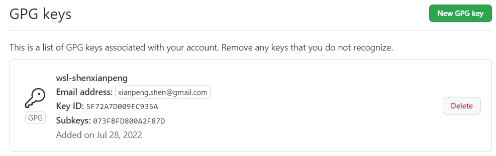

### First, List your GPG key

```bash
# If folders does not exist will create be related automatically
$ gpg --list-keys
gpg: directory '/home/ubuntu/.gnupg' created
gpg: keybox '/home/ubuntu/.gnupg/pubring.kbx' created
gpg: /home/ubuntu/.gnupg/trustdb.gpg: trustdb created

$ gpg --list-key
```

### Second, generate GPG key


```bash
$ gpg --gen-key
gpg (GnuPG) 2.2.19; Copyright (C) 2019 Free Software Foundation, Inc.
This is free software: you are free to change and redistribute it.
There is NO WARRANTY, to the extent permitted by law.

Note: Use "gpg --full-generate-key" for a full featured key generation dialog.

GnuPG needs to construct a user ID to identify your key.

Real name: shenxianpeng
Email address: xianpeng.shen@gmail.com
You selected this USER-ID:
    "shenxianpeng <xianpeng.shen@gmail.com>"

Change (N)ame, (E)mail, or (O)kay/(Q)uit? O
We need to generate a lot of random bytes. It is a good idea to perform
some other action (type on the keyboard, move the mouse, utilize the
disks) during the prime generation; this gives the random number
generator a better chance to gain enough entropy.
We need to generate a lot of random bytes. It is a good idea to perform
some other action (type on the keyboard, move the mouse, utilize the
disks) during the prime generation; this gives the random number
generator a better chance to gain enough entropy.
gpg: key 5F72A7D009FC935A marked as ultimately trusted
gpg: directory '/home/ubuntu/.gnupg/openpgp-revocs.d' created
gpg: revocation certificate stored as '/home/ubuntu/.gnupg/openpgp-revocs.d/F0F32CB8C65536ECE0187EAD5F72A7D009FC935A.rev'
public and secret key created and signed.

pub   rsa3072 2022-07-28 [SC] [expires: 2024-07-27]
      F0F32CB8C65536ECE0187EAD5F72A7D009FC935A
uid                      shenxianpeng <xianpeng.shen@gmail.com>
sub   rsa3072 2022-07-28 [E] [expires: 2024-07-27]
```

### Third, get your public key content

```bash
# get with your email
gpg --armor --export xianpeng.shen@gmail.com
# or with your pub key id
pg --armor --export F0F32CB8C65536ECE0187EAD5F72A7D009FC935A

#
# public key content output below
#

```

### Fourth, add the public key content (GPG keys) to GitHub

Open GitHub, Settings -> SSH and GPG keys -> New GPG key



Then when you commit with command `git commit -S -m "Your commit message"`, then a verified signature will show on GitHub


---

转载本站文章请注明作者和出处，请勿用于任何商业用途。欢迎关注公众号「DevOps攻城狮」
