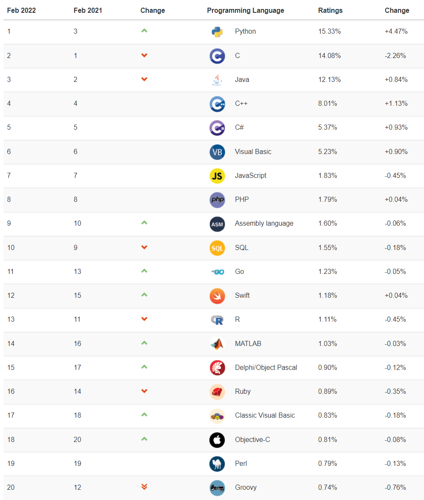
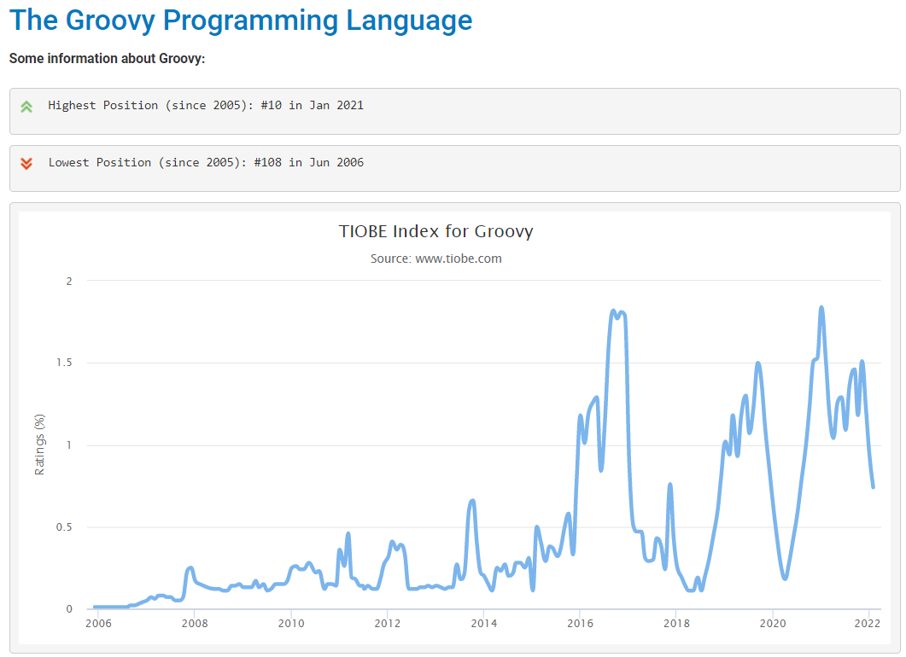

在使用 Jenkins 和 Groovy 越久，我就这样的疑问：

Groovy 到底是什么语言？
Groovy 有哪些特性？
Groovy 和 Java 有什么区别？
Groovy 和 Java 如何选择？
Groovy 在整个开发语言中占什么位置？要不要学？

本篇我的学习结果的分享，希望也能帮助你解答以上的这些问题。

## 什么是 Groovy

Apache Groovy 是一种强大的、可选类型的动态语言，具有静态类型和静态编译功能，适用于 Java 平台，旨在通过简洁、熟悉且易于学习的语法提高开发人员的工作效率。
它与任何 Java 程序顺利集成，并立即为你的应用程序提供强大的功能，包括脚本功能、特定领域语言创作、运行时和编译时元编程和函数式编程。

## Groovy 的特性

翻译官方的说法，Groovy 有以下六大特性。

1. 平坦的学习曲线 - 简洁、易读且富有表现力的语法，Java 开发人员易于学习
2. 强大的功能 - 闭包、构建器、运行时和编译时元编程、函数式编程、类型推断和静态编译
3. 流畅的 Java 集成 - 与 Java 和任何第三方库无缝、透明地集成和互操作
4. 领域特定语言 - 灵活可延展的语法，先进的集成和定制机制，在你的应用程序中集成可读的业务规则
5. 充满活力和丰富的生态系统 - Web 开发、响应式应用程序、并发/异步/并行库、测试框架、构建工具、代码分析、GUI 构建
6. 脚本和测试胶水 - 非常适合编写简洁和可维护的测试，以及所有构建和自动化任务

## Groovy 和 Java 的区别

1. Groovy 是一种编程语言，也支持脚本语言；Java 是一种面向对象的编程语言。
2. Groovy 支持多方法，运行方法的选择将在运行时选择；Java 提供多方法的声明，在编译时而不是运行时选择。
3. Groovy 中，自动资源管理机制是不存在的，静态的、匿名的内部类；Java 从 Java7 版本开始就提供了自动资源管理，在内部静态类或匿名类方面占上风。
4. Groovy 中，有一些函数式编程特性，如 Lambda 函数，函数式接口；而 Java 从 JDK 8 版本开始就有 Lambda 函数、函数式接口和许多其他的流和并行操作功能。
5. Groovy 可以用单引号或双引号格式定义和声明字符串和字符字面；Java 只有双引号格式来声明和定义字符串字面或字符字面。
6. Groovy 中所有东西都是一个对象，并且只使用对象。因此，不存在自动装箱或拆箱的概念，也不存在基元的转换；相反，Java 有基元数据类型和 Wrapper 类，可以显式或隐式地进行自动装箱和自动拆箱。
7. Groovy 中，数据类型的自动拓宽和缩小有很多宽广的范围，有很多转换；而Java在数据类型的缩小或拓宽方面有限制。
8. Groovy 对其所有类型的类成员或数据都有一个默认的访问修饰符；而Java的默认访问级别是包级，取决于类成员的类型。
9. Groovy 在其类中自动生成 getters 和 setter 来访问和修改类的成员；而在 Java 中，它们必须在类中明确提到访问修饰符。
10. Groovy 有 Groovy beans；而Java有Java beans。
11. Groovy 也被称为 Java 的超集，因为 Java 程序可以在 Groovy 环境中运行。反过来并不一定。
12. Groovy 在定义类型时有更简单的语法，只需使用 def 来声明一个变量；Java有不同类型的类型名称来声明变量或类的任何方法或成员。
13. Groovy 不要求任何主方法或方法的入口点来运行类或任何程序；而 Java 则要求类中的 main 方法来运行程序。

## Groovy 和 Java 如何选择

* 如果可扩展性和性能至关重要并且公司开发 Web 应用程序，当然是 Java。比如电商、银行、金融、国防、医疗保健等领域的大公司都会选择 Java，因为它经过时间证明，通常用于开发复杂的企业项目。
* Groovy 可以用来编排一些 Pipeline，自动化，测试任务，因为它既是编程语言也是一种出色的脚本语言，功能强大且易于学习。

## Groovy 目前流行排名

我们从这张图看到 2022 年 Groovy 语言的排行有一个非常大的下滑，从之前的排名 12 直接跌倒了 20。

从数据上 2022 年 2 月 Groovy 有小幅减少（从 0.76，%0.74%），但这不是主要原因，主要是很可能是因为 TIOBE index 从 Alexa 更换为 Similarweb 网络流量引擎导致的波动。

这些语言的排名上升包括：Assembly language，Go，Swift, MATLAB, Delphi/Object Pascal, Classic Visual Basic, Objective-C 的增长抢占了 Groovy 原有的位置。

另外从 Groovy 的流行历史来看，它目前还是有很多人在使用的。开发者或许不会把它当作第一语言，但作为脚本语言学习一下还是可以的。

对于使用 Jenkins Shared Libraries 的 DevOps 工程师，需要学习 Groovy。

## 参考

* Groovy vs Java: https://flyoutsourcing.com/blog/groovy-vs.-java-what-suits-your-needs.html
* Differences with Java：https://groovy-lang.org/differences.html
* TIOBE index：https://www.tiobe.com/tiobe-index/
