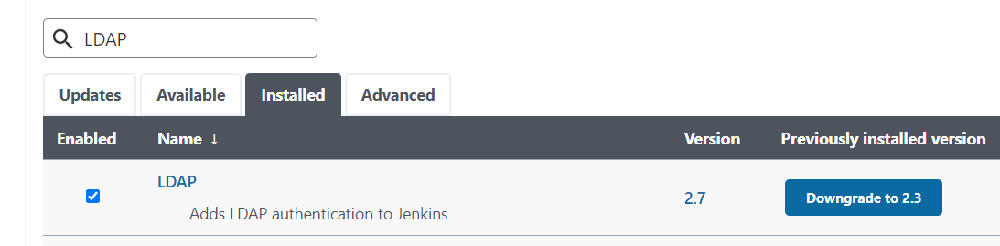

## 简介

在很多组织中，使用 **LDAP 登录** 是用户凭证认证的常见方式。

---

## 配置 LDAP

**前提**：已安装 Jenkins LDAP 插件



关于详细配置方法，可以参考 Jenkins LDAP 插件官方文档：  
https://plugins.jenkins.io/ldap/

以下是我用于测试的 LDAP 配置示例：


---

## 无法使用 LDAP 登录？

有时由于组织的 LDAP 服务器出现问题，导致无法通过 LDAP 登录 Jenkins，但你仍需要继续使用 Jenkins。

此时可以通过修改 `config.xml` 临时禁用 LDAP 身份验证。

```bash
# 登录 Jenkins 服务器并进入 Jenkins 主目录
cd /var/lib/jenkins/

# 强烈建议在修改前备份 config.xml !!!
cp config.xml config.xml.bak

# 修改 config.xml，将
<useSecurity>true</useSecurity>
# 改为
<useSecurity>false</useSecurity>

# 重启 Jenkins 服务
sudo service jenkins restart
```

这样你就可以再次登录 Jenkins 了。

---

当组织的 LDAP 恢复正常后，你可以将 `config.xml` 替换为之前的备份文件，用户即可继续通过 LDAP 登录。

---

转载本文请注明作者与出处，禁止商业用途。欢迎关注公众号「DevOps攻城狮」。
