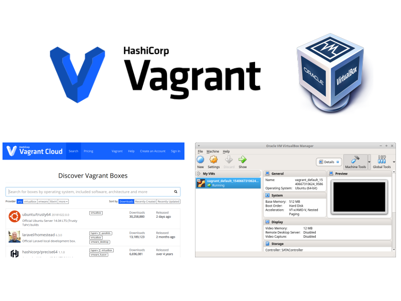

## What is Vagrant

Vagrant is an [open-source](https://github.com/hashicorp/vagrant) software product used to easily build and maintain virtual software development environments.

For example, it can build development environments based on providers such as VirtualBox, VMware, KVM, Hyper-V, AWS, and even Docker. It improves development efficiency by simplifying the configuration management of virtualized software.

Vagrant is developed in Ruby, but its ecosystem supports development in several other languages.

Simply put, Vagrant is an encapsulation layer over traditional virtual machines, allowing you to use virtual development environments more conveniently.

## Vagrant's History

Vagrant was initially launched as a personal project by [Mitchell Hashimoto](https://www.hashicorp.com/about?name=mitchell-hashimoto) in January 2010.

The first version of Vagrant was released in March 2010. In October 2010, Engine Yard announced that they would sponsor the Vagrant project.

The first stable version of Vagrant, Vagrant 1.0, was released in March 2012, exactly two years after the original release.

In November of the same year, Mitchell founded HashiCorp to support full-time development of Vagrant. Vagrant remains open-source software, and HashiCorp is committed to creating commercial versions and providing professional support and training for Vagrant.

Now HashiCorp has become a world-leading open-source company. Through a series of products, including Vagrant, Packer (packaging), Nomad (deployment), Terraform (cloud environment configuration), Vault (access management), and Consul (monitoring), it has redefined the entire DevOps process from end to end.

Vagrant initially supported VirtualBox, and version 1.1 added support for other virtualization software (such as VMware and KVM), as well as support for server environments such as Amazon EC2. Starting with version 1.6, Vagrant natively supported Docker containers, which can replace fully virtualized operating systems in some cases.

## How to Use Vagrant

Prerequisites for using Vagrant:

1. Install Vagrant. Download [Vagrant](https://www.vagrantup.com/downloads)
2. Install [VirtualBox](https://www.virtualbox.org/)

Once both are ready, you can create and use your virtual machine via the command line.

For example, you need an [Ubuntu 18.04 LTS 64-bit](https://app.vagrantup.com/hashicorp/boxes/bionic64) virtual machine. More virtual machines can be searched for on the [Box](https://app.vagrantup.com/boxes/search) website, which is similar to Docker Hub, where users can download and upload various Vagrant Boxes.

You only need to execute a few simple commands to complete startup, login, logout, and destruction.

Initialize Vagrant

```bash
vagrant init hashicorp/bionic64
```

Start the virtual machine. This should take a few tens of seconds (the first time will take longer to download the image, depending on your internet speed).

```bash
vagrant up
```

Log in to your virtual machine, and you can then use your created Ubuntu virtual machine.

```bash
vagrant ssh
```

When you're done, execute `logout` to log out.

## Differences Between Vagrant and Traditional Virtual Machine Software




Vagrant is much more convenient than traditional virtual machine usage. Let's look at how to create a virtual machine using the traditional method.

Taking VirtualBox as an example, assuming you have already installed VirtualBox, the steps to create a virtual machine using the traditional method are as follows:

First, download the corresponding ISO file.
Then, load the ISO using VirtualBox or VMware.
Finally, configure the CPU, memory, disk, network, user, etc., and wait for the installation to complete.

This method is very cumbersome to configure, requiring step-by-step operations.  These configuration steps often require documentation to ensure that an "identical" virtual development environment can be created later.

By comparison, you should now have a general understanding of how Vagrant is used and some of the differences between it and traditional virtual machine usage.

## Summary

The advantages of Vagrant over traditional virtual machine usage: it provides easy-to-configure, reproducible, and portable work environments, thereby improving productivity and flexibility.

**Vagrant can be said to be the easiest and fastest way to create and manage virtualized environments!**

It is able to be so convenient because it stands on the shoulders of giants (VirtualBox, VMware, AWS, OpenStack, or other providers), and then uses tools such as Shell scripts, Ansible, Chef, and Puppet to automatically install and configure software on the virtual machine.

The next article will introduce the [differences between Vagrant and Docker](../vagrant-vs-docker/).
