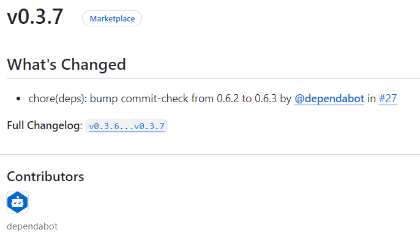
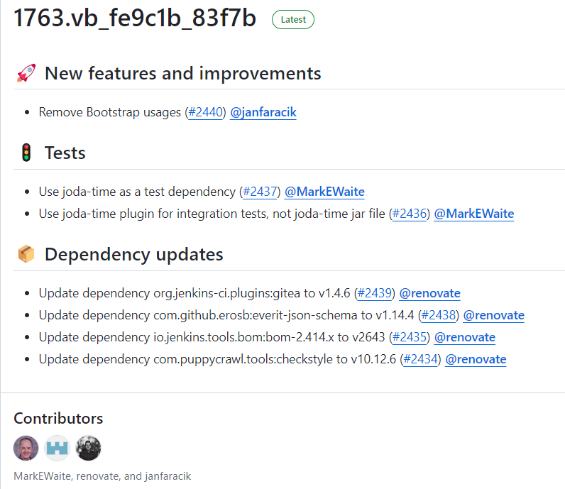
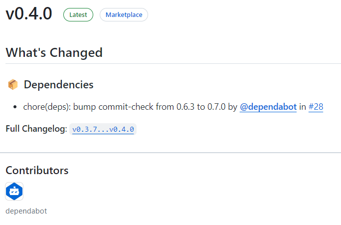

If you've used GitHub to release projects, you'll know that GitHub can [automatically generate Release Notes](https://docs.github.com/en/repositories/releasing-projects-on-github/automatically-generated-release-notes#creating-automatically-generated-release-notes-for-a-new-release).

Here's an example of GitHub's automatically generated Release Notes.



The Release Notes in this screenshot are concise and easy to read.  However, if the content is extensive, as in the case of the [configuration-as-code-plugin](https://github.com/jenkinsci/configuration-as-code-plugin) project under the Jenkinsci organization, you'll see that the Release Notes are categorized by title. If this content were mixed together, the experience would be significantly worse. (Don't mistake this for manual categorization; programmers wouldn't want to do that 😅)



**This article will share two methods for automatically categorizing the content of GitHub Release Notes based on their titles.**


## Method One: Using GitHub's Built-in Functionality

Method one uses GitHub's built-in functionality to automatically categorize Release Notes. This involves creating a configuration file, `.github/release.yml`, in your repository. This functionality is similar to GitHub's Issue Template and Pull Request Template.  Specific configuration options can be found in the [official documentation](https://docs.github.com/en/repositories/releasing-projects-on-github/automatically-generated-release-notes#configuration-options).

Below is the configuration from the commit-check-action project [configuration](https://github.com/commit-check/commit-check-action/blob/main/.github/release.yml):

```yaml
changelog:
  exclude:
    labels:
      - ignore-for-release
  categories:
    - title: '🔥 Breaking Changes'
      labels:
        - 'breaking'
    - title: 🏕 Features
      labels:
        - 'enhancement'
    - title: '🐛 Bug Fixes'
      labels:
        - 'bug'
    - title: '👋 Deprecated'
      labels:
        - 'deprecation'
    - title: 📦 Dependencies
      labels:
        - dependencies
    - title: Other Changes
      labels:
        - "*"
```

With the `.github/release.yml` configuration file added, the next time Release Notes are generated, the content will be automatically categorized (the 📦 Dependencies title in the image below is automatically added).



## Method Two: Using Release Drafter

Method two uses [Release Drafter](https://github.com/release-drafter/release-drafter), requiring a configuration file named `.github/release-drafter.yml` in your repository.

The [configuration options](https://github.com/release-drafter/release-drafter?tab=readme-ov-file#configuration-options) provided by the Release Drafter project show that it offers more features and is more complex to use.  It also supports placing the configuration file in a central repository's `.github` directory to enable unified configuration and sharing across multiple repositories.

> Currently, method one (`.github/release.yml`) does not support unified configuration via a central `.github` repository; see this [discussion](https://github.com/orgs/community/discussions/7926).

Here's an example of the `.github/release-drafter.yml` configuration from [jenkinsci/configuration-as-code-plugin](https://github.com/jenkinsci/configuration-as-code-plugin).

```yaml
_extends: .github
```

The `_extends: .github` configuration inherits settings from the central repository's [`.github/.github/release-drafter.yml`](https://github.com/jenkinsci/.github/blob/master/.github/release-drafter.yml) configuration.

```yaml
# Configuration for Release Drafter: https://github.com/toolmantim/release-drafter
name-template: $NEXT_MINOR_VERSION
tag-template: $NEXT_MINOR_VERSION
# Uses a more common 2-digit versioning in Jenkins plugins. Can be replaced by semver: $MAJOR.$MINOR.$PATCH
version-template: $MAJOR.$MINOR

# Emoji reference: https://gitmoji.carloscuesta.me/
# If adding categories, please also update: https://github.com/jenkins-infra/jenkins-maven-cd-action/blob/master/action.yaml#L16
categories:
  - title: 💥 Breaking changes
    labels:
      - breaking
  - title: 🚨 Removed
    labels:
      - removed
  - title: 🎉 Major features and improvements
    labels:
      - major-enhancement
      - major-rfe
  - title: 🐛 Major bug fixes
    labels:
      - major-bug
  - title: ⚠️ Deprecated
    labels:
      - deprecated
  - title: 🚀 New features and improvements
    labels:
      - enhancement
      - feature
      - rfe
  - title: 🐛 Bug fixes
    labels:
      - bug
      - fix
      - bugfix
      - regression
      - regression-fix
  - title: 🌐 Localization and translation
    labels:
      - localization
  - title: 👷 Changes for plugin developers
    labels:
      - developer
  - title: 📝 Documentation updates
    labels:
      - documentation
  - title: 👻 Maintenance
    labels:
      - chore
      - internal
      - maintenance
  - title: 🚦 Tests
    labels:
      - test
      - tests
  - title: ✍ Other changes
  # Default label used by Dependabot
  - title: 📦 Dependency updates
    labels:
      - dependencies
    collapse-after: 15
exclude-labels:
  - reverted
  - no-changelog
  - skip-changelog
  - invalid

template: |
  <!-- Optional: add a release summary here -->
  $CHANGES

replacers:
  - search: '/\[*JENKINS-(\d+)\]*\s*-*\s*/g'
    replace: '[JENKINS-$1](https://issues.jenkins.io/browse/JENKINS-$1) - '
  - search: '/\[*HELPDESK-(\d+)\]*\s*-*\s*/g'
    replace: '[HELPDESK-$1](https://github.com/jenkins-infra/helpdesk/issues/$1) - '
  # TODO(oleg_nenashev): Find a better way to reference issues
  - search: '/\[*SECURITY-(\d+)\]*\s*-*\s*/g'
    replace: '[SECURITY-$1](https://jenkins.io/security/advisories/) - '
  - search: '/\[*JEP-(\d+)\]*\s*-*\s*/g'
    replace: '[JEP-$1](https://github.com/jenkinsci/jep/tree/master/jep/$1) - '
  - search: '/CVE-(\d{4})-(\d+)/g'
    replace: 'https://cve.mitre.org/cgi-bin/cvename.cgi?name=CVE-$1-$2'
  - search: 'JFR'
    replace: 'Jenkinsfile Runner'
  - search: 'CWP'
    replace: 'Custom WAR Packager'
  - search: '@dependabot-preview'
    replace: '@dependabot'

autolabeler:
  - label: 'documentation'
    files:
      - '*.md'
    branch:
      - '/docs{0,1}\/.+/'
  - label: 'bug'
    branch:
      - '/fix\/.+/'
    title:
      - '/fix/i'
  - label: 'enhancement'
    branch:
      - '/feature\/.+/'
    body:
      - '/JENKINS-[0-9]{1,4}/'
```

This is the central repository's `.github/.github/release-drafter.yml` configuration.  The Jenkins official configuration uses many features, such as templates, replacements, and automatic label addition.  A thorough reading of the [Release Drafter documentation](https://github.com/release-drafter/release-drafter?tab=readme-ov-file#configuration-options) is recommended for a better understanding and utilization.

## Summary

Both methods can automatically categorize titles when generating Release Notes, but they have some key differences. Understanding these differences will help you make a better choice.

1. GitHub's built-in method is easier to understand and configure and meets the needs of most projects. Its main drawback is the lack of support for reading `.github/release.yml` from a central `.github` repository.
2. Release Drafter provides more powerful features, such as templates, sorting, replacements, and automatic label addition to pull requests.  Importantly, it allows the creation of a template in a central repository for inheritance by other projects.


For large open-source organizations, Release Drafter is a better choice due to its powerful features and support for inheriting central repository configurations. For personal projects, GitHub's built-in method is generally sufficient.

This concludes my discussion of the two methods for automatically generating and categorizing GitHub Release Notes.

Please feel free to leave any questions or suggestions in the comments section.

---

Please cite the author and source when reprinting this article.  Do not use it for any commercial purposes.  Follow the "DevOps攻城狮" WeChat official account.