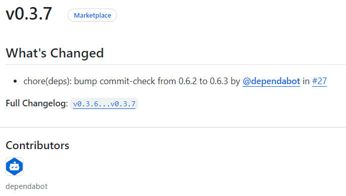
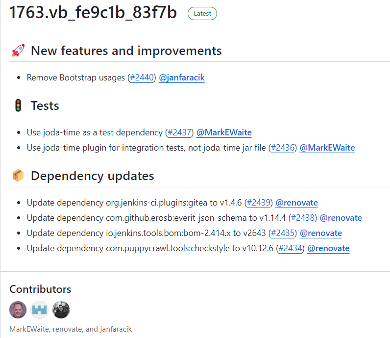
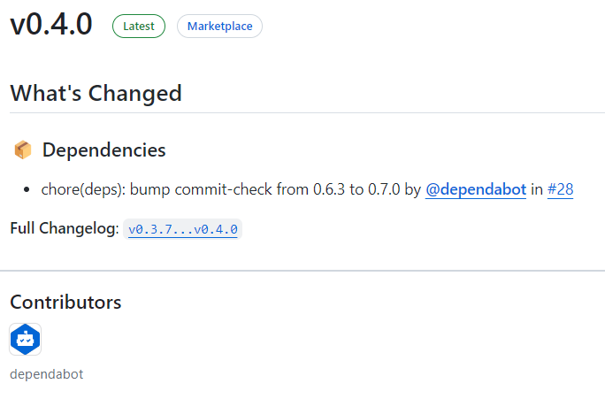

如果你使用过 GitHub 发布过项目，你会知道 GitHub 可以[自动生成 Release Notes](https://docs.github.com/en/repositories/releasing-projects-on-github/automatically-generated-release-notes#creating-automatically-generated-release-notes-for-a-new-release)。

就像这样 GitHub 自动生成的 Release Notes。



这个截图里的 Release Notes 内容很少，看起来还很清晰。但如果内容很多，以 Jenkinsci 组织下的 [configuration-as-code-plugin](https://github.com/jenkinsci/configuration-as-code-plugin) 项目为例，可以看出来这里的 Release Notes 中的内容是按照标题进行分类的，假如这些内容混在一起将会非常糟糕的体验。(不要误以为这是手动进行分类的，程序员才不愿意干这种事😅)



**本文将分享针对需要对 GitHub Release Notes 的内容按照标题进行自动分类的两种方式。**


## 方式一：使用 GitHub 官方提供的功能

方式一是通过 GitHub 提供的功能对 Release Notes 进行自动分类，即在仓库下面创建配置文件 `.github/release.yml`。这个功能与 GitHub 的 Issue Template 和 Pull Request Template 类似。具体的配置选项可以参考[官方文档](https://docs.github.com/en/repositories/releasing-projects-on-github/automatically-generated-release-notes#configuration-options)

以下我是在 commit-check-action 项目的[配置](https://github.com/commit-check/commit-check-action/blob/main/.github/release.yml)

```yaml
changelog:
  exclude:
    labels:
      - ignore-for-release
  categories:
    - title: '🔥 Breaking Changes'
      labels:
        - 'breaking'
    - title: 🏕 Features
      labels:
        - 'enhancement'
    - title: '🐛 Bug Fixes'
      labels:
        - 'bug'
    - title: '👋 Deprecated'
      labels:
        - 'deprecation'
    - title: 📦 Dependencies
      labels:
        - dependencies
    - title: Other Changes
      labels:
        - "*"
```

针对上面的示例，在添加了 `.github/release.yml` 配置文件之后，当再次生成 Release Notes 时就会自动将其内容进行自动归类（下图中的标题 📦 Dependencies 是自动添加的）



## 方式二：使用 Release Drafter

方式二是使用 [Release Drafter](https://github.com/release-drafter/release-drafter)，即在仓库创建配置文件 `.github/release-drafter.yml`。

从 Release Drafter 项目提供的[配置参数](https://github.com/release-drafter/release-drafter?tab=readme-ov-file#configuration-options)可以看出来它提供的功能更多，使用也更加复杂。另外它还支持将配置文件放到组织下的中央仓库 `.github` 来实现统一的配置、并将其共享给其他仓库。

> 目前方式一 `.github/release.yml` 不支持通过中央仓库 `.github` 来实现统一的配置，详见这个[讨论](https://github.com/orgs/community/discussions/7926)。

这里还以 [jenkinsci/configuration-as-code-plugin](https://github.com/jenkinsci/configuration-as-code-plugin) 为例看到它的 `.github/release-drafter.yml` 的配置。

```yaml
_extends: .github
```

这个配置的 `_extends: .github` 表示从中央仓库 [`.github/.github/release-drafter.yml`](https://github.com/jenkinsci/.github/blob/master/.github/release-drafter.yml) 继承过来的配置。

```yaml
# Configuration for Release Drafter: https://github.com/toolmantim/release-drafter
name-template: $NEXT_MINOR_VERSION
tag-template: $NEXT_MINOR_VERSION
# Uses a more common 2-digit versioning in Jenkins plugins. Can be replaced by semver: $MAJOR.$MINOR.$PATCH
version-template: $MAJOR.$MINOR

# Emoji reference: https://gitmoji.carloscuesta.me/
# If adding categories, please also update: https://github.com/jenkins-infra/jenkins-maven-cd-action/blob/master/action.yaml#L16
categories:
  - title: 💥 Breaking changes
    labels:
      - breaking
  - title: 🚨 Removed
    labels:
      - removed
  - title: 🎉 Major features and improvements
    labels:
      - major-enhancement
      - major-rfe
  - title: 🐛 Major bug fixes
    labels:
      - major-bug
  - title: ⚠️ Deprecated
    labels:
      - deprecated
  - title: 🚀 New features and improvements
    labels:
      - enhancement
      - feature
      - rfe
  - title: 🐛 Bug fixes
    labels:
      - bug
      - fix
      - bugfix
      - regression
      - regression-fix
  - title: 🌐 Localization and translation
    labels:
      - localization
  - title: 👷 Changes for plugin developers
    labels:
      - developer
  - title: 📝 Documentation updates
    labels:
      - documentation
  - title: 👻 Maintenance
    labels:
      - chore
      - internal
      - maintenance
  - title: 🚦 Tests
    labels:
      - test
      - tests
  - title: ✍ Other changes
  # Default label used by Dependabot
  - title: 📦 Dependency updates
    labels:
      - dependencies
    collapse-after: 15
exclude-labels:
  - reverted
  - no-changelog
  - skip-changelog
  - invalid

template: |
  <!-- Optional: add a release summary here -->
  $CHANGES

replacers:
  - search: '/\[*JENKINS-(\d+)\]*\s*-*\s*/g'
    replace: '[JENKINS-$1](https://issues.jenkins.io/browse/JENKINS-$1) - '
  - search: '/\[*HELPDESK-(\d+)\]*\s*-*\s*/g'
    replace: '[HELPDESK-$1](https://github.com/jenkins-infra/helpdesk/issues/$1) - '
  # TODO(oleg_nenashev): Find a better way to reference issues
  - search: '/\[*SECURITY-(\d+)\]*\s*-*\s*/g'
    replace: '[SECURITY-$1](https://jenkins.io/security/advisories/) - '
  - search: '/\[*JEP-(\d+)\]*\s*-*\s*/g'
    replace: '[JEP-$1](https://github.com/jenkinsci/jep/tree/master/jep/$1) - '
  - search: '/CVE-(\d{4})-(\d+)/g'
    replace: 'https://cve.mitre.org/cgi-bin/cvename.cgi?name=CVE-$1-$2'
  - search: 'JFR'
    replace: 'Jenkinsfile Runner'
  - search: 'CWP'
    replace: 'Custom WAR Packager'
  - search: '@dependabot-preview'
    replace: '@dependabot'

autolabeler:
  - label: 'documentation'
    files:
      - '*.md'
    branch:
      - '/docs{0,1}\/.+/'
  - label: 'bug'
    branch:
      - '/fix\/.+/'
    title:
      - '/fix/i'
  - label: 'enhancement'
    branch:
      - '/feature\/.+/'
    body:
      - '/JENKINS-[0-9]{1,4}/'
```

以上是中央仓库的 `.github/.github/release-drafter.yml` 配置，可以看到 Jenkins 官方使用了很多特性，比如模板、替换、自动加 label 等，需要在通读 [Release Drafter 的文档](https://github.com/release-drafter/release-drafter?tab=readme-ov-file#configuration-options)之后能更好的理解和使用。

## 总结

以上两种方式都可以帮助你在自动生成 Release Notes 的时候自动进行标题分类，但两者有一些如下差别，了解它们可以帮助你更好的进行选择。

1. GitHub 官方提供的方式更容易理解和配置，可以满足绝大多数的项目需求。主要的不足是不支持从中央仓库 `.github` 中读取 `.github/release.yml`。
2. Release Drafter 提供了更为强大的功能，比如模板、排序、替换、自动对 pull request 加 label 等等，尤其是可以通过中央仓库来设置一个模板，其他项目来继承其配置。

如果是大型的开源组织，Release Drafter 是更好的选择，因为它提供了强大的功能以及支持继承中央仓库配置。如果是个人项目，GitHub 官方提供的方式基本满足需求。

以上就是我对两个生成 GitHub Release Notes 并进行自动分类的分享。

如果有任何疑问或建议欢迎在评论区留言。

---

转载本站文章请注明作者和出处，请勿用于任何商业用途。欢迎关注公众号「沈显鹏」
