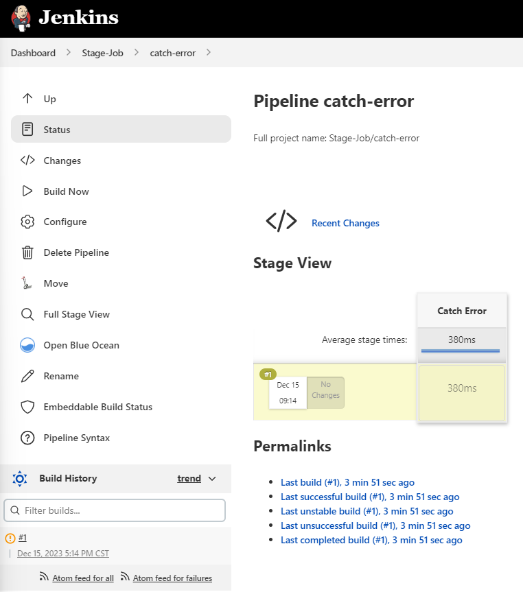

Sometimes you don't want Jenkins pipeline failed for a specific error occurs. so you can use `catchError` to catch error and update stage or build result to `SUCCESSFUL` or `UNSTABLE` or `FAILURE` (if you want)




Here is the Jenkinsfile of pipeline

```
pipeline {
    agent { node { label 'linux' } }

    stages {
        stage('Catch Error') {
            steps {
                catchError(buildResult: 'UNSTABLE', stageResult: 'UNSTABLE', message: 'abc: command not found') {
                    sh "abc"
                }
            }
        }
    }
}
```

Here is the output of pipeline

```bash
17:14:07  [Pipeline] Start of Pipeline
17:14:08  [Pipeline] node
17:14:08  Running on linux in /agent/workspace/Stage-Job/catch-error
17:14:08  [Pipeline] {
17:14:08  [Pipeline] stage
17:14:08  [Pipeline] { (Catch Error)
17:14:08  [Pipeline] catchError
17:14:08  [Pipeline] {
17:14:08  [Pipeline] sh
17:14:08  + abc
17:14:08  /agent/workspace/Stage-Job/catch-error@tmp/durable-303b03ca/script.sh: line 1: abc: command not found
17:14:08  [Pipeline] }
17:14:08  ERROR: abc: command not found
17:14:08  ERROR: script returned exit code 127
17:14:08  [Pipeline] // catchError
17:14:08  [Pipeline] }
17:14:08  [Pipeline] // stage
17:14:08  [Pipeline] }
17:14:08  [Pipeline] // node
17:14:08  [Pipeline] End of Pipeline
17:14:08  Finished: UNSTABLE
```
---

转载本站文章请注明作者和出处，请勿用于任何商业用途。欢迎关注公众号「DevOps攻城狮」
