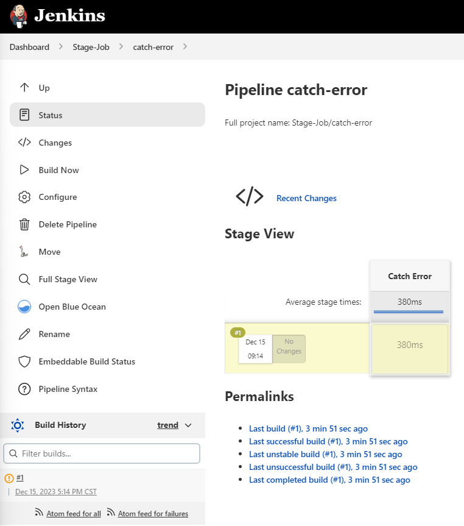

有时候，我们并不希望 Jenkins Pipeline 因为某个特定错误而直接失败。  
这时可以使用 `catchError` 来捕获错误，并将阶段（stage）或构建（build）结果更新为 `SUCCESS`、`UNSTABLE` 或 `FAILURE`（如果需要的话）。



---

## Jenkinsfile 示例

```groovy
pipeline {
    agent { node { label 'linux' } }

    stages {
        stage('Catch Error') {
            steps {
                catchError(buildResult: 'UNSTABLE', stageResult: 'UNSTABLE', message: 'abc: command not found') {
                    sh "abc"
                }
            }
        }
    }
}
```

---

## Pipeline 输出示例

```bash
17:14:07  [Pipeline] Start of Pipeline
17:14:08  [Pipeline] node
17:14:08  Running on linux in /agent/workspace/Stage-Job/catch-error
17:14:08  [Pipeline] {
17:14:08  [Pipeline] stage
17:14:08  [Pipeline] { (Catch Error)
17:14:08  [Pipeline] catchError
17:14:08  [Pipeline] {
17:14:08  [Pipeline] sh
17:14:08  + abc
17:14:08  /agent/workspace/Stage-Job/catch-error@tmp/durable-303b03ca/script.sh: line 1: abc: command not found
17:14:08  [Pipeline] }
17:14:08  ERROR: abc: command not found
17:14:08  ERROR: script returned exit code 127
17:14:08  [Pipeline] // catchError
17:14:08  [Pipeline] }
17:14:08  [Pipeline] // stage
17:14:08  [Pipeline] }
17:14:08  [Pipeline] // node
17:14:08  [Pipeline] End of Pipeline
17:14:08  Finished: UNSTABLE
```

---

转载本文请注明作者与出处，禁止商业用途。欢迎关注公众号「DevOps攻城狮」。