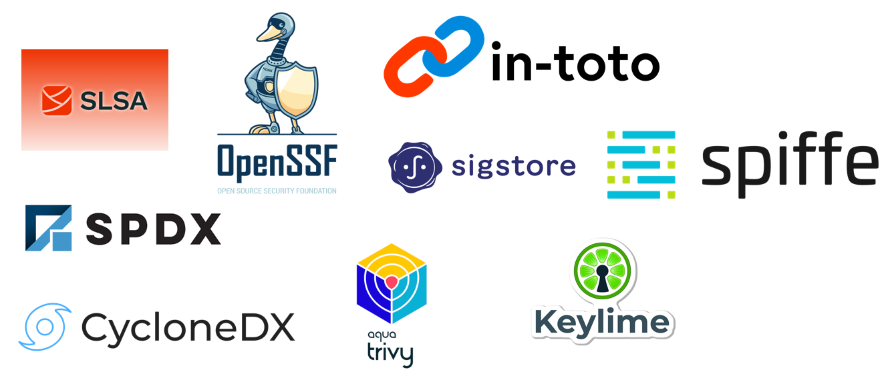

## 为什么软件供应链安全很重要？

软件供应链安全是指保障软件开发中涉及的组件、活动与流程的安全。

近年来，软件供应链攻击愈发频繁。SonaType 报告称，从 2019 年到 2022 年，开源软件供应链攻击增长了 **700% 以上**。


在 [Google 安全博客](https://security.googleblog.com/2021/06/introducing-slsa-end-to-end-framework.html) 中，列举了许多真实的供应链攻击案例。Google 于 2021 年提出了名为 **SLSA** 的解决方案。

同时，Linux Foundation 与 CNCF 等知名组织也提出了相关标准与工具，用于帮助生产可信的软件与生成证明文件（attestation）。



基于此背景，许多组织希望将开源社区的最佳实践引入到自身的 CICD 流水线中。

---

## 如何在 GitHub 与非 GitHub 项目中采用软件供应链安全

下面我将分别以 **GitHub** 与 **Rocket Bitbucket** 为例，介绍如何集成软件供应链安全。

---

### GitHub 项目

在 GitHub 上，最简单且最常用的方式是使用 **slsa-github-generator**。  
这是由 SLSA 官方提供的工具，用于在构建过程中生成证明文件（attestation），并将签名的证明文件上传到由 **Sigstore** 创建的透明日志系统 **Rekor**。

示例仓库：[slsa-provenance-demo](https://github.com/shenxianpeng/slsa-provenance-demo)

在安装你的产品包之前，用户可先下载包与其 `.intoto.jsonl` 结尾的证明文件，并手动或在 CI 流水线中运行以下命令来验证构件是否被篡改：

```bash
slsa-verifier verify-artifact test-1.0.0-py3-none-any.whl \
  --provenance-path test-1.0.0-py3-none-any.whl.intoto.jsonl \
  --source-uri github.com/shenxianpeng/slsa-provenance-demo

Verified signature against tlog entry index 49728014 at URL: https://rekor.sigstore.dev/api/v1/log/entries/24296fb24b8ad77af7063689e8760fd7134f37e17251ec1d5adc16af64cb5cb579493278f7686e77
Verified build using builder "https://github.com/slsa-framework/slsa-github-generator/.github/workflows/generator_generic_slsa3.yml@refs/tags/v1.9.0" at commit fb7f6df9f8565ed6fa01591df2af0c41e5573798
Verifying artifact test-1.0.0-py3-none-any.whl: PASSED

PASSED: Verified SLSA provenance
````

---

### 非 GitHub 项目

对于代码托管在非 GitHub 平台的组织，可以使用 **Witness**（CNCF in-toto 提供的工具）。
Witness 可在构建过程中生成与验证证明文件，且容易集成到现有构建流程中。

只需在构建命令中加入 `witness` 命令，即可在生成构建产物的同时生成证明文件、签名策略文件（policy-signed.json）以及公钥文件。

参考示例仓库：[witness-demo](https://github.com/shenxianpeng/witness-demo)

在安装产品包之前，用户可手动或在 CI 流水线中运行以下命令验证构件是否被篡改：

```bash
witness verify \
  -f dist/witness_demo-1.0.0-py3-none-any.whl \
  -a witness-demo-att.json \
  -p policy-signed.json \
  -k witness-demo-pub.pem

INFO    Using config file: .witness.yaml
INFO    Verification succeeded
INFO    Evidence:
INFO    0: witness-demo-att.json
```

---

转载本文请注明作者与出处，禁止商业用途。欢迎关注公众号「DevOps攻城狮」。
