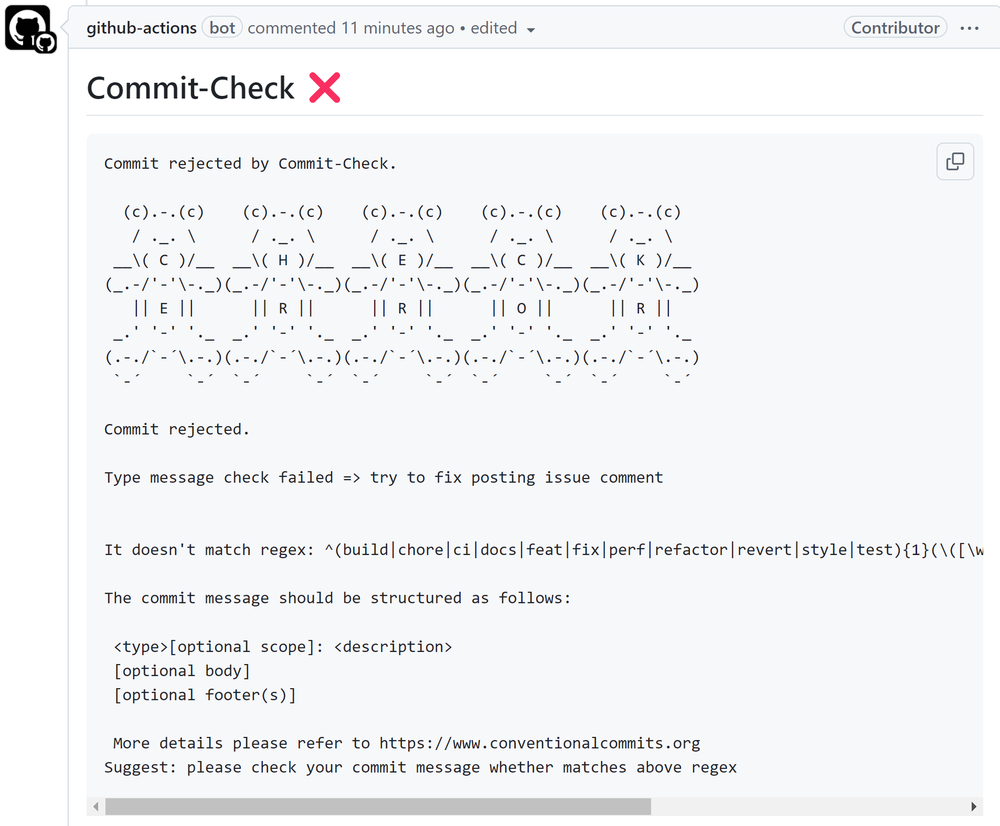

Recently, users have requested two features: support for adding comments in Pull Requests and checking if a Pull Request has been rebased.

After several nights of work, we are pleased to announce the addition of two important features in the latest `commit-check` and `commit-check-action`: `pr-comments` and `base-merge`.

These two features aim to further enhance Pull Request (PR) inspection capabilities.


### 1. `pr-comments`: Automatically Add Check Results to Pull Request

In team collaboration development, PRs are usually the main entry point for code review. To make code check results more intuitive, `pr-comments` provides a new way:

After a code commit triggers the CI/CD Pipeline, `commit-check` will automatically present the check results in the Pull Request interface as comments.

Without the need to click extra or switch to log files, developers can directly view the detection results in the PR's conversation area, facilitating quick problem location.

Success and failure example effects:




**Note:** `pr-comments` only supports [commit-check-action](https://github.com/commit-check/commit-check-action).

### 2. `base-merge`: Ensure Branch is Based on the Target Branch

In the development process, some teams want each Pull Request to be developed based on the latest target branch.

`commit-check` provides a new option: `base-merge`, which helps teams ensure that the branch has been rebased to the specified target branch (e.g., `main` or `master`).

- Automatically checks whether the current branch is based on the specified target branch.
- If an incorrect baseline is detected, `commit-check` will return an error message, causing the CI Pipeline to fail and providing clear instructions.

**Note:** `base-merge` supports [commit-check](https://github.com/commit-check/commit-check) and [commit-check-action](https://github.com/commit-check/commit-check-action).

---

## What is Commit Check

If you are unfamiliar with Commit Check, here's a brief introduction:

**Commit Check** is a free and powerful tool used to enforce commit metadata standards, including commit messages, branch naming, committer name/email, and commit signatures. Its error messages and suggested commands are fully customizable, ensuring consistency among teams.

As an alternative to [GitHub Enterprise metadata restrictions](https://docs.github.com/en/enterprise-server@3.11/repositories/configuring-branches-and-merges-in-your-repository/managing-rulesets/available-rules-for-rulesets#metadata-restrictions) and the Bitbucket paid plugin [Yet Another Commit Checker](https://marketplace.atlassian.com/apps/1211854/yet-another-commit-checker?tab=overview&hosting=datacenter), Commit Check stands out by integrating DevOps principles and Infrastructure as Code (IaC).

It is currently the best free and open-source solution for Conventional Commit and Branch support.

---

## Configuration

### Using the Default Configuration

If you don't set a `.commit-check.yml` file, Commit Check will use the default configuration. Commit messages will follow Conventional Commits rules, and branch naming will follow Conventional Branch rules.

### Custom Configuration

If you need to change the configuration, you can customize it in `.commit-check.yml`:

```yaml
checks:
  - check: message
    regex: '^(build|chore|ci|docs|feat|fix|perf|refactor|revert|style|test){1}(\([\w\-\.]+\))?(!)?: ([\w ])+([\s\S]*)|(Merge).*|(fixup!.*)'
    error: "The commit message should be structured as follows:\n\n
    <type>[optional scope]: <description>\n
    [optional body]\n
    [optional footer(s)]\n\n
    More details please refer to https://www.conventionalcommits.org"
    suggest: Please check your commit message against the above regex.

  - check: branch
    regex: ^(bugfix|feature|release|hotfix|task|chore)\/.+|(master)|(main)|(HEAD)|(PR-.+)
    error: "Branches must begin with these types: bugfix/ feature/ release/ hotfix/ task/ chore/"
    suggest: Run command `git checkout -b type/branch_name`

  - check: author_name
    regex: ^[A-Za-z ,.\'-]+$|.*(\[bot])
    error: The committer name seems invalid
    suggest: Run command `git config user.name "Your Name"`

  - check: author_email
    regex: ^.+@.+$
    error: The committer email seems invalid
    suggest: Run command `git config user.email yourname@example.com`

  - check: commit_signoff
    regex: Signed-off-by:.*[A-Za-z0-9]\s+<.+@.+>
    error: Signed-off-by not found in latest commit
    suggest: Run command `git commit -m "conventional commit message" --signoff`

  - check: merge_base
    regex: main # it can be master, develop, devel etc. based on your project.
    error: Current branch is not rebased onto target branch
    suggest: Ensure your branch is rebased with the target branch
```

---

## Usage

### As GitHub Actions

```yaml
name: Commit Check

on:
  push:
  pull_request:
    branches: 'main'

jobs:
  commit-check:
    runs-on: ubuntu-latest
    permissions:  # use permissions because of pr-comments
      contents: read
      pull-requests: write
    steps:
      - uses: actions/checkout@v4
        with:
          ref: ${{ github.event.pull_request.head.sha }}  # checkout PR HEAD commit
          fetch-depth: 0  # required for merge-base check
      - uses: commit-check/commit-check-action@v1
        env:
          GITHUB_TOKEN: ${{ secrets.GITHUB_TOKEN }} # required for pr-comments
        with:
          message: true
          branch: true
          author-name: true
          author-email: true
          commit-signoff: true
          merge-base: false
          job-summary: true
          pr-comments: ${{ github.event_name == 'pull_request' }}
```

### As pre-commit hook

Add the following configuration to the `.pre-commit-config.yaml` file:

```yaml
-   repo: https://github.com/commit-check/commit-check
    rev: the tag or revision
    hooks:
    -   id: check-message  # requires hook prepare-commit-msg
    -   id: check-branch
    -   id: check-author-name
    -   id: check-author-email
    -   id: check-commit-signoff
    -   id: check-merge-base # requires downloading all git history
```

### As CLI Tool

Install from PyPI:

```bash
pip install commit-check

# example
commit-check --message --branch --author-name --author-email --commit-signoff --merge-base
```

For more usage details, see the [README](https://github.com/commit-check/commit-check).

---

If you have any questions or suggestions, please raise them in [GitHub Issues](https://github.com/commit-check/commit-check/issues).
