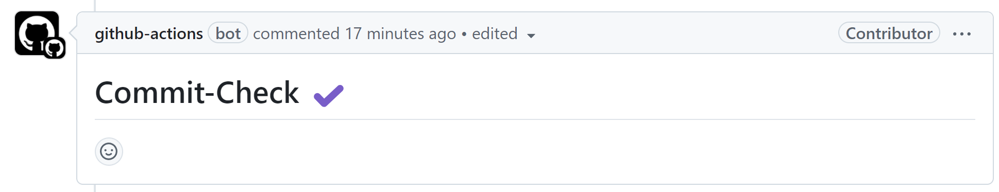
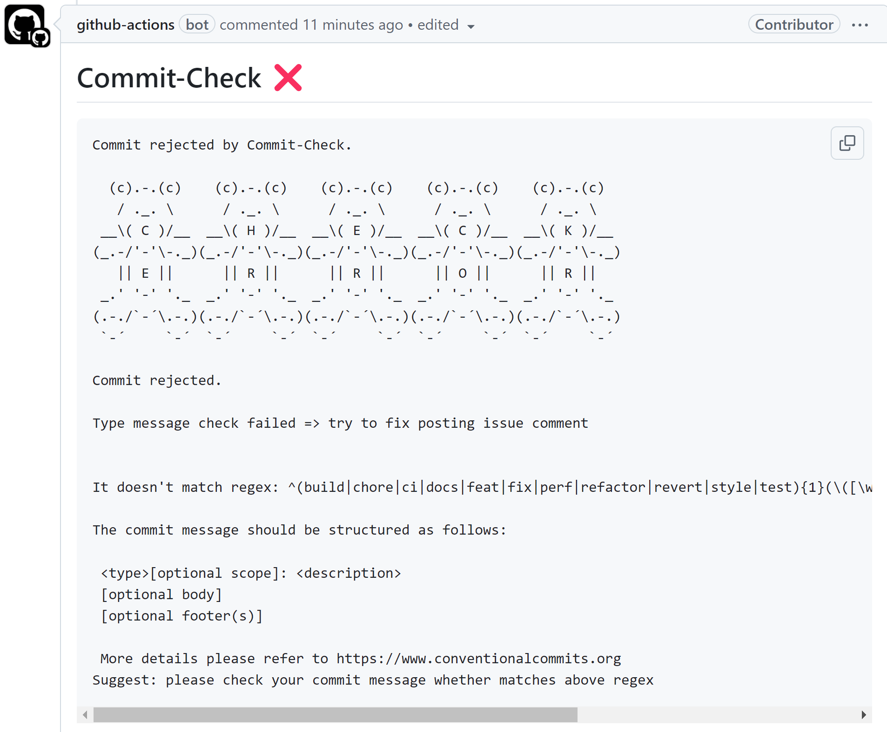

最近有用户提出两个需求：一是支持在 Pull Request 中增加评论，二是检查 Pull Request 是否已经 rebase。

经过几晚的努力，现在正式宣布在最新的 commit-check 以及 commit-check-action 中新增两个重要功能：`pr-comments` 和 `base-merge`。

这两个功能旨在进一步提升 Pull Request (PR) 的检查能力。


### 1. pr-comments: 自动添加检查结果到 Pull Request

在团队合作开发中，PR 通常是代码审核的主要入口。为了让代码检查结果更直观，pr-comments 提供了一种新方式：

当代码提交触发 CI/CD Pipeline 后，commit-check 会自动在 Pull Request 界面中以评论形式呈现检查结果。

无需额外点击或切换到日志文件，开发者可以直接在 PR 的对话区域查看检测结果，方便快速定位问题。

成功和失败的示例效果：





**注：**pr-comments 仅支持 [commit-check-action](https://github.com/commit-check/commit-check-action)。

### 2. base-merge: 确保分支基于目标分支

在开发过程中，有些团队希望每个 Pull Request 都基于最新的目标分支进行开发。

commit-check 提供了一个新的选项：`base-merge`，可以帮助团队确保分支已 rebase 到指定的目标分支（例如 main 或 master）。

- 自动检查当前分支是否基于指定目标分支。
- 如果检测到基线不正确，commit-check 会返回错误信息，让 CI Pipeline 失败，并提供明确的提示。

**注：** base-merge 支持 [commit-check](https://github.com/commit-check/commit-check) 和 [commit-check-action](https://github.com/commit-check/commit-check-action)。

---

## 什么是 Commit Check

如果你还不了解 Commit Check，这里简单介绍一下：

**Commit Check** 是一个免费且强大的工具，用于强制执行提交元数据标准，包括提交消息、分支命名、提交者姓名/邮箱以及提交签名。它的错误信息和建议命令可以完全自定义，确保团队之间的一致性。

作为 [GitHub Enterprise 元数据限制](https://docs.github.com/en/enterprise-server@3.11/repositories/configuring-branches-and-merges-in-your-repository/managing-rulesets/available-rules-for-rulesets#metadata-restrictions) 和 Bitbucket 付费插件 [Yet Another Commit Checker](https://marketplace.atlassian.com/apps/1211854/yet-another-commit-checker?tab=overview&hosting=datacenter) 的替代方案，Commit Check 通过集成 DevOps 原则和基础设施即代码（IaC）脱颖而出。

它是目前针对 Conventional Commit 和 Branch 支持最好的免费开源解决方案。

---

## 配置

### 使用默认配置

如果没有设置 `.commit-check.yml`，Commit Check 将使用默认配置。提交消息将遵循 Conventional Commits 规则，分支命名遵循 Conventional Branch 规则。

### 自定义配置

如果需要更改配置，可以在 `.commit-check.yml` 中进行自定义：

```yaml
checks:
  - check: message
    regex: '^(build|chore|ci|docs|feat|fix|perf|refactor|revert|style|test){1}(\([\w\-\.]+\))?(!)?: ([\w ])+([\s\S]*)|(Merge).*|(fixup!.*)'
    error: "The commit message should be structured as follows:\n\n
    <type>[optional scope]: <description>\n
    [optional body]\n
    [optional footer(s)]\n\n
    More details please refer to https://www.conventionalcommits.org"
    suggest: Please check your commit message against the above regex.

  - check: branch
    regex: ^(bugfix|feature|release|hotfix|task|chore)\/.+|(master)|(main)|(HEAD)|(PR-.+)
    error: "Branches must begin with these types: bugfix/ feature/ release/ hotfix/ task/ chore/"
    suggest: Run command `git checkout -b type/branch_name`

  - check: author_name
    regex: ^[A-Za-z ,.\'-]+$|.*(\[bot])
    error: The committer name seems invalid
    suggest: Run command `git config user.name "Your Name"`

  - check: author_email
    regex: ^.+@.+$
    error: The committer email seems invalid
    suggest: Run command `git config user.email yourname@example.com`

  - check: commit_signoff
    regex: Signed-off-by:.*[A-Za-z0-9]\s+<.+@.+>
    error: Signed-off-by not found in latest commit
    suggest: Run command `git commit -m "conventional commit message" --signoff`

  - check: merge_base
    regex: main # it can be master, develop, devel etc. based on your project.
    error: Current branch is not rebased onto target branch
    suggest: Ensure your branch is rebased with the target branch
```

---

## 用法

### 作为 GitHub Actions

```yaml
name: Commit Check

on:
  push:
  pull_request:
    branches: 'main'

jobs:
  commit-check:
    runs-on: ubuntu-latest
    permissions:  # use permissions because of pr-comments
      contents: read
      pull-requests: write
    steps:
      - uses: actions/checkout@v4
        with:
          ref: ${{ github.event.pull_request.head.sha }}  # checkout PR HEAD commit
          fetch-depth: 0  # required for merge-base check
      - uses: commit-check/commit-check-action@v1
        env:
          GITHUB_TOKEN: ${{ secrets.GITHUB_TOKEN }} # required for pr-comments
        with:
          message: true
          branch: true
          author-name: true
          author-email: true
          commit-signoff: true
          merge-base: false
          job-summary: true
          pr-comments: ${{ github.event_name == 'pull_request' }}
```

### 作为 pre-commit hook

将以下配置添加到 `.pre-commit-config.yaml` 文件：

```yaml
-   repo: https://github.com/commit-check/commit-check
    rev: the tag or revision
    hooks:
    -   id: check-message  # requires hook prepare-commit-msg
    -   id: check-branch
    -   id: check-author-name
    -   id: check-author-email
    -   id: check-commit-signoff
    -   id: check-merge-base # requires downloading all git history
```

### 作为 CLI 工具

从 PyPI 安装：

```bash
pip install commit-check

# example
commit-check --message --branch --author-name --author-email --commit-signoff --merge-base
```

更多用法详见 [README](https://github.com/commit-check/commit-check)。

---

如果有任何问题或建议，欢迎在 [GitHub Issues](https://github.com/commit-check/commit-check/issues) 中提出。


---

转载本站文章请注明作者和出处，请勿用于任何商业用途。欢迎关注公众号「DevOps攻城狮」
