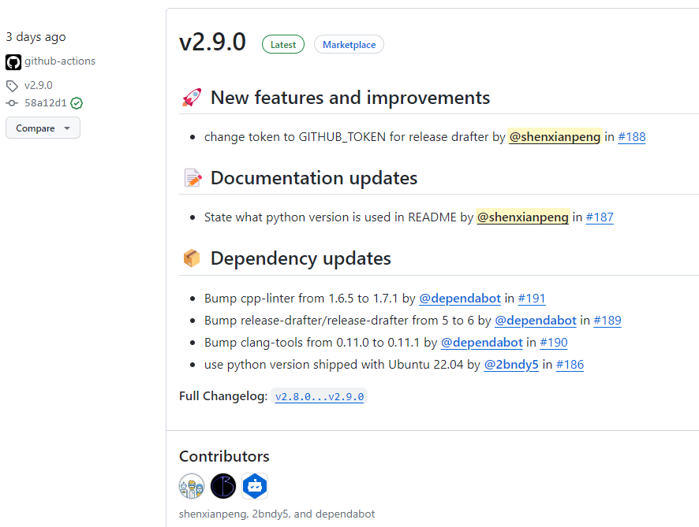
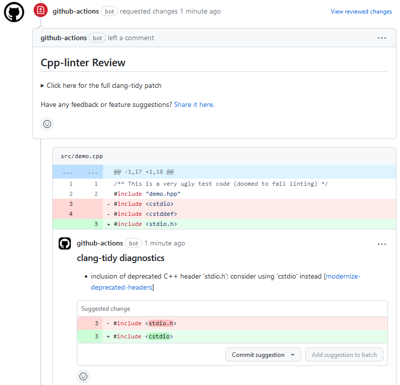
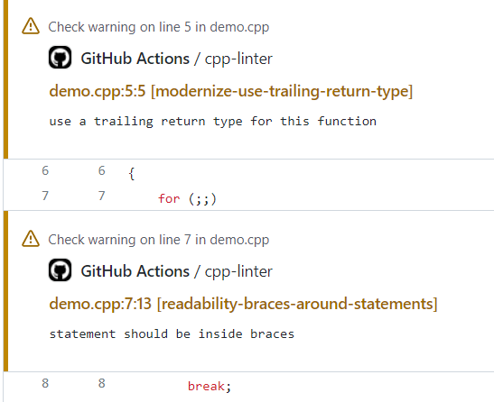
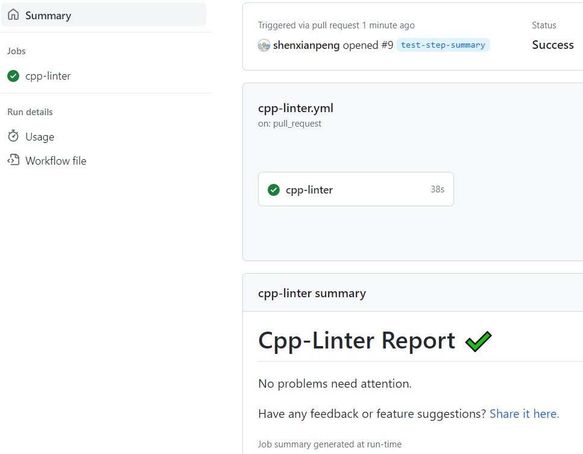

As the creator and contributor of [cpp-linter](https://github.com/cpp-linter), I am pleased to announce that cpp-linter-action now supports Pull Request Review functionality starting from version v2.9.0 👏

Here are the [release notes](https://github.com/cpp-linter/releases) for cpp-linter-action.

Among them, **Bump cpp-linter from 1.6.5 to 1.7.1 by @dependabot in [#191](https://github.com/cpp-linter/pull/191)** is the most significant change. Note: the cpp-linter package is the core dependency of cpp-linter-action.

## What is cpp-linter-action

If you are unfamiliar with [cpp-linter-action](https://github.com/cpp-linter/cpp-linter-action), you can check out my [previous article](https://shenxianpeng.github.io/2022/08/cpp-linter/).

In short, cpp-linter-action is a [GitHub Action](https://docs.github.com/en/actions/quickstart) under the cpp-linter organization, designed for C/C++ code to format code, diagnose, and fix typical programming errors.

Currently, cpp-linter-action is used by over 500 open-source projects (closed-source projects cannot be counted), including well-known organizations or projects such as Microsoft, Linux Foundation, CachyOS, nextcloud, and Jupyter.

It can be said that cpp-linter-action is currently the best Linter choice for C/C++ projects on GitHub.

## About the Pull Request Review Feature

The newly added Pull Request Review feature allows you to provide review suggestions directly after cpp-linter-action completes the check, eliminating the need for developers to manually modify and push the detected errors to the remote repository.

Instead, you can directly click the **Commit suggestions** button on GitHub to merge the suggested changes into the current pull request, saving the effort of manual modification and pushing.

Once all suggestions have been addressed, the GitHub Actions bot will automatically approve your pull request.

## Other Features Supported by cpp-linter-action

Besides the Pull Request Review feature, cpp-linter-action currently supports three other options: Annotations, Thread Comment, and Step Summary.

### GitHub Annotations

This displays the execution results at the specified code lines that need modification.

### Thread Comment

This adds the execution results as comments on the Pull Request.

### Step Summary

This adds and displays the execution results in the GitHub Action job execution interface.

## The Story Behind This Release

I finally found some time to sit down and write an article about the story behind this release on the evening of the eighth day of the Lunar New Year after my child fell asleep.

This release is particularly thanks to the contribution of cpp-linter co-creator [@2bndy5](https://github.com/2bndy5).  I have never met him in person, yet we have "worked" together for three years.  We met because of his proactive contribution, but our communication has been limited to discussions on GitHub issues and pull requests, with only non-public information communicated via email.

As @2bndy5's self-introduction states: passionate about programming, enjoys DIY electronics, and insists on writing easy-to-understand documentation. He is one of the few people I know who is technically comprehensive and has incredibly user-friendly documentation—a true **geek**.

Not long ago, I received an email from him saying that due to a family emergency, he needed to take a break and had lost the motivation to code. He told me that all the changes for the Pull Request Review seemed to have passed the tests. If I wanted to lead the release, he could provide support.

Here, I want to express my deepest sympathy and condolences 🙏 for what happened to him.

To continue his work, I needed to carefully read his changes and understand this functionality, but I didn't have enough time to do so at the end of the year. I wanted to wait until the Lunar New Year holiday to catch up.

However, before the Lunar New Year holiday, my child fell ill on the 27th day of the 12th lunar month and needed to be hospitalized.  Because we discovered it early, the illness wasn't serious, and the child recovered well on New Year's Eve. We hoped that after a couple of days of observation, they could be discharged.
Alas, an accident happened—the child accidentally burned their arm. As parents, we were heartbroken. This is the darkest moment I never want to recall.  It was just one setback after another.  So we stayed in the hospital from the 27th day of the 12th lunar month until the 6th day of the first lunar month—10 days in total.
The day after the child was discharged, my wife and I both fell ill, probably because we relaxed and became exhausted.

During this time, @2bndy5 completed the testing, documentation updates, and release of the Pull Request Review feature. He said in a comment that spending time coding allowed him to temporarily escape reality.

Finally, the day before I returned to work, I had almost recovered my energy and eagerly opened GitHub to review and test the contribution code from another contributor. This contributor's title came from an astrophysicist from the University of Dortmund in Germany, which was quite surprising.

But that's the fun part of open source; it allows you to have the opportunity to freely spar with any expert at close range. If you submit code to the Linux kernel, you might even get guidance from Linus himself :)

Finally, welcome to use any project under the cpp-linter organization and provide your valuable opinions, suggestions, or contribute code.

———— February 17, 2024, 23:34

---

Please indicate the author and source when reprinting this article and do not use it for any commercial purposes.  Follow the "DevOps攻城狮" WeChat official account.
