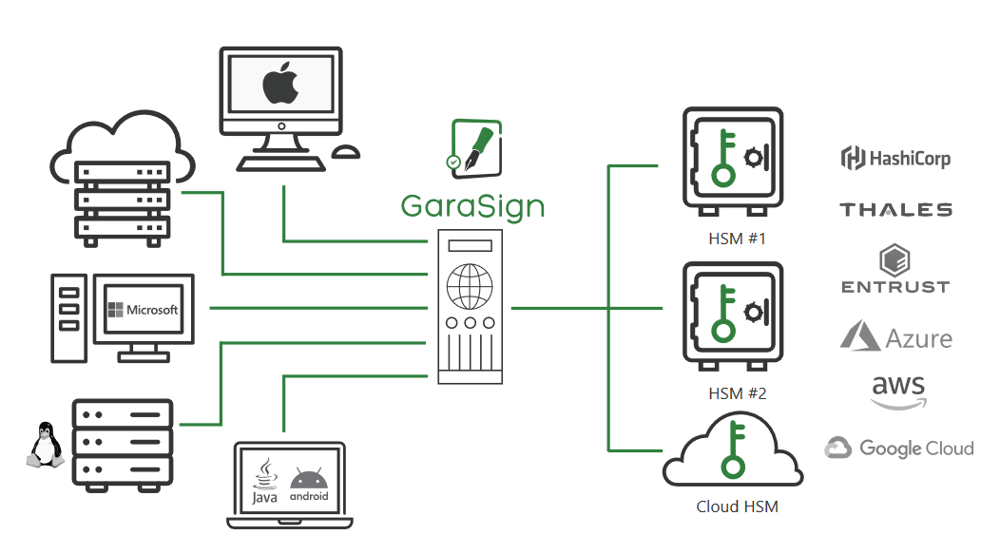

上次我在 [代码签名（Code Signing）](2024/04/code-signing/)的文章中时候提到了 GaraSign，这是我在工作中使用到的另一个代码签名工具。

鉴于关于 GaraSign 的使用并没有多少中文资料，本篇我将介绍关于 GaraSign 的一些实线，希望对你有帮助。


## 代码签名

这里再次说明什么是代码签名。代码签名证书用于对应用程序、驱动程序、可执行文件和软件程序进行数字签名，客户可通过这种方式验证他们收到的代码未被网络罪犯和黑客篡改或破坏。签名后的交付产品结合了加密令牌和证书，用户可在安装产品前对其进行验证。代码签名可确认谁是软件作者，并证明代码在签名后未被修改或篡改。

## Garasign 解决方案

GaraSign 是一个基于 SaaS 的安全协调平台，可对企业基础设施、服务和数据进行集中管理。GaraSign 可与所有主要操作系统、平台和工具的本地客户端集成，确保现有工作流不受干扰，同时改善其整体安全态势和合规性。

### GaraSign 由以下组件组成：

* 加密令牌 - 存储签名密钥的加密设备（通常是一个或多个 HSM - Hardware Security Modules）
* GaraSign 签名服务器 - 位于存储签名密钥的加密令牌前的 REST 服务器
* GaraSign Signing 客户端 - 允许与之集成的签名工具在本地散列数据并将签名生成脱载至 GaraSign Signing 服务器的客户端。



Garasign 代码签名散列方法 - 大幅提高速度


## 安装 GaraSign

关于如何安装 GaraSign 这里不过去介绍，可以到官网找相关的安装文档。这里要注意目前 GaraSign 对操作系统版本的要求还是很高的，比如

* Windows 最低要求是 Windows 2019, Win10 and Win11
* Linux 最低要求是 RHEL 7.9, 8.0, 9.0，CentOS 7.9, 8.0, 9.0，Rocky 8.0

如果你的构建环境还是比较旧的或是不符合其支持的版本，建议你向我一样设置一台专用的 GaraSign 机器（推荐 Linux）。

如果你使用 Jenkins 来构建，可以将这台机器设置为一台 Jenkins agent，通过创建一个 Jenkins pipeline，这样其他所有的要需要发布的包都可以通过这个 pipeline 来进行签名。

## 如何签署独立签名

如果你已经设置好了 GaraSign 环境，以 Linux 为例，那么就可以通过下面的命令进行签署。

> 注：在 Windows 与 Linux 在签署不同的类型文件所使用到的命令不同，因此推荐在 Linux 进行签名会更加简单。

```bash
openssl dgst -sign <private key file> -keyform PEM -sha256 -out <signature-file-name.sig> -binary <binary file to sign>
```
### 具体的实施

加入你的 Artifacts 存在 Artifactory 上面，下面就 Jenkins 为例，来实施一个可以自动签名的 pipeline。包括：

1. 从 Artifactory 上下载需要签名的 Artifacts
2. 使用 GaraSign 进行签名
3. 验证 GaraSign 是否成功
4. 上传签名文件和公钥到 Artifactory 上的同一个目录下

```groovy
pipeline{

	agent {
        node {
            label 'garasign'
        }
    }

    parameters {
        string(
            name: 'REPO_PATH',
            defaultValue: '',
            summary: 'Repository Path on Artifactory. eg. generic-stage/test_repo/devel/54/mybuild_1.1.0_752d0821_64bit.exe'
        )
    }

    environment {
		BOT   = credentials("BOT-credential")
		ART_URL = "https://my.org.com/artifactory"
    }

    stages {
        stage('GaraSign'){
            steps {
				script {
					if (! params.REPO_PATH){
						error "REPO_PATH can not empty, exit!"
					}
					// Update Job description
					def manualTrigger = true
					currentBuild.upstreamBuilds?.each { b ->
						currentBuild.description = "Triggered by: ${b.getFullDisplayName()}\n${REPO_PATH}"
						manualTrigger = false
					}
					if (manualTrigger == true) { currentBuild.description = "Manual sign: ${REPO_PATH}" }

					sh '''
					# download artifacts
					curl -u${BOT_USR}:${BOT_PSW} -O ${ART_URL}/${REPO_PATH}
					file_name=$(basename ${REPO_PATH})
					repo_folder=$(dirname ${REPO_PATH})

					# garasign
					openssl dgst -sign grs.privkey.pem -keyform PEM -sha256 -out $file_name.sig -binary $file_name

					# verify
					grs.pem.pub.key
					output=$(openssl dgst -verify grs.pem.pub.key -keyform PEM -sha256 -signature $file_name.sig -binary $file_name)
					if echo "$output" | grep -q "Verified OK"; then
						echo "Output is Verified OK"
					else
						echo "Output is not Verified OK"
						exit 1
					fi

					# upload signature file (.sig) and public key (.pem.pub.key)
					curl -u${BOT_USR}:${BOT_PSW} -T $file_name.sig  ${ART_URL}/${repo_folder}/
					curl -u${BOT_USR}:${BOT_PSW} -T grs.pem.pub.key ${ART_URL}/${repo_folder}/
					'''
				}
            }
        }
    }
}
```

## 如何验证独立签名

还是以 Linux 为例，使用如下命令可以进行签名的验证。

```bash
openssl dgst -verify <public key file> -signature <signature> <file to verify>
```

当你的 Artifacts 已经进行了签名，在提供给客户的时候，你不但需要提供发布的包，而且需要提供签名文件 (.sig) 和公钥 (.pem.pub.key)。

举个例子，如下 CLI 产品分别提供了 Windows，Linux 和 AIX 三个平台的安装包，客户可以参考如下进行签名验证。

```bash
# 下载安装包、签名文件和公钥
$ ls
cli.pem.pub.key  CLI_AIX_1.1.0.zip  CLI_AIX_1.1.0.zip.sig  CLI_LINUXX86_1.1.0.zip  CLI_LINUXX86_1.1.0.zip.sig  CLI_WINDOWS_1.1.0.zip  CLI_WINDOWS_1.1.0.zip.sig

# 验证签名
openssl dgst -verify cli.pem.pub.key -signature CLI_AIX_1.1.0.zip.sig CLI_AIX_1.1.0.zip
Verified OK

openssl dgst -verify cli.pem.pub.key -signature CLI_LINUXX86_1.1.0.zip.sig CLI_LINUXX86_1.1.0.zip
Verified OK

openssl dgst -verify cli.pem.pub.key -signature CLI_WINDOWS_1.1.0.zip.sig CLI_WINDOWS_1.1.0.zip
Verified OK

# 当包和签名文件不符时会验证失败
openssl dgst -verify cli.pem.pub.key -signature CLI_AIX_1.1.0.zip.sig CLI_LINUXX86_1.1.0.zip
Verification Failure
```

以上就是关于 GaraSign 的实现分享，如有任何问题或是建议咱们评论区见。

---

转载本站文章请注明作者和出处，请勿用于任何商业用途。欢迎关注公众号「DevOps攻城狮」
