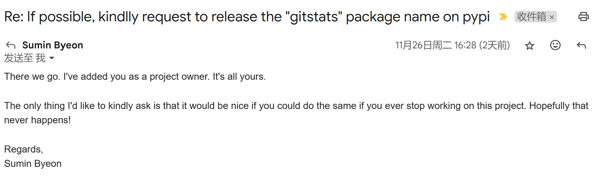

Recently, in the evenings (usually after my child has gone to sleep), I've been working on something: reviving the long-dormant GitStats project.

Previously, I wrote two articles about GitStats.  If you're interested, you can check them out:

* [Git History Statistics Generator GitStats](https://shenxianpeng.github.io/2019/12/git-stats/)
* [Automatically Providing Multi-Dimensional Code Analysis Reports to My Boss Regularly via Jenkins](https://shenxianpeng.github.io/2020/01/git-stats-jenkins/)

## What is GitStats

GitStats is a Python-based tool for analyzing the history of a Git repository and generating an HTML report.

However, it only supports Python 2, and the author has stopped maintaining it (the last commit was 9 years ago).

In current development environments, compatibility and ease of use are significantly limited, but its value remains undeniable.

Therefore, I decided to modernize this project.

## Completed Work

1. **Migration to Python 3.9+**: Refactored the code to support Python 3 versions. ✅
2. **Creation of a Modern CI/CD Pipeline**: Added CI/CD tools for easier continuous development and release. ✅
3. **Publication to PyPI**: Users can now install it via `pip install gitstats`. ✅
4. **Docker Image Provided**: Users no longer need to handle dependencies themselves; running `gitstats` is more convenient. ✅
5. **Online Preview Provided**: Created a demonstration page to allow users to intuitively understand GitStats' functionality. ✅

## Special Thanks

Here, I would like to express my special thanks to Sumin Byeon (@suminb). From his introduction, he seems to be a programmer living in South Korea.

The original owner of GitStats on PyPI was him, so I couldn't directly use that name. I tried other names, such as `git-stats` and `gitstory`, but they were rejected by PyPI due to similarity to other projects.

Seeing that his project hadn't been maintained for five years, I sent him an email on a whim, asking if he would be willing to transfer the GitStats name to me, as I was reviving the project.

Unexpectedly, he replied quickly and eventually agreed to transfer the GitStats name to me. His only condition was that if I stopped maintaining GitStats in the future and someone else needed the name, I would do the same as he did and transfer the name to them.

I agreed and promised to maintain GitStats long-term. (Hopefully, I can do it.)

## Future Plans

1. **Addressing Valuable Issues**: Reviewing unresolved issues in the original repository and selecting valuable ones for fixing.
2. **Reviewing Existing Pull Requests**: Evaluating PRs from the original repository and merging them into the current project as appropriate.
3. **Updating Documentation**: Improving the documentation to make it clearer and easier to understand.
4. **Adding New Features**: Adding features to make the project more powerful and useful.
5. **UI Optimization**: Improving the visual appeal and user experience of the interface.

## How to Participate

If you are interested in improving GitStats, you are welcome to participate in this project! You can:

1. **Suggest Features**:  Propose ideas or feature requests to help the project better meet user needs.
2. **Contribute Code**: Fix bugs or add features to directly contribute to the project.
3. **Share and Promote**: Recommend GitStats to friends or communities who might be interested.

Finally, let's work together to bring GitStats back to life!

_Written at 2:50 AM on November 28, 2024_

---

Please indicate the author and source when reprinting this article. Please do not use it for any commercial purposes.  Welcome to follow the WeChat public account "DevOps攻城狮".