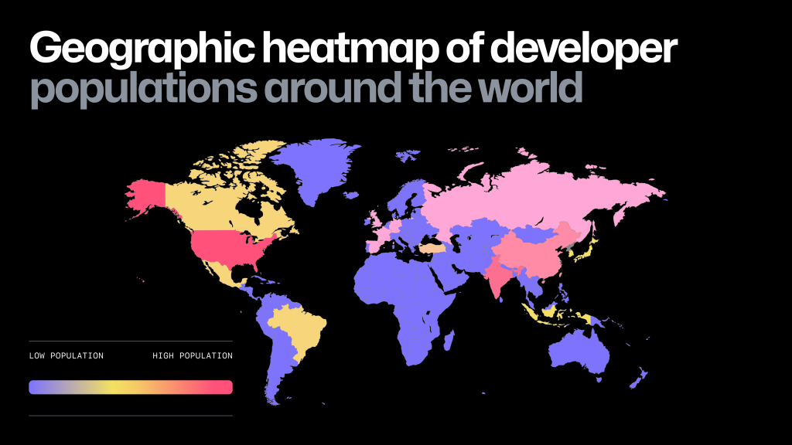
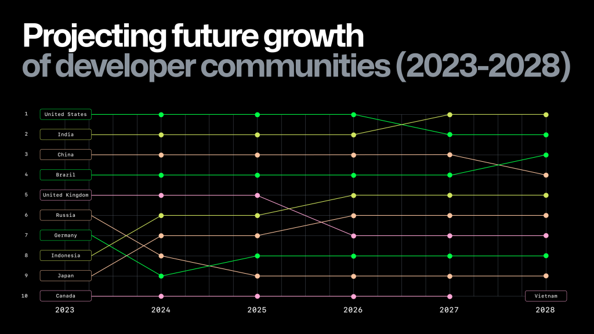
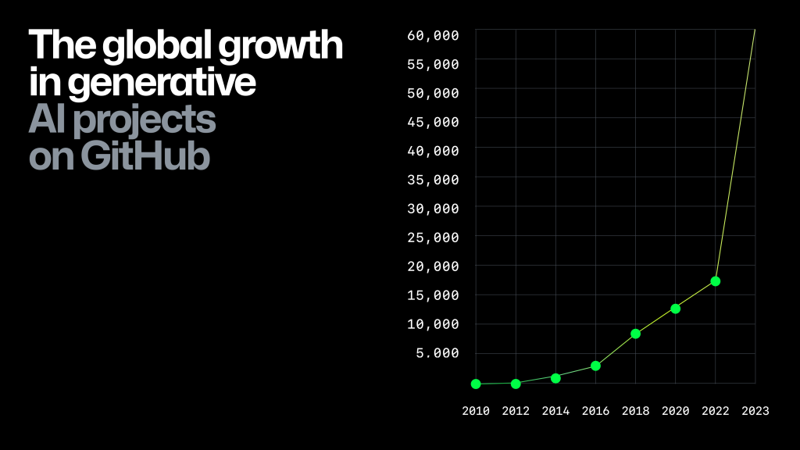
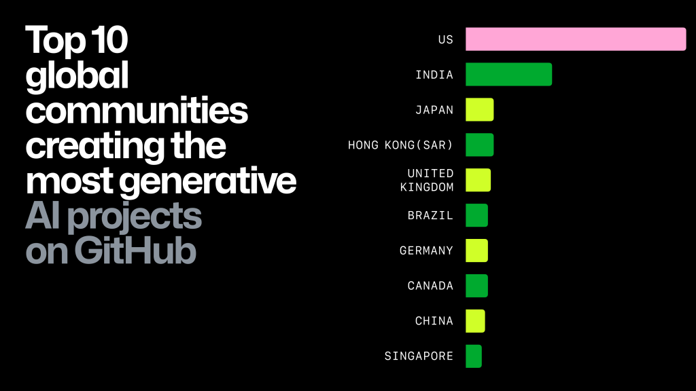
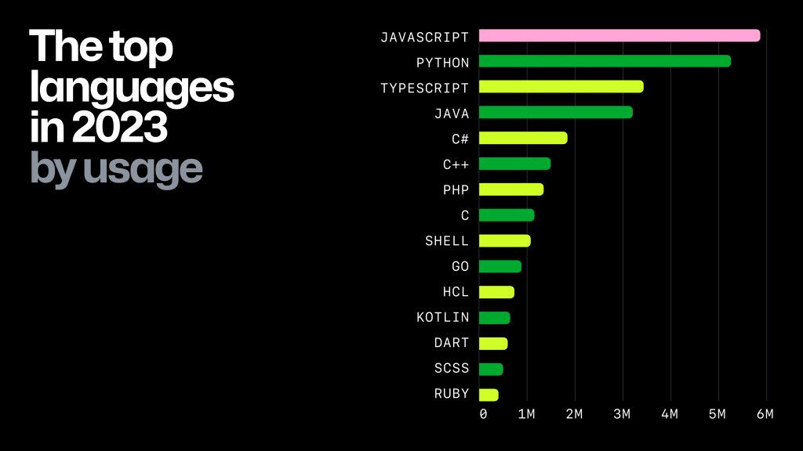
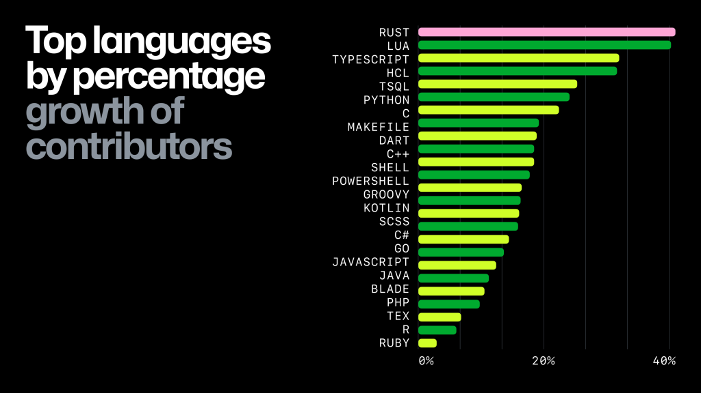
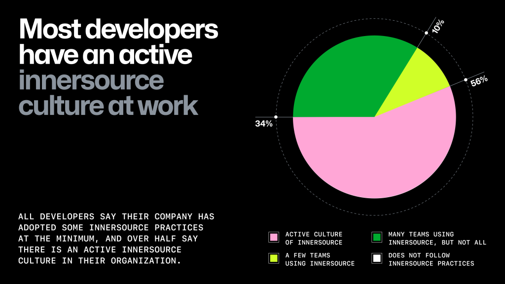
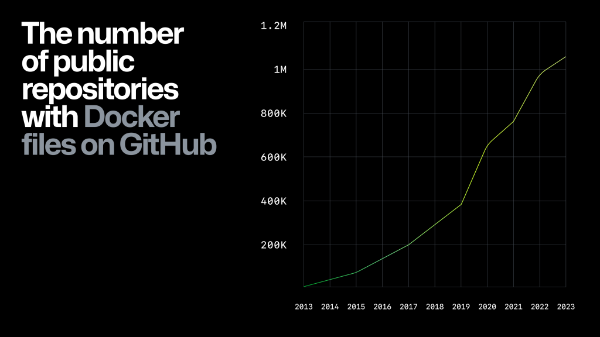
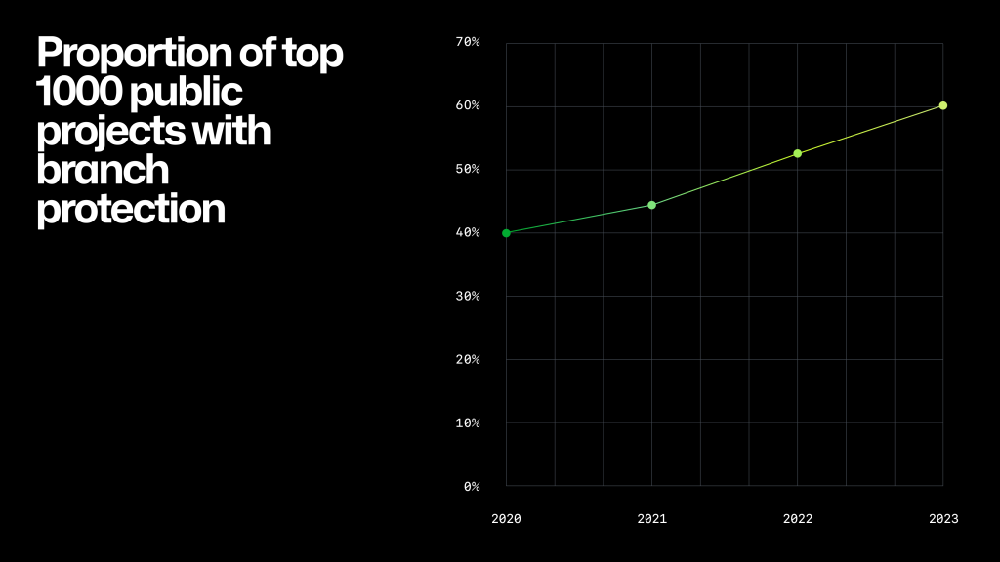
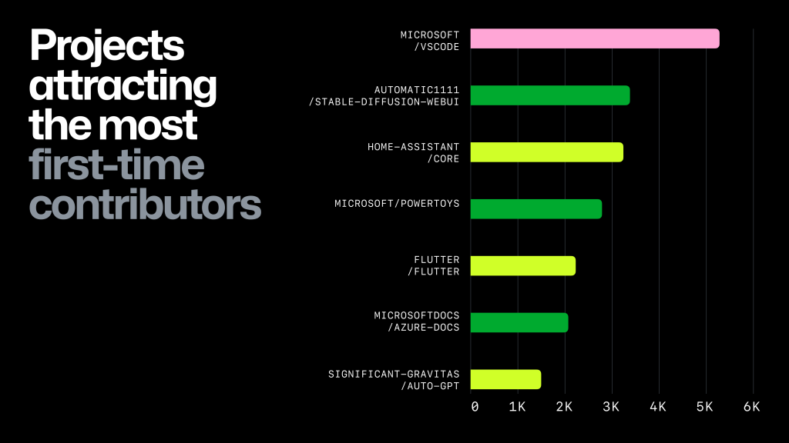

最近看到一篇非常有信息量的关于人工智能、云原生、开源的趋势报告，出自于GitHub，翻译并分享给大家，以下是报告全文。

> 英文原文在这里：https://github.blog/2023-11-08-the-state-of-open-source-and-ai/?utm_source=banner&utm_medium=github&utm_campaign=octoverse

---

**新技术成为主流意味着什么？**

Git 于 2005 年首次发布，当我们创建 GitHub 时，Git 还是一个新的开源版本控制系统。如今，Git 已成为现代开发人员体验的基本元素 — 93% 的开发人员使用它在各地构建和部署软件。

2023 年，GitHub 数据凸显了另一种技术如何迅速开始重塑开发者体验：人工智能。去年，越来越多的开发人员开始使用人工智能，同时也尝试构建人工智能驱动的应用程序。 Git 从根本上改变了当今的开发人员体验，现在人工智能正在为软件开发的下一步奠定基础。

在 GitHub，我们知道开发人员喜欢边做边学，开源可以帮助开发人员更快地采用新技术，将其集成到他们的工作流程中，并构建下一代技术。开源还为几乎所有现代软件提供动力——包括大部分数字经济。当我们探索技术如何成为主流时，GitHub 在弥合开源技术实验与广泛采用之间的差距方面继续发挥着关键作用，这些技术支撑着我们软件生态系统的基础。

在今年的报告中，我们将研究围绕人工智能、云和 Git 的开源活动如何改变开发人员体验，并日益增强对开发人员和组织的影响。

**我们发现了三大趋势:**

* 开发人员正在大量使用生成式人工智能进行构建。
    我们看到越来越多的开发人员尝试使用 OpenAI 和其他 AI 参与者的基础模型，开源生成式 AI 项目甚至会在 2023 年进入按贡献者数量计算的前 10 个最受欢迎的开源项目。几乎所有开发人员 (92%) 都在使用或试验借助 AI 编码工具，我们期望开源开发人员能够在 GitHub 上推动下一波 AI 创新浪潮。
* 开发人员正在大规模运营云原生应用程序。
    我们看到使用基于 Git 的基础设施即代码 (IaC) 工作流程的声明性语言有所增加，云部署的标准化程度更高，开发人员使用 Dockerfile 和容器、IaC 和其他云原生的速度急剧增加技术。
* 2023 年首次开源贡献者数量最多。
    我们继续看到商业支持的开源项目在首次贡献者和总体贡献中占据最大份额，但今年，我们还看到生成式 AI 项目进入了首次贡献者最受欢迎的前 10 个项目。我们还看到 GitHub 上的私人项目显著增长，同比增长 38%，占 GitHub 上所有活动的 80% 以上。

### 在 GitHub 上构建的全球开发者社区

在全球范围内，开发人员正在使用 GitHub 来构建软件并进行比以往更多的协作，而且涉及公共和私人项目。这不仅证明了 Git 在当今开发者体验中的基础价值，也展示了全球开发者社区使用 GitHub 构建软件的情况。

**美国拥有 2020 万开发者，过去一年开发者增长 21%，继续拥有全球最大的开发者社区。**

但自 2013 年以来，我们不断看到其他社区在整个平台上实现了更多增长，我们预计这种情况会持续下去。 GitHub 上开发人员的全球分布显示了哪些地区拥有最多的开发人员。

**亚太地区、非洲、南美洲和欧洲的开发者社区逐年扩大，其中印度、巴西和日本处于领先地位。**

### 预测未来五年排名前 10 的开发者社区

为了了解哪些开发者社区将在未来五年内增长最快，我们根据当前的增长率进行了预测。在此标题下，我们预计到 2027 年印度将取代美国成为 GitHub 上最大的开发者社区。

### 亚太地区发展最快的开发者社区

我们继续看到，在印度、日本和新加坡等经济中心的推动下，亚太地区出现了可观的增长。

|                       | 开发人员数量   | 同比增长 |
|-----------------------|----------------|----------|
| 01 新加坡             | >100 万开发者  | 39%      |
| 02 印度               | >1320 万开发者 | 36%      |
| 03 香港（特别行政区）  | >160 万开发者  | 35%      |
| 04 越南               | >150 万开发者  | 34%      |
| 05 印度尼西亚          | >290 万开发者  | 31%      |
| 06 日本               | >280 万开发者  | 31%      |
| 07 菲律宾             | >130 万开发者  | 31%      |
| 08 泰国               | >857K 开发者   | 25%      |
| 09 韩国               | >190 万开发者  | 22%      |
| 10 澳大利亚           | >140 万开发者  | 21%      |

表 1：2023 年开发者总数增长，较 2022 年增长百分比。

#### 印度的开发者社区继续实现同比大幅增长

在去年的 Octoverse 中，我们预测印度的开发者总数将超过美国。这仍然有望发生。印度的开发者人数同比增长 36%，2023 年有 350 万新开发者加入 GitHub。

作为联合国支持的数字公共产品联盟的一部分，印度一直在利用开放材料（从软件代码到人工智能模型）建设数字公共基础设施，以改善数字支付和电子商务系统。以下是印度开发人员在 GitHub 上构建并贡献的开源软件 (OSS) 项目列表。

### 新加坡今年是亚太地区开发者人数增长最快的国家

并且以开发者占总人口的比例最高而位居全球第一。新加坡国立大学计算机学院将 GitHub 纳入其课程，高增长也可能归因于该国在东南亚的监管重要性。

由于对技术和初创公司的投资，我们还可能在明年看到日本的开发人员持续增长。

### 非洲发展最快的开发者社区

非洲地区拥有世界上增长最快的人口和不断增加的开发人员，已被认为是有前途的科技公司中心。（例如，在肯尼亚，小学和中学必须教授编程。）

|                       | 开发人员数量   | 同比增长 |
|-----------------------|----------------|----------|
| 01 新加坡             | >100 万开发者  | 39%      |
| 02 印度               | >1320 万开发者 | 36%      |
| 03 香港（特别行政区） | >160 万开发者  | 35%      |
| 04 越南               | >150 万开发者  | 34%      |
| 05 印度尼西亚         | >290 万开发者  | 31%      |
| 06 日本               | >280 万开发者  | 31%      |
| 07 菲律宾             | >130 万开发者  | 31%      |
| 08 泰国               | >857K 开发者   | 25%      |
| 09 韩国               | >190 万开发者  | 22%      |
| 10 澳大利亚           | >140 万开发者  | 21%      |

表 2：2023 年开发者总数增长，较 2022 年增长百分比。

尼日利亚是 OSS 采用和技术投资的热点，其 45% 的同比增长率（全球增幅最高）反映了这一点。GitHub 上还有至少 200 个由尼日利亚开发者制作的项目集合，可以在[“非洲制造”集合](https://github.com/collections/made-in-africa)下找到。

### 南美洲发展最快的开发者社区

南美洲的开发者增长率与亚太和非洲一些增长最快的开发者社区相当。

|                       | 开发人员数量   | 同比增长 |
|-----------------------|----------------|----------|
| 01 新加坡             | >100 万开发者  | 39%      |
| 02 印度               | >1320 万开发者 | 36%      |
| 03 香港（特别行政区） | >160 万开发者  | 35%      |
| 04 越南               | >150 万开发者  | 34%      |
| 05 印度尼西亚         | >290 万开发者  | 31%      |
| 06 日本               | >280 万开发者  | 31%      |
| 07 菲律宾             | >130 万开发者  | 31%      |
| 08 泰国               | >857K 开发者   | 25%      |
| 09 韩国               | >190 万开发者  | 22%      |
| 10 澳大利亚           | >140 万开发者  | 21%      |

表 3：2023 年开发者总数增长，较 2022 年增长百分比。

2023年，巴西的开发者人数是该地区最多的，并继续以两位数增长，同比增长30%。此前，巴西的私人和公共组织持续投资。查看巴西开发人员在 GitHub 上创建和贡献的 [OSS 项目列表](https://github.com/collections/made-in-brazil)。

我们还看到阿根廷和哥伦比亚的持续增长，这两个国家在过去几年中已成为组织的热门投资目标。

### 欧洲发展最快的开发者社区

整个欧洲的社区开发人员总数继续增加，但他们的发展现在更接近于美国的总体发展，因为南美洲、非洲和亚太地区的社区增长超过了他们。

|                       | 开发人员数量   | 同比增长 |
|-----------------------|----------------|----------|
| 01 新加坡             | >100 万开发者  | 39%      |
| 02 印度               | >1320 万开发者 | 36%      |
| 03 香港（特别行政区） | >160 万开发者  | 35%      |
| 04 越南               | >150 万开发者  | 34%      |
| 05 印度尼西亚         | >290 万开发者  | 31%      |
| 06 日本               | >280 万开发者  | 31%      |
| 07 菲律宾             | >130 万开发者  | 31%      |
| 08 泰国               | >857K 开发者   | 25%      |
| 09 韩国               | >190 万开发者  | 22%      |
| 10 澳大利亚           | >140 万开发者  | 21%      |

值得注意的是，法国的增长是在[政府推动吸引更多科技初创企业](https://sifted.eu/articles/french-tech-nurtures-grander-ipo-ambitions)之后实现的。我们还看到西班牙和意大利的增长有所上升，这说明这两个地区为支持其国内技术市场所做的努力。

## 2023 年生成式 AI 爆发式增长

虽然生成式人工智能在 2023 年引起了轰动，但对于 GitHub 上的开发者来说，它并不是全新的。事实上，过去几年我们已经在 GitHub 上看到了几个生成式 AI 项目的出现，以及许多其他专注于 AI 的项目。

但 2023 年的 GitHub 数据反映了这些人工智能项目如何从更面向专业的工作和研究发展到更主流的采用，开发人员越来越多地使用预先训练的模型和 API 来构建由人工智能驱动的生成应用程序。

**就在去年过半的时候，我们看到 2023 年的生成式 AI 项目数量是 2022 年全年的两倍多。** 我们知道这只是冰山一角。

随着越来越多的开发人员尝试这些新技术，我们期望他们能够推动软件开发中的人工智能创新，并继续将该技术快速发展的功能带入主流。

**开发人员越来越多地尝试人工智能模型。** 在过去的几年里，我们看到开发人员使用 [tensorflow/tensorflow](https://github.com/tensorflow/tensorflow)、[pytorch/pytorch](https://github.com/pytorch/pytorch) 等机器学习库构建项目，而现在我们看到更多的开发人员尝试使用 AI 模型和LLM（例如 [ChatGPT API](https://github.com/topics/chatgpt-api)）。

**保持聪明：** 我们预计企业和组织也将利用预先训练的人工智能模型，特别是随着越来越多的开发人员熟悉如何使用它们进行构建。

**开源人工智能创新多种多样，顶级人工智能项目由个人开发者拥有。** 分析 GitHub 上排名前 20 的开源生成式 AI 项目，其中一些顶级项目归个人所有。这表明 GitHub 上的开源项目继续推动创新，并向我们所有人展示行业的未来发展，社区围绕最令人兴奋的进步而构建。

**生成式人工智能正在推动生成式人工智能项目的个人贡献者在全球范围内大幅增长，同比增长 148%，生成式人工智能项目总数也同比增长 248%。** 值得注意的是，美国、印度和日本在开发者社区中处于领先地位，其他地区（包括香港特别行政区）、英国和巴西紧随其后。

**了解生成式人工智能的开发人员数量大幅增加将对企业产生影响。** 随着越来越多的开发人员熟悉构建基于人工智能的生成式应用程序，我们预计不断增长的人才库将支持寻求开发自己的基于人工智能的产品和服务的企业。

**底线：** 在过去的一年里，我们看到基于基础模型（例如 ChatGPT）构建的应用程序呈指数级增长，因为开发人员使用这些 LLM 来开发面向用户的工具，例如 API、机器人、助手、移动应用程序和插件。全球开发人员正在帮助为主流采用奠定基础，而实验正在帮助组织建立人才库。

## 最流行的编程语言

**自从我们在 2019 年看到云原生开发的巨大增长以来，IaC 在开源领域也持续增长。** 2023 年，Shell 和 Hashicorp 配置语言 (HCL) 再次成为开源项目中的顶级语言，这表明运维和 IaC 工作在开源领域越来越受到重视。

* HCL 采用率同比增长 36%，这表明开发人员正在为其应用程序利用基础设施。
* HCL 的增加表明开发人员越来越多地使用声明性语言来指示他们如何利用云部署。

JavaScript 再次夺得第一大最受欢迎语言的桂冠，并且我们继续看到 Python 和 Java 等熟悉的语言逐年保持在前五名语言之列。

**TypeScript 越来越受欢迎。** 今年，TypeScript 首次取代 Java，成为 GitHub 上 OSS 项目中第三大最受欢迎的语言，其用户群增长了 37%。 TypeScript 是一种集语言、类型检查器、编译器和语言服务于一体的语言，它于 2012 年推出，标志着渐进类型的到来，它允许开发人员在代码中采用不同级别的静态和动态类型。

**用于数据分析和操作的流行语言和框架显著增加。** T-SQL 和 TeX 等古老语言在 2023 年不断发展，这凸显了数据科学家、数学家和分析师如何越来越多地使用开源平台和工具。

**底线：** 编程语言不再仅仅局限于传统软件开发领域。

与 GitHub 上使用的总体最流行语言相比，我们发现 2023 年创建的项目中使用的最流行语言具有显著的一致性。一些值得注意的异常值包括 Kotlin、Rust、Go 和 Lua，它们在 GitHub 上的新项目中出现了更大的增长。

Rust 和 Lua 都以其内存安全性和效率而闻名，并且都可以用于系统和嵌入式系统编程，这可以归因于它们的增长。Go 最近的增长是由 Kubernetes 和 Prometheus 等云原生项目推动的。

## 开发者活动是新技术采用的领头羊

2023 年初，我们庆祝了[超过 1 亿开发者使用 GitHub 的里程碑](https://github.blog/2023-01-25-100-million-developers-and-counting/) —— 自去年以来，我们看到 GitHub 上的全球开发者帐户数量增长了近 26%。更多的开发人员跨时区协作并构建软件。私人和公共存储库中的开发人员活动强调了哪些技术正在被广泛采用，以及哪些技术有望得到更广泛的采用。

**开发人员正在自动化更多的工作流程。** 在过去的一年里，开发人员使用 GitHub Actions 分钟数增加了 169%，用于自动化公共项目中的任务、开发 CI/CD 管道等。

* 平均而言，开发人员在公共项目中每天使用 GitHub Actions 的时间超过 2000 万分钟。随着 GitHub Marketplace 中的 GitHub Actions 数量在 2023 年突破 20,000 个大关，社区不断发展。
* 这凸显了开源社区对 CI/CD 和社区管理自动化的认识不断增强。

**超过 80% 的 GitHub 贡献都贡献给私有存储库。** 其中，私人项目贡献超过 42 亿美元，公共和开源项目贡献超过 3.1 亿美元。这些数字显示了通过免费、团队和 GitHub Enterprise 帐户在公共、开源和私人存储库中发生的活动的巨大规模。大量的私人活动表明了内部源代码的价值，以及基于 Git 的协作不仅有利于开源代码的质量，而且也有利于专有代码的质量。

事实上，在最近 GitHub 赞助的一项调查中，所有开发人员都表示他们的公司至少采用了一些内部源实践，超过一半的开发人员表示他们的组织中有活跃的内部源文化。

**GitHub 是开发人员操作和扩展云原生应用程序的地方。** 2023 年，430 万个公共和私有存储库使用 Dockerfile，超过 100 万个公共存储库使用 Dockerfile 来创建容器。过去几年，我们看到 Terraform 和其他云原生技术的使用量不断增加。 IaC 实践的增加也表明开发人员正在为云部署带来更多标准化。

**生成式人工智能进入 GitHub Actions。** 人工智能在开发者社区中的早期采用和协作能力在 GitHub Marketplace 中的[300 多个人工智能驱动的 GitHub Actions](https://github.com/marketplace?type=actions&query=ai+)和[40 多个 GPT 支持的 GitHub Actions](https://github.com/marketplace?type=actions&query=gpt+)中显而易见。开发人员不仅继续尝试人工智能，还通过 GitHub Marketplace 将其带入开发人员体验及其工作流程的更多部分。

**底线：** 开发人员尝试新技术并在公共和私人存储库中分享他们的经验。这项相互依赖的工作凸显了容器化、自动化和 CI/CD 在开源社区和公司之间打包和发布代码的价值。

## 开源的安全状况

今年，我们看到开发人员、OSS 社区和公司等通过自动警报、工具和主动安全措施更快地响应安全事件，这有助于开发人员更快地获得更好的安全结果。我们还看到 GitHub 上共享了负责任的 AI 工具和研究。

**更多的开发人员正在使用自动化来保护依赖关系。** 与 2022 年相比，2023 年开源开发人员合并的针对易受攻击包的自动化Dependabot拉取请求数量增加了 60%，这凸显了共享社区对开源和安全性的奉献精神。得益于 GitHub 上的免费工具（例如 Dependabot、代码扫描和密钥扫描），开源社区的开发人员正在修复更多易受攻击的软件包并解决代码中的更多漏洞。

**更多的开源维护者正在保护他们的分支机构。**受保护的分支为维护者提供了更多方法来确保其项目的安全性，我们已经看到超过 60% 的最受欢迎的开源项目 使用它们。自从我们今年早些时候在 GA 中在 GitHub 上推出存储库规则以来，大规模管理这些规则应该会变得更加容易。

**开发人员正在 GitHub 上分享负责任的 AI 工具。** 在实验性生成人工智能时代，我们看到人工智能信任和安全工具的发展趋势。开发人员正在围绕负责任的人工智能、人工智能公平、负责任的机器学习和道德人工智能创建和共享工具。

乔治城大学安全与新兴技术中心也在确定哪些国家和机构是值得信赖的人工智能研究的顶级生产者，并在 GitHub 上分享其研究代码。

**底线：** 为了帮助 OSS 社区和项目保持更加安全，我们投资了 Dependabot、受保护的分支、CodeQL 和秘密扫描，免费向公共项目提供。2023 年的新采用指标显示这些投资如何成功帮助更多开源项目提高整体安全性。我们还看到软件开发人员和机构研究人员对创建和共享负责任的人工智能工具感兴趣。

## 开源状态

2023 年，开发者**为 GitHub 上的开源项目做出了总计 3.01 亿的贡献**，其中包括 [Mastodon](https://github.com/mastodon/mastodon) 等热门项目到 [Stable Diffusion](https://github.com/AUTOMATIC1111/stable-diffusion-webui) 和 [LangChain](https://github.com/langchain-ai/langchain) 等生成式 AI 项目。

商业支持的项目继续吸引一些最开源的贡献，但 2023 年是生成式 AI 项目也进入 GitHub 上十大最受欢迎项目的第一年。说到生成式 AI，几乎三分之一拥有至少一颗星**的开源项目都有一位使用 GitHub Copilot 的维护者。**

**商业支持的项目继续领先。** 2023 年，贡献者总数最大的项目获得了压倒性的商业支持。这是去年以来的持续趋势，microsoft/vscode、flutter/flutter 和 vercel/next.js 在 2023 年再次跻身前 10 名。

**生成式人工智能在开源和公共项目中快速发展。** 2023 年，我们看到基于 AI 的生成式 OSS 项目，如 langchain-ai/langchain 和 AUTOMATIC1111/stable-diffusion-webui，在 GitHub 上按贡献者数量跃居榜首。越来越多的开发人员正在使用预先训练的人工智能模型构建法学硕士应用程序，并根据用户需求定制人工智能应用程序。

**开源维护者正在采用生成式人工智能。** 几乎三分之一拥有至少一颗星的开源项目都有使用 GitHub Copilot 的维护者。这是我们向开源维护人员免费提供 GitHub Copilot 的计划，并表明生成式 AI 在开源领域的采用日益广泛。

**开发人员看到了组合包和容器化的好处。** 正如我们之前指出的，2023 年有 430 万个存储库使用了 Docker。另一方面，Linux 发行版 NixOS/nixpkgs 在过去两年中一直位居贡献者开源项目的榜首。

**首次贡献者继续青睐商业支持的项目。** 去年，我们发现，与其他项目相比，围绕流行的、商业支持的项目的品牌认知度吸引了更多的首次贡献者。这种情况在 2023 年继续出现，一些在 Microsoft、Google、Meta 和 Vercel 支持的首次贡献者中最受欢迎的开源项目。

但社区驱动的开源项目（从 home-assistant/core 到 AUTOMATIC1111/stable-diffusion-webui、langchain-ai/langchain 和Significant-Gravitas/Auto-GPT）也见证了首次贡献者的活动激增。这表明，基础模型的开放实验增加了生成人工智能的可及性，为新的创新和更多合作打开了大门。

**2023 年，首次为开源项目做出贡献的贡献者数量最多。** 新的开发人员通过 freeCodeCamp、First Contributions 和 GitHub Education 等计划参与到开源社区中。我们还看到大量开发人员参与了 Google 和 IBM 等公司的在线开源教育项目。

**底线是：**开发人员正在为开源生成式人工智能项目做出贡献，开源维护者正在采用生成式人工智能编码工具，而公司则继续依赖开源软件。这些都表明，公开学习并分享新技术实验的开发人员提升了整个全球开发人员网络 - 无论他们是在公共存储库还是私人存储库中工作。

## 总结

正如 Git 已成为当今开发人员体验的基础一样，我们现在也看到了人工智能成为主流的证据。仅在过去一年，就有高达 92% 的开发人员表示在工作内外使用基于人工智能的编码工具。在过去的一年里，GitHub 上托管的各种开源项目的人工智能实验也出现了爆炸性增长。

**我们给您留下三个要点：**

1. **GitHub 是生成式 AI 的开发者平台。** 生成式 AI 将于 2023 年从专业领域发展成为主流技术，开源活动的爆炸式增长反映了这一点。随着越来越多的开发人员构建和试验生成式 AI，他们正在使用 GitHub 进行协作和集体学习。
2. **开发人员正在 GitHub 上大规模运行云原生应用程序。** 2019 年，我们开始看到开源中使用基于容器的技术的开发人员数量大幅增加，并且越来越多的开发人员使用基于 Git 的 IaC 工作流程、容器编排和其他云原生技术的速度急剧增加2023 年。如此大量的活动表明开发人员正在使用 GitHub 来标准化他们将软件部署到云的方式。
3. **GitHub 是开源社区、开发人员和公司构建软件的地方。** 2023 年，我们看到私有存储库的数量增加了 38%，占 GitHub 上所有活动的 81% 以上。但我们看到开源社区持续增长，他们使用 GitHub 来构建未来并推动行业向前发展。数据显示新的开源开发人员的增加以及开放社区可能实现的快速创新步伐，很明显开源从未如此强大。

---

转载本站文章请注明作者和出处，请勿用于任何商业用途。欢迎关注公众号「DevOps攻城狮」
