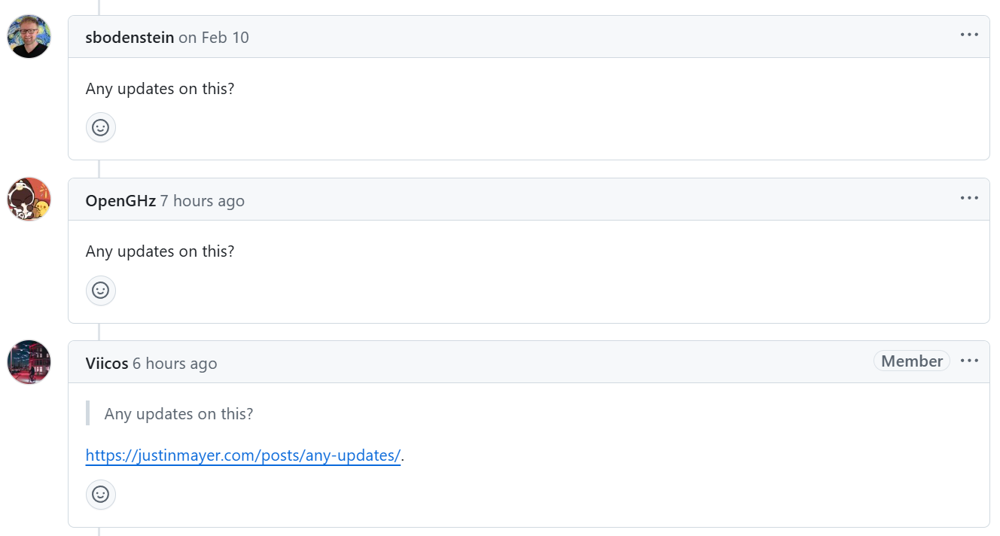

今天在逛 Pydantic 的 GitHub 仓库时，我看到一个熟悉的评论和一个链接：

> > Any updates on this?
> 
> https://justinmayer.com/posts/any-updates/

---

顺着这个链接，我第一次读到了 Justin Mayer 写的这篇文章：《“Any updates?”》

下面我就来分享一下这篇文章的主要内容和我的看法。

---

在开源世界里，这样的场景你一定熟悉：

有人在项目仓库里发现了一个问题（issue），看到最后一条评论已经是几周前的，于是便在下面留言：

> “有什么最新进展吗？”
> 
> “Any updates?”

看似无害的一句话，其实往往会带来不小的麻烦。

## 为什么不该这么问

如果一个问题有了更新，它一定会出现在对应的 issue 中，所有人都能第一时间看到。

开源项目不像公司内部那样会有“私下会议”“内部冲刺”或“隐藏计划”，所有的开发进展都公开、透明。

所以，当有人留言“有什么更新吗？”，并不会带来任何新信息，
却会让**所有订阅这个 issue 的人**都收到一条无意义的通知。

要知道，其中很多人是**无偿贡献者或维护者**。他们投入自己的业余时间来改进项目，而这样的“提醒”通知，只会让他们感到烦躁甚至挫败。

## 那该怎么办？

其实，想知道项目的进展是可以理解的。但与其发一条“有更新吗？”，不如做点更有价值的事。

1. 资助项目

    维护者的时间是有限的。如果项目能获得资金支持，他们更有动力、也有条件去持续改进。
    哪怕是一笔小额捐助，都比一句“有更新吗？”更有帮助。

2. 贡献时间

    如果你暂时不打算捐款，也可以想想自己能否贡献一点时间。
    比如可以这样留言：

    > “非常感谢所有为这个项目做出贡献的人！
    > 我能帮忙做点什么，让这个问题更快推进吗？”

    这类留言既友善，又能传递出积极的合作意愿。

3. 什么也不做（真的）

    如果你暂时没办法捐助，也无法参与贡献，
    那么最友善的选择，其实是——**什么也不做**。
    
    静静等待项目的更新，让维护者按照自己的节奏前进。

## 附：别用留言订阅通知

有些人会在评论里发“有更新吗？”只是为了订阅后续消息。

千万别这样。

只要点击 GitHub 页面右侧的 “Subscribe（订阅）” 按钮，就能收到所有更新通知，不必额外留言。

## 保持友善

“有什么更新吗？”这句话背后的含义其实是：

> “我希望这件事能尽快完成，但目前看来还没有人去做。”

这会无形中给维护者带来压力。
而开源项目最需要的，不是催促，而是理解与支持。

所以，请做一个友善的开源公民：

> 有能力，就出一份力；
> 没时间，就多一点耐心。

💫 世界因为你的善意与尊重，会变得更美好。

## 我的看法

确实，这种“Any updates?”的留言，看着就让人很烦躁，属于是白嫖式的“催更”。

下次如果还有人发“Any updates?” 或 “有什么更新吗？”，你就直接把这篇文章的链接发给他，让他自己去看吧！

---

转载本站文章请注明作者和出处，请勿用于任何商业用途。欢迎关注公众号「DevOps攻城狮」
