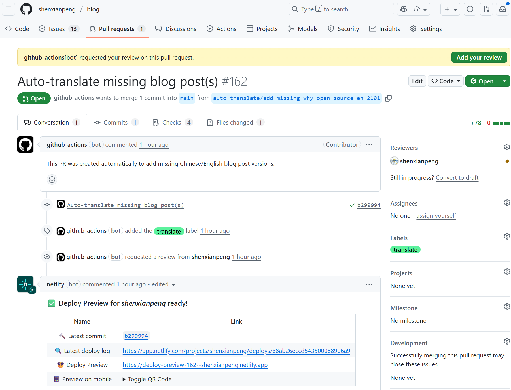

Recently, while reviewing Google Analytics, I discovered an interesting phenomenon:
My blog (shenxianpeng.github.io) has decent traffic from Google Search, but the primary language of visitors is surprisingly **English**, with Chinese coming in second.


Come to think of it, it's not surprising—I've written a few good English articles before, such as [Using Gcov and LCOV for C/C++ Code Coverage](../gcov-example), attracting many overseas readers.

However, the problem is: I mainly write in Chinese, only occasionally in English. If readers want to see a version in another language, I have to manually translate, copy, paste, preview, and submit... The whole process is tedious and time-consuming.

So I thought: **Let's automate this with AI.**

---

## My Solution

**Using GitHub Actions + Gemini API to achieve automatic bilingual blog publishing.**

The overall idea is simple:

1. Every time I write a new article and commit it to the repository, GitHub Actions will be automatically triggered;
2. The workflow calls the Gemini API to translate the Chinese text into English;
3. The translated article is committed to a new branch, and a PR is automatically created;
4. Netlify deploys a preview; I can review it on GitHub and merge it with one click;
5. After merging, the English version of the article will be published.



This way, I only need to focus on writing in Chinese, and the English version will be generated automatically.

---

## Core Configuration

Here's the core configuration of GitHub Actions (simplified version):

```yaml
on:
  push:
    paths:
      - 'content/posts/**/*.md'
      - 'content/misc/**/*.md'
  schedule:
    - cron: '0 2 * * *' # Prevents missed translations and controls API call frequency
  workflow_dispatch:

jobs:
  check-and-translate:
    runs-on: ubuntu-latest
    steps:
      - uses: actions/checkout@v5
      - uses: actions/setup-python@v5
        with:
          python-version: '3.13'
      - run: make install-deps
      - run: make translate
        env:
          GEMINI_API_KEY: ${{ secrets.GEMINI_API_KEY }}
          GITHUB_TOKEN: ${{ secrets.GITHUB_TOKEN }}
```

I put the dependencies and translation logic in the Makefile:

```makefile
install-deps:
	pip3 install -r requirements.txt

translate:
	python3 .github/auto_translate.py
```

## Results and Inspiration

The final result is excellent:

**Effortless:** No need for manual translation and copy-pasting;
**Efficient:**  An English version is generated almost simultaneously with a Chinese article;
**Cost-effective:**  Using Gemini API + Netlify, the cost is almost zero.

More importantly, many "seemingly troublesome little things" can be solved through AI + automation.
Writing a blog is just one example; extending this idea, it can be applied to many scenarios:
For example, bilingual support for technical documentation, internationalization of team knowledge bases, or even translation of internal company wikis.

## Conclusion

**Don't waste time on "repetitive work"—let tools and automation handle it; save your energy for more creative things.**

If you also have the habit of writing blogs or documents, I hope this article will inspire you.

Complete code here 👉 [GitHub Repository](https://github.com/shenxianpeng/blog)
