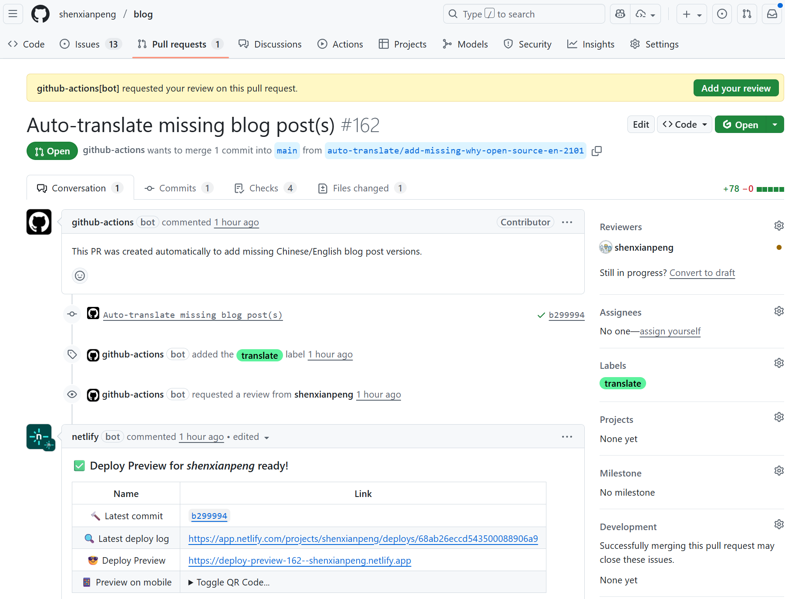

最近翻看 Google Analytics 时，我发现了一个有趣的现象：  
我的博客（shenxianpeng.github.io）在 Google 搜索里的流量还不错，但访问者的主要语言居然是 **英文**，中文反而排在第二。  


仔细想想，其实也不奇怪——我之前写过几篇质量还不错的英文文章，比如 [使用 Gcov 和 LCOV 做 C/C++ 项目的代码覆盖率](../gcov-example)，吸引了不少海外读者。  

但问题是：我平时主要写中文，偶尔才写英文。如果读者想看另一种语言的版本，我就得自己手动翻译、复制、粘贴、预览、提交……整个流程又繁琐又耗时。  

于是我想：**把这件事交给 AI + 自动化**。

---

## 我的解决方案

**用 GitHub Actions + Gemini API，实现博客的自动双语发布。**

整体思路其实很简单：

1. 每当我写好一篇新文章并提交到仓库时，GitHub Actions 会自动触发；  
2. 工作流调用 Gemini API，把中文翻译成英文；  
3. 翻译后的文章会提交到新分支，并自动创建一个 PR；  
4. Netlify 部署预览，我在 GitHub 上 Review 后就能一键合并；  
5. 合并后，英文版文章就会随后上线。  



这样一来，我只需要专注写中文，英文版就能自动生成。  

---

## 核心配置

下面是 GitHub Actions 的核心配置（精简版）：  

```yaml
on:
  push:
    paths:
      - 'content/posts/**/*.md'
      - 'content/misc/**/*.md'
  schedule:
    - cron: '0 2 * * *' # 防止漏翻译，顺便控制 API 调用频率
  workflow_dispatch:

jobs:
  check-and-translate:
    runs-on: ubuntu-latest
    steps:
      - uses: actions/checkout@v5
      - uses: actions/setup-python@v5
        with:
          python-version: '3.13'
      - run: make install-deps
      - run: make translate
        env:
          GEMINI_API_KEY: ${{ secrets.GEMINI_API_KEY }}
          GITHUB_TOKEN: ${{ secrets.GITHUB_TOKEN }}
```

依赖和翻译逻辑我放在了 Makefile 里：

```makefile
install-deps:
	pip3 install -r requirements.txt

translate:
	python3 .github/auto_translate.py
```

## 效果与启发

最终效果很不错：

**省心**：不需要手动翻译、复制粘贴；
**高效**：写一篇中文文章，英文版几乎同步生成；
**省钱**：借助 Gemini API + Netlify，几乎零成本。

更重要的是：其实很多“看似麻烦的小事”，都可以通过 AI + 自动化 解决。
写博客只是一个例子，把思路延展出去，还能应用在很多场景里：
比如技术文档的双语支持、团队知识库的国际化，甚至公司内部 wiki 的翻译。

## 最后

**别把时间浪费在“重复劳动”上，交给工具和自动化去做；把精力留给更有创造力的事情。**

如果你也有写博客、写文档的习惯，希望这篇文章能给你一些启发。

完整代码在这里 👉 [GitHub 仓库](https://github.com/shenxianpeng/blog)
