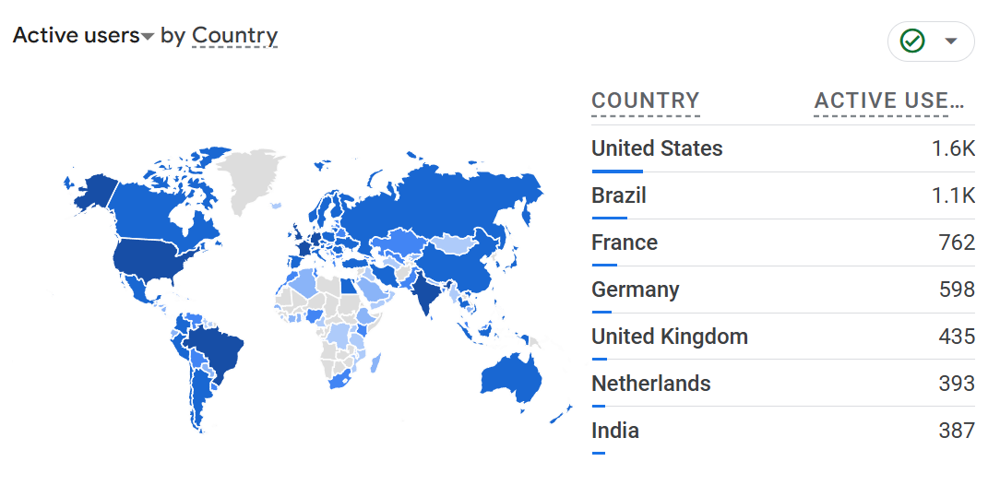

One year ago today, I officially released the [Conventional Branch specification](../conventional-branch).

Over the past year, the community response has been enthusiastic, with more and more teams adopting this specification to manage their Git branches.

For example, when searching "Conventional Branch" on Google, the specification page ranked first in search results for a considerable period.

According to Google Analytics data, the specification homepage (**https://conventional-branch.github.io/**) has accumulated over 12K visits in the past year, with widespread adoption beginning earlier this year.

Currently, **the Conventional Branch specification has been translated into multiple languages**, including Chinese and Portuguese.

Based on access data, users are distributed globally, with particularly active usage in **the United States, Brazil, France, the United Kingdom, Germany, Russia, and Japan**.

However, there are some regrets: despite China's large IT workforce, the number of visits is relatively limited, possibly due to the inconvenience of using Google Search and GitHub within the country.

Today, the Conventional Branch specification is quite complete and frequently appears alongside Conventional Commits in the Contribution Guides of many open-source projects, guiding developers to better manage branches and commits.

Going forward, I hope it will be adopted in more projects and that we can continue to improve multilingual support, allowing more developers to benefit.

If you also find this specification valuable, please like and share it so more people can learn about it.

Feel free to try it in your projects or suggest improvements; let's work together to make Git branch management simpler and more efficient.
