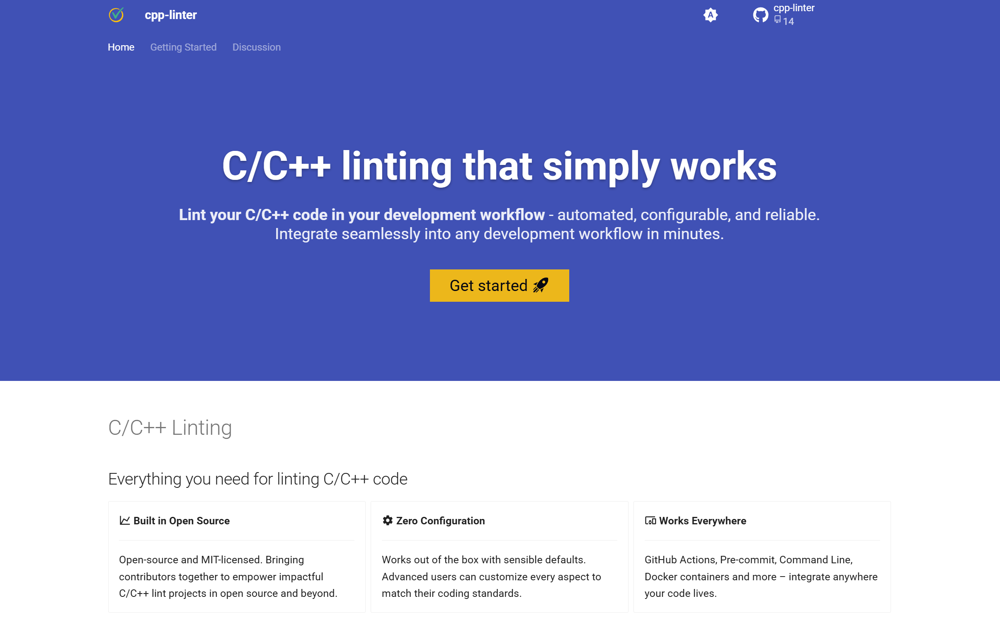
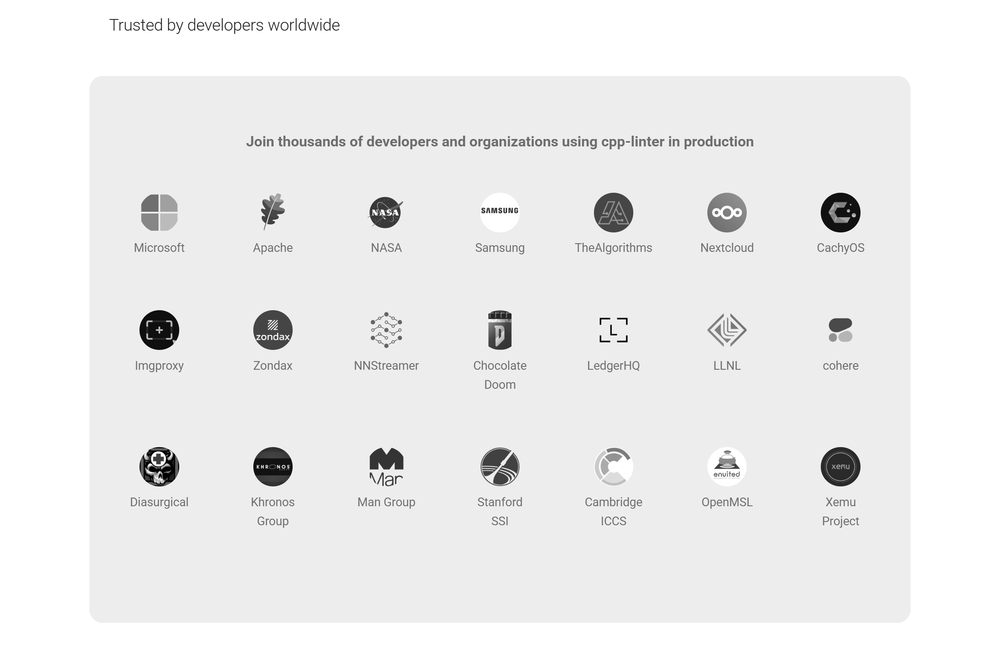
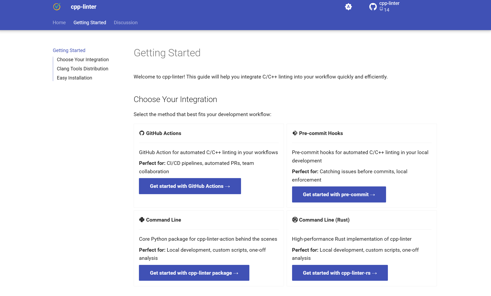

随着 cpp-linter 的维护进入第 4 个年头，我们也创建了不少相关的项目和工具。不过一直以来，我们只是在 GitHub organization 的首页做了简单的介绍。

但对用户来说，这显然还不够友好。另外网站可以接入 Google Analytics 进行流量分析，帮助我们更好地了解用户需求和行为。

因此，我决定创建一个 官网 来更系统地介绍 cpp-linter 相关的项目和工具。

经过了几个晚上的努力，cpp-linter 的官网终于上线了：https://cpp-linter.github.io/

废话不多说，直接上图！

## 首页

首页整体偏简洁，突出工具入口。

首页还展示了使用我们项目的知名组织和开源社区。

不仅有微软、三星、Apache 这样的业界巨头，也有 NASA、斯坦福大学、剑桥大学，甚至劳伦斯利弗莫尔国家实验室这样的顶尖科研机构。

这让我感到非常自豪和鼓舞！

如何快速使用 cpp-linter 的项目和工具。

## 开始页

列出了所有相关的项目和工具，并提供了简要的介绍和链接。

## 讨论页

最后是讨论区，邀请用户参与讨论和交流。

## 为什么是这个样子？

我们之前的 cpp-linter 组织下的很多项目已经有了在线文档，并且基本都是使用 [GitHub Pages](https://pages.github.com/) + [MkDocs](https://www.mkdocs.org/) + [Material for MkDocs](https://squidfunk.github.io/mkdocs-material/) 搭建的。

为了保持风格一致，这次 cpp-linter.github.io 官网也采用了 mkdocs-material 作为主题。

整体来看，我对最终效果还是非常满意的，基本达到了预期目标。

## 小技巧

如果你也想搭建一个网站，最好先找到你喜欢的主题。合适的主题能更好地承载和表达你的内容，从而达到理想的效果。

比如这次的网站，我参考了一些优秀的开源项目官网的设计，例如 astral.sh 和 mkdocs-material 官网。

当然，并不是照搬，而是借鉴他们的**设计思路、布局方式和分类逻辑**。

## 结语

做开源项目，不仅要有好的代码，还需要有好的文档和网站。这样才能让更多人了解并使用你的项目。

欢迎大家使用 cpp-linter 相关的项目和工具——这里为你提供了一站式的 **C/C++ 代码格式化与静态分析解决方案**。

如果你有任何建议或意见，欢迎随时提交 Issue 或参与 Discussions！

如果觉得这篇文章有帮助，欢迎分享给身边做 C/C++ 的朋友们。

---

转载本站文章请注明作者和出处，请勿用于任何商业用途。欢迎关注公众号「DevOps攻城狮」
