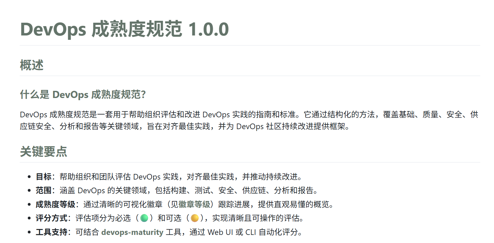
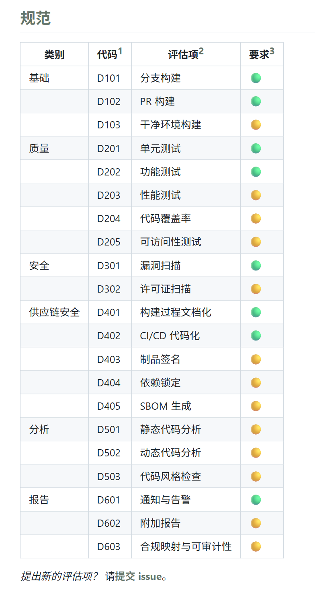
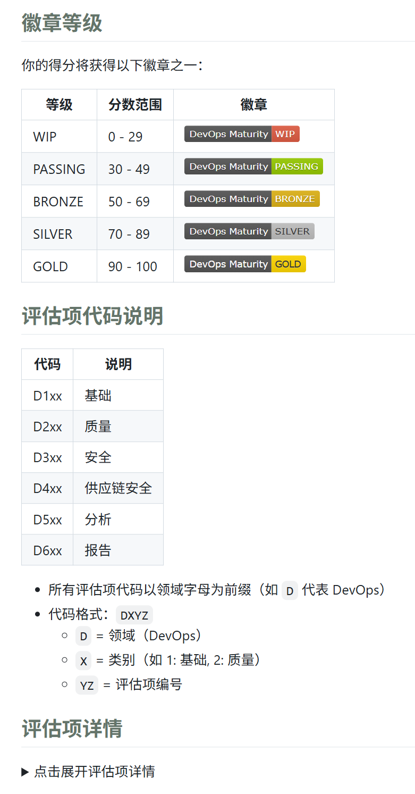

对，我又开源了一个项目 —— **DevOps Maturity（成熟度）**。

它能帮你和团队更好地评估、提升 DevOps 实践水平。
甚至，就算只是拿去给老板画个大饼，这个项目也相当好用。

闲话不多说，一起来看看它到底是怎么回事吧！

---

日常工作中，我们经常会谈到 **DevOps** 这个词。可你有没有想过：

* 我们团队的 DevOps 成熟度到底如何？
* 怎样衡量一个组做得好，另一个组还需改进？
* 是否存在统一的衡量标准？

基于这些疑问，**我们需要一个 DevOps 成熟度模型**，帮助团队更好地评估和提升自身的实践水平。

但评估方式也值得思考。
如果只是写个 wiki、发个 excel 让大家填一填，这种“原始”的方法不仅效率低，也很难真正沉淀和追踪结果。

所以我们需要一个更现代化、更高效的方式来做 DevOps 成熟度评估。
于是，开源项目 —— **DevOps Maturity** 便由此诞生。

## DevOps 成熟度规范

这个规范是基于 [DevOps Maturity Model](https://axify.io/blog/devops-maturity-model) 和 [Google DORA](https://cloud.google.com/devops) 并结合实际进行了实现。

它定义了不同成熟度级别的 **特征和指标**，让团队清楚地知道：

* 我们目前处于什么阶段？
* 下一步应该往哪里提升？

关键要点如下：

具体规范覆盖了 **基础、质量、安全、供应链安全、分析与报告** 等方面，每一部分都包含了可操作的评估项：

在结果展示上，我们没有采用复杂的百分比或分数，而是通过 **授予徽章等级** 的方式来激励团队持续改进：

更多细节可以在官网查看 👉 **https://devops-maturity.github.io/zh/**

## DevOps Maturity 评估工具

有了规范和标准，还需要一个工具来落地执行。

因此我开发了 [DevOps Maturity 评估工具](https://github.com/devops-maturity/devops-maturity)，提供了 Web 和 CLI 两种使用方式。

评估结果会统一存入 SQLAlchemy 数据库，可在 Web 或 CLI 中进行查看和分析。

CLI 演示动画：

CLI 演示视频：

<iframe width="560" height="315" src="https://www.youtube.com/embed/RZJtcynyC08?si=Zw_Yc2YMa_R6SfCi" title="YouTube video player" frameborder="0" allow="accelerometer; autoplay; clipboard-write; encrypted-media; gyroscope; picture-in-picture; web-share" referrerpolicy="strict-origin-when-cross-origin" allowfullscreen></iframe>

Web 演示视频：

<iframe width="560" height="315" src="https://www.youtube.com/embed/BGpz0iP61c4?si=XXJJT5Gq5adHdF8D" title="YouTube video player" frameborder="0" allow="accelerometer; autoplay; clipboard-write; encrypted-media; gyroscope; picture-in-picture; web-share" referrerpolicy="strict-origin-when-cross-origin" allowfullscreen></iframe>

## 五大亮点

DevOps Maturity 项目有以下五大突出亮点：

1. **规范化评估**：基于业界成熟的模型，提供清晰的评估标准和指标。
2. **开源工具**：提供 Web 和 CLI 两种方式，方便团队使用和集成。
3. **可视化结果**：通过直观的界面展示评估结果，帮助团队快速了解现状。
4. **持续改进**：通过徽章等级激励机制，鼓励团队不断提升 DevOps 实践。
5. **自定义扩展**：支持用户根据自身需求定制评估项和指标，比如修改 [`criteria.yaml`](https://github.com/devops-maturity/devops-maturity/blob/main/src/config/criteria.yaml)，不用修改一行代码即可生成独有的评估方案。

另外，DevOps Maturity 企业版也在开发中，包括更多企业级特性和支持，敬请期待！

## 你的帮助让它更好

DevOps Maturity 已经正式发布，欢迎大家参与：

* 试用并采纳
* 分享使用反馈
* 提出改进建议
* 贡献代码

这些支持，都会让开源项目走得更远 🙌

如果你觉得有价值，也请点一个 ⭐ [**Star**](https://github.com/devops-maturity/devops-maturity)，让更多人看到并受益。
