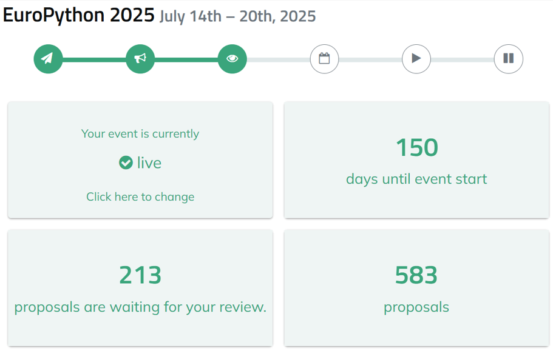

Lately, I haven't been contributing much code outside of work. I've mainly been spending my time reviewing proposals for EuroPython 2025 (the 2025 European Python Conference).

While in China, I never considered participating in or volunteering for events.  But since moving to Europe, I've felt a desire to participate more.

Below, I'll discuss why I chose to volunteer and what I've learned during this week of activity.

## Why I chose to participate

First, I wanted to challenge myself—to force myself to speak up, communicate with others, and actively listen.

Second, this experience is valuable for my resume and blog.

Third, I don't participate in just any event.  For me, the ideal event falls into one of two categories: Python or DevOps.

**This is the underlying logic behind my decision-making process.**

The idea itself was the most important part. Once I had the idea, at the end of last year I searched for European events in 2025 and found EuroPython 2025, being held in Prague. I then applied to join the organizing committee.

No matter what, I really wanted to participate, to volunteer.  It would be even better to attend in person—as long as the ticket is free. I would cover the flight and hotel myself, treating it as a family vacation, and I could also meet up with former colleagues. A win-win-win.

## What I've learned as a reviewer

First, I've gained insight into how such an event is organized, including the documentation, responsibilities, review process, requirements, and tools used. Overall, the organizers seem very experienced, and the event is progressing smoothly.

Second, as a reviewer, I've read hundreds of presentation proposals, shared my opinions, helped the organizing committee score them, and ultimately helped select which proposals will be presented at the conference in July 2025. This has broadened my horizons.

## A reflection

**Open source is a powerful personal endorsement.**

Within our company, sharing a Python linter tool like `uv` or `pre-commit` is fine as long as you're knowledgeable.

However, when presenting at a conference, you might have plenty of valuable content, but it might not be enough to get the judges' approval. If you are an author or maintainer of `uv` or `pre-commit`, your chances of getting selected are several times higher.

For example, while reviewing proposals, I saw a proposal from a PyPI member.  Their proposal had great content, but being a PyPI member instantly boosted the value of the presentation.

There were also some Python Core Devs and PyPy Core Devs.  Let's just say, if these individuals want to share something about their contributions, it's very easy—the organizers would be delighted.

## Finally

Although this requires a few extra hours each day, the rewards are significant. At the very least, it has broadened my horizons and exposed me to many new ideas.

Therefore, I'll try some projects I haven't tackled before, such as PyPy, Pydantic, and FastAPI.

I've completed 129 reviews, and there's one day left. I hope I can finish close to 150-200, even though the committee only suggests 30 reviews per person.

In short, this has been a very positive learning experience. I've learned many new ideas, improved my English and communication skills, and gained experience beneficial for my career and resume.

This task was initially challenging, but not insurmountable—it's the perfect level of challenge for growth.

What do you think?

---

Please indicate the author and source when reprinting this article, and do not use it for any commercial purposes.  Follow the "DevOps攻城狮" WeChat public account.