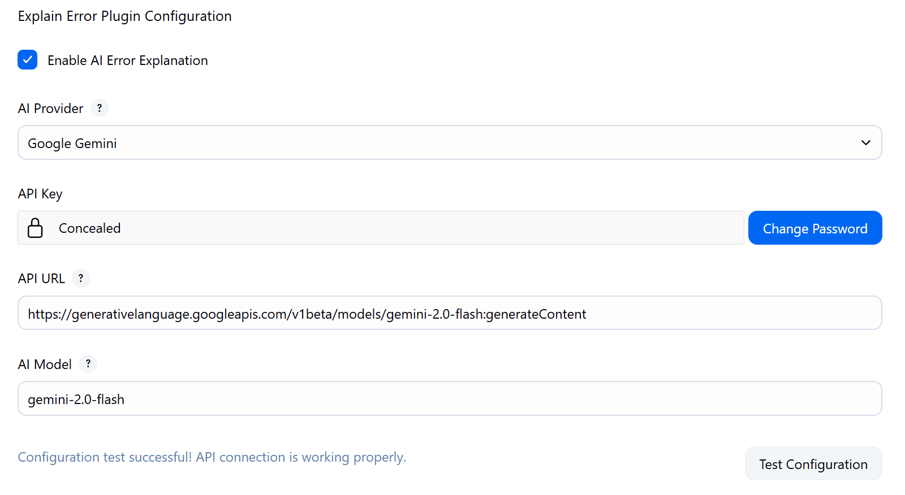

Last week I released the [Jenkins Explain Error Plugin](https://shenxianpeng.github.io/2025/07/explain-error-plugin/), aiming to help Jenkins users analyze and resolve errors in Jenkins builds faster through built-in AI.

Some readers mentioned in the comments that they hoped the plugin would support the Google Gemini model for error analysis, as their company can only use Google's AI services.

Today, I'm excited to announce that the plugin now supports the Google Gemini model! 🎉

## Plugin Updates

- Added support for the Google Gemini model.
- Optimized documentation and added an example video.

## How to Use Google Gemini

Before you begin, ensure the plugin is updated to the latest version.  You can find the Explain Error Plugin in the Jenkins Plugin Manager and upgrade it to the latest version.

After updating, you can choose to use the Google Gemini model for error analysis in the plugin configuration. Simply set the model to `Google Gemini` in the **Explain Error Plugin Configuration** section under `Manage Jenkins → Configure System`, and provide the corresponding API address and key.

Click Test Configuration to ensure your Google Gemini API Key, URL, and Model are correctly filled in and accessible.

## Example Plugin Video

Considering that many users may not be familiar with using the plugin, I've recorded a short video demonstrating how to use the Explain Error Plugin for error analysis in Jenkins.

You can watch this video on [YouTube](https://www.youtube.com/watch?v=rPI9PMeDQ2o).

## Conclusion

If you have any questions or suggestions during use, please submit an issue on GitHub or leave a comment.

Repository address: [jenkinsci/explain-error-plugin](https://github.com/jenkinsci/explain-error-plugin)

Welcome to Star ⭐️ and support!

---

Please indicate the author and source when reprinting this article, and do not use it for any commercial purposes. Welcome to follow the WeChat official account "DevOps攻城狮".
